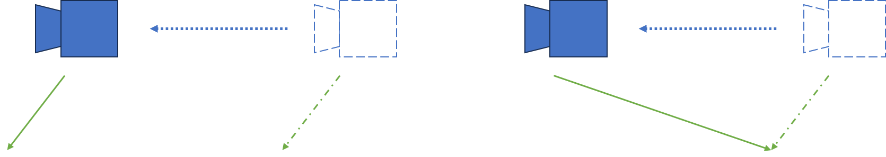

# 概述

## OpenGL

## GLFW

# 配置
## 下载并本地编译GLFW源码
- [下载GLFW的源码或是预编译二进制文件](https://www.glfw.org/)，此处我们下载GLFW源码并本地进行编译，可以生成适合我们自己cpu，操作系统等配置的库
- 具体教程见[GLFW配置](https://blog.csdn.net/qq_40229737/article/details/136886863)

## 运行GLFW官方示例
- [官方示例](https://www.glfw.org/docs/latest/quick.html)
```c++
#define GLAD_GL_IMPLEMENTATION
#include <glad/gl.h>
#define GLFW_INCLUDE_NONE
#include <GLFW/glfw3.h>
 
#include "linmath.h"
 
#include <stdlib.h>
#include <stddef.h>
#include <stdio.h>
```
- 根据示例的头文件可发现其中我们还需要配置`glad/gl.h`, `GLFW/glfw3.h` 以及`linmath.h`

### glad
- [已知GLFW库里的函数和OpenGL里的函数对应上很麻烦，而glad就是为了解决这类问题的](https://learnopengl-cn.github.io/01%20Getting%20started/02%20Creating%20a%20window/)
- 我们需要使用glad提供的[webserve](https://glad.dav1d.de/)来获取库文件，通过配置一些版本信息我们将下载glad提供的压缩包，在里面提供了我们需要的`glad.h`的库文件以及一个`glad.c`文件
- 这个压缩包里不仅提供上述glad相关，同时提供了一个`glad.h`依赖的`khrplatform.h`，所以在粘贴时别把KHR文件夹忘了，而且把KHR文件夹和glad文件夹放在同级，要不然还要更改glad.h里的引用路径

### GLFW/glfw3.h
- 我们先将下载的`GLFW源码中的include文件夹`复制出来，这个文件夹记录了GLFW所依赖的库
- 再把`编译后的GLFW`中`src\debug\`文件夹中的`glfw3.lib`文件也复制出来，这就是我们生成的GLFW库(`注意这里是编译完，打开sln，然后在vs里生成lib`)

### linmath.h
- `linmath.h`是一个轻量的数学库，为计算机图形学和物理模拟提供基础数学运算功能。
- 其[下载链接在此](https://github.com/datenwolf/linmath.h)，下载后把`linmath.h`拎出来备用

### 完成文件夹配置
- 至此我们有了如下文件
```c++
// .h头文件
- GLFW
    glfw3.h
    glfw3native.h
- glad
    glad.h
- KHR
    khrplatform.h
linmath.h

// lib库文件
glfw3.lib

// .c文件
glad.c
```
- 我们在项目文件夹中创建一个Dependencies文件夹专门来放外部依赖项，该文件夹下文件布置如图：

- 放的位置也是按上面的放就行，`glfw3.lib`与includ文件夹同级
`glad.c`文件拉到visio studio项目中的Source Files目录下就行

### 项目配置与链接
- 右键项目 -> 属性 -> C/C++ -> General -> Additional Include Directories -> 添加$(SolutionDir)Dependencies\GLFW\include (人话就是把外部包含项配置为include文件夹下的东西，而且把那些.h文件一起放在一块就一齐配置好了)
- 然后是链接库 -> Linker -> General -> Additional Library Directories -> 添加$(SolutionDir)Dependencies\GLFW（这里主要是指向glfw3.lib）
- 然后是添加依赖 -> Linker -> Input -> 添加glfw3.lib和opengl32.lib

### 修改示例代码中的错误
- 复制粘贴官网的示例代码后发现`gladLoadGL(glfwGetProcAddress);`报错，根据提示信息这是个无参数方法，将里面的参数删除掉，运行，搞定。
- 还有头文件是gl.h，这里对不上就自己把头文件改成`#include<glad/glad.h>`
- 总之见招拆招多google

### 例外
- 由于教程里使用的是GLEW而不是glad，所以后面就用GLEW了，没啥区别，glad是GLEW的升级版本，配置什么的也和前面类似
- `不过需要注意的是使用静态库时需要在属性 -> C/C++ -> processer ->第一行也就是预编译里添加GLEW_STATIC`
- 以及`glew.g要放在其他的上面先进行编译`

## 第一个示例（初始化GLEW，画一个三角形）
```c++
#include <GL/glew.h>
#include <GL/glut.h>
#include <GLFW/glfw3.h>
#include <iostream>

// glew.g要放在其他的上面先进行编译
// 记得在项目属性 -> C/C++ -> processer ->第一行也就是预编译里添加GLEW_STATIC

int main(void)
{
    GLFWwindow* window;

    /* Initialize the library */
    if (!glfwInit())
        return -1;

    /* Create a windowed mode window and its OpenGL context */
    window = glfwCreateWindow(640, 480, "Hello World", NULL, NULL);
    if (!window)
    {
        glfwTerminate();
        return -1;
    }

    /* Make the window's context current */
    glfwMakeContextCurrent(window);

    // glewinit需要在上下文建立后才能调用 初始化GLEW
    glewInit();

    std::cout << glGetString(GL_VERSION) << std::endl;

    /* Loop until the user closes the window */
    while (!glfwWindowShouldClose(window))
    {
        /* Render here */
        glClear(GL_COLOR_BUFFER_BIT);

        /*my render code*/ // 传统OpenGL风格画三角形
        glBegin(GL_TRIANGLES);
        glVertex2f(-0.5f, -0.5f);
        glVertex2f(0.0f, 0.5f);
        glVertex2f(0.5f, -0.5f);
        glEnd();

        /* Swap front and back buffers */
        glfwSwapBuffers(window);

        /* Poll for and process events */
        glfwPollEvents();
    }

    glfwTerminate();
    return 0;
}
```

# OpenGL
## OpenGL示例简要结构
- `大前提，OpenGL是一个状态机`
- 从上述代码示例开始简单分析，首先里面有一个循环，这个循环在窗口关闭之前会一直进行循环，也就是说这个循环意味着不停将物体按帧渲染在屏幕上的一个过程，所以循环内放的是具体的渲染操作（或者说是call GPU进行渲染的操作）
```c++
/* Loop until the user closes the window */
    while (!glfwWindowShouldClose(window))
    {
        /* Render here */
        glClear(GL_COLOR_BUFFER_BIT);

        /*my render code*/ // 传统OpenGL风格画三角形
        glBegin(GL_TRIANGLES);
        glVertex2f(-0.5f, -0.5f);
        glVertex2f(0.0f, 0.5f);
        glVertex2f(0.5f, -0.5f);
        glEnd();

        /* Swap front and back buffers */
        glfwSwapBuffers(window);

        /* Poll for and process events */
        glfwPollEvents();
    }
```
- 由于前面说了OpenGL是一个状态机，所以状态的设置，比如顶点缓存的申请，绑定，着色器的配置等都是在循环外进行，同时初始化glfw，建立上下文，初始化glew都是在前面完成的
```c++
GLFWwindow* window;

    /* Initialize the library */
    if (!glfwInit())
        return -1;

    /* Create a windowed mode window and its OpenGL context */
    window = glfwCreateWindow(640, 480, "Hello World", NULL, NULL);
    if (!window)
    {
        glfwTerminate();
        return -1;
    }

    /* Make the window's context current */
    glfwMakeContextCurrent(window);

    // glewinit需要在上下文建立后才能调用 初始化GLEW
    glewInit();
```

# 现代OpenGL
- 与上面5行渲染一个三角形不同，现代OpenGL风格会需要很多代码来渲染一个简单的三角形，然而现代风格具有着更好的可编程性，我们将配置顶点缓存，顶点属性，着色器，索引缓冲区等一系列操作
- `状态机` 我们通常所说的状态机是有限状态机，也就是被描述的事物的状态的数量是有限个，例如自动门的状态就是两个 open 和 closed 。
- `OpenGL状态机` 一系列的变量描述OpenGL此刻应当如何运行。
- `上下文` OpenGL当前的状态叫做上下文
- OpenGL的操作可以理解为，指定某号顶点缓存，指定某号着色器等等，指定完后也就是状态配置完后，call GPU去根据当前状态完成渲染操作

## 顶点缓存VBO（顶点缓冲对象）
- `顶点:`顶点不单单指位置，它需要被理解为一个结构体，顶点中存放诸如位置，纹理坐标，法线，颜色等属性
- `顶点缓存:`抛去顶点两个字进行理解，顶点缓存就是一个简单的缓存区用来存放相关数据并作为一个“单位”供我们使用，OpenGL可以创建很多个缓存区，我们通过指定缓存区索引给OpenGL来配置状态
- `构建数据 -> 将相关的顶点数据推入缓存区 -> 将缓存区推入GPU并返回缓存区指针(绑定)`

- 申请一块缓存区，用来存放顶点数据
```c++
//                  申请的缓存区数量     返回的VBO ID/name
void glGenBuffers(	GLsizei n ,GLuint * buffers);
```

- 将创建的缓冲绑定至GL_ARRAY_BUFFER目标上
```c++
//                  绑定的buffer目标     缓存name
void glBindBuffer(	GLenum target, GLuint buffer);
```
- 开空间
```c++
void glBufferData(	GLenum target,          // 绑定的buffer目标
                    GLsizeiptr size,        // 要开辟的空间大小
                    const GLvoid * data,    // 使用的数据
                    GLenum usage);          // 指定数据存储的预期使用模式
```
- 缓存绑定完，空间开完之后需要指定缓存内数据各个数据的实际意义
```c++
void glVertexAttribPointer(	GLuint index,             // location编号，就是vs里标的那个
                            GLint size,               // 该属性的数据数量，必须为1，2，3，4
                            GLenum type,              // 数据类型
                            GLboolean normalized,     // 是否归一化
                            GLsizei stride,           // 每个顶点之间的数据步长
                            const GLvoid * pointer);  // 该顶点属性数据的偏移量    
```
- 激活属性
```c++
void glEnableVertexAttribArray(	GLuint index);    // 和上面一样location编号
```

所以一整套下来创建一个简单的顶点数据如下所示
```c++

float position[] = {
    // 位置 ------------颜色--------------纹理坐标
   -0.5f,  0.5f, 0.0f, 1.0f, 0.0f, 0.0f, -1.0f, -1.0f, // 左上
   -0.5f, -0.5f, 0.0f, 0.0f, 0.5f, 0.0f,  1.0f, -1.0f, // 左下
    0.5f,  0.5f, 0.0f, 0.0f, 0.5f, 0.0f,  1.0f,  1.0f, // 右上
    0.5f, -0.5f, 0.0f, 0.0f, 0.0f, 1.0f, -1.0f,  1.0f  // 右下
};

    unsigned int VAO, VBO, EBO;
    
    glGenVertexArrays(1, &VAO);
    glGenBuffers(1, &VBO);
    glGenBuffers(1, &EBO);

    glBindVertexArray(VAO);
    glBindBuffer(GL_ARRAY_BUFFER, VBO);
    glBufferData(GL_ARRAY_BUFFER, sizeof(position), position, GL_STATIC_DRAW);

    glBindBuffer(GL_ELEMENT_ARRAY_BUFFER, EBO);
    glBufferData(GL_ELEMENT_ARRAY_BUFFER, sizeof(indices), indices, GL_STATIC_DRAW);
    // 编号location， 此属性数据数量， 是否归一化， 单个顶点总数据量（步长）， 偏移量
    glVertexAttribPointer(0, 3, GL_FLOAT, false, sizeof(float) * 8, (void*)0);
    glVertexAttribPointer(1, 3, GL_FLOAT, false, sizeof(float) * 8, (void*)(3 * sizeof(float)));
    glVertexAttribPointer(2, 2, GL_FLOAT, false, sizeof(float) * 8, (void*)(6 * sizeof(float)));
    glEnableVertexAttribArray(0);
    glEnableVertexAttribArray(1);
    glEnableVertexAttribArray(2);

    glBindVertexArray(0);
    // 对应的顶点着色器
    #version 460 core

    layout(location = 0) in vec3 aPos;
    layout(location = 1) in vec3 aColor;
    layout(location = 2) in vec2 aTexCoord;

    out vec3 ourColor;
    out vec2 ourTexCoord;

    void main() {
      gl_Position = vec4(aPos.xyz, 1.0f);
      ourColor = aColor;
      ourTexCoord = aTexCoord;
    }

```

## 顶点数组对象VAO
VAO用来保存VBO所做的`顶点属性`设置，这样我们就不需要在切换渲染对象的时候重复的设置VBO状态，所以VAO像是一个快照
`仅仅仅仅保存以下三个！！！ 所以不要不要指望VAO保存shader， trans啥的信息`
- 通过glVertexAttribPointer设置的顶点属性配置。
- 通过glVertexAttribPointer调用与顶点属性关联的顶点缓冲对象。
- glEnableVertexAttribArray和glDisableVertexAttribArray的调用。
VAO的使用很简单，它会自动的保存VBO的设置快照
```c++
unsigned int VAO;
glGenVertexArrays(1, &VAO);
glBindVertexArray(VAO);
... 设置VBO信息
glBindVertexArray(0);  //解绑当前VAO以供其他VAO操作
```
## 元素缓冲对象EBO
直接代码
```c++
// ..:: 初始化代码 :: ..
// 1. 绑定顶点数组对象
glBindVertexArray(VAO);
// 2. 把我们的顶点数组复制到一个顶点缓冲中，供OpenGL使用
glBindBuffer(GL_ARRAY_BUFFER, VBO);
glBufferData(GL_ARRAY_BUFFER, sizeof(vertices), vertices, GL_STATIC_DRAW);
// 3. 复制我们的索引数组到一个索引缓冲中，供OpenGL使用
glBindBuffer(GL_ELEMENT_ARRAY_BUFFER, EBO);
glBufferData(GL_ELEMENT_ARRAY_BUFFER, sizeof(indices), indices, GL_STATIC_DRAW);
// 4. 设定顶点属性指针
glVertexAttribPointer(0, 3, GL_FLOAT, GL_FALSE, 3 * sizeof(float), (void*)0);
glEnableVertexAttribArray(0);

[...]

// ..:: 绘制代码（渲染循环中） :: ..
glUseProgram(shaderProgram);
glBindVertexArray(VAO);
glDrawElements(GL_TRIANGLES, 6, GL_UNSIGNED_INT, 0);
glBindVertexArray(0);
```
## 着色器
着色器使用类c语言的GLSL编写
着色器的开头总是要声明版本，接着是输入和输出变量、uniform和main函数。
渲染管线中我们目前可以自定义的并且关注的两个着色器为顶点着色器（vertex shader）&片段（片元）着色器(fragment shader)
### 顶点着色器 vertex shader
- 顶点着色器主要的目的是把3D坐标转为另一种3D坐标（后面会解释），同时顶点着色器允许我们对顶点属性进行一些基本处理。
以上面提到的顶点着色器为例
```c++
    #version 460 core                         // 版本信息

    layout(location = 0) in vec3 aPos;        // 顶点属性信息+输入信息
    layout(location = 1) in vec3 aColor;
    layout(location = 2) in vec2 aTexCoord;

    out vec3 ourColor;                        // 输出信息
    out vec2 ourTexCoord;                     // 这里的输出信息会输出给几何/片元着色器，像是那个一个个小框连起来的那个界面的感觉

    void main() {
      gl_Position = vec4(aPos.xyz, 1.0f);     // gl_posion输出每个顶点的对应坐标
      ourColor = aColor;
      ourTexCoord = aTexCoord;
    }
```

### 片段着色器 fragment shader
- 片段着色器的主要目的是计算一个像素的最终颜色，这也是所有OpenGL高级效果产生的地方。通常，片段着色器包含3D场景的数据（比如光照、阴影、光的颜色等等），这些数据可以被用来计算最终像素的颜色。
以 texture 项目中的与上面vs对应的片段着色器为例
```c++
#version 460 core

in vec3 ourColor;                         // 接收顶点着色器发出的数据
in vec2 ourTexCoord;                      // 注意名字，类型要一样

out vec4 FragColor;                       // 输出每个像素点的颜色

uniform sampler2D ourTexture1;            // 纹理采样器
uniform sampler2D ourTexture2;

void main() {
    // 第一个纹理         第二个纹理          0.4两个纹理的混合比（60%第一个纹理, 40%第二个纹理）
     FragColor = mix(texture(ourTexture1, ourTexCoord), texture(ourTexture2, ourTexCoord), 0); 
}
```
着色器一般写为工具类使用，关键代码自己找项目中的shader.cpp
简单的说流程为： 读取GLSL代码 -> 创建着色器 -> 设置着色器代码（source） -> 编译着色器 -> 检查着色器编译状态进行错误处理 -> 创建着色器程序 -> 给程序添加着色器 -> 链接着色器 -> 着色器程序错误处理 -> 删除着色器（因为已经用它们创建好着色器程序了） -> 返回着色器程序ID

## 纹理
下载配置 stb_img.h 库，根据注释创建一个 stb_img.cpp 并加上
```c++
#define STB_IMAGE_IMPLEMENTATION
#include "stb_image.h"
```
纹理具体使用教程上有
- 生成纹理
```c++
unsigned int texture;
glGenTextures(1, &texture);
glBindTexture(GL_TEXTURE_2D, texture);
// 为当前绑定的纹理对象设置环绕、过滤方式
glTexParameteri(GL_TEXTURE_2D, GL_TEXTURE_WRAP_S, GL_REPEAT);   
glTexParameteri(GL_TEXTURE_2D, GL_TEXTURE_WRAP_T, GL_REPEAT);
glTexParameteri(GL_TEXTURE_2D, GL_TEXTURE_MIN_FILTER, GL_LINEAR);
glTexParameteri(GL_TEXTURE_2D, GL_TEXTURE_MAG_FILTER, GL_LINEAR);
// 加载并生成纹理
int width, height, nrChannels;
unsigned char *data = stbi_load("container.jpg", &width, &height, &nrChannels, 0);
if (data)
{
    glTexImage2D(GL_TEXTURE_2D, 0, GL_RGB, width, height, 0, GL_RGB, GL_UNSIGNED_BYTE, data);
    glGenerateMipmap(GL_TEXTURE_2D);
}
else
{
    std::cout << "Failed to load texture" << std::endl;
}
stbi_image_free(data);

// 设置每个纹理对应的采样器
glUniform1i(glGetUniformLocation(s.ID, "ourTexture1"), 0);
glUniform1i(glGetUniformLocation(s.ID, "ourTexture2"), 1);
```
- 数据绑定，纹理坐标设置等部分在上面那一大串代码里有
`mipmap`这个面试有相关问题，概念也比较简单，教程里有，主要还是为了节省资源

## 坐标系统(重要)
五个坐标系统
- 局部坐标：物体本身的坐标系统，该坐标系统就像是blender里对单个物体进行操作，描述物体本身的状态，如scale， rotate， trans等
- 世界坐标：用来描述整个世界的坐标系统，比如每个物体在世界中的位置，
- 观察坐标：将世界坐标转换为从摄像机或是观察者位置观察的坐标，即观察坐标
- 裁剪坐标：裁剪坐标会将坐标数据处理在-1.0到1.0之间，判断哪些顶点会出现在屏幕上，不会出现在屏幕上的坐标会被裁剪掉，同时它们的坐标也并不会被处理在-1.0到1.0之间，直接说就是不管了
- 屏幕坐标：将裁剪坐标变换为屏幕坐标，将使用一个叫做视口变换(Viewport Transform)的过程。视口变换将位于-1.0到1.0范围的坐标变换到由glViewport函数所定义的坐标范围内。最后变换出来的坐标将会送到光栅器，将其转化为片段。

讲不清，看教程， 放点代码
```c++
// modelmat，一些rotate， scale， transform操作放model
glm::mat4 modelMat = glm::mat4(1.0f);
// 投影矩阵
glm::mat4 projectMat = glm::perspective(glm::radians(45.0f), windowWidth / windowHeight, 0.1f, 100.0f);
// 观察矩阵，往往和lookat矩阵用，用来设置观察的位置，视角等
glm::mat4 viewMat = myCamera.getMat();
```
## 变换
- 就是矩阵那一套，modelmat用的那一套
`先进行缩放操作，然后是旋转，最后才是位移，否则它们会（消极地）互相影响`
## 摄像机


# TIPS
## progressive jpeg & 打印stbi_failure_reason()
- 有些图片加载为纹理时就是不好用，可以通过stbi_failure_reason()查看具体的问题，progressive jpeg问题就是因为使用的图片为渐进加载JPEG，所以没法用，可以用PS换成PNG
## 检查相对路径
- 通过检查项目属性 ->debug里面的工作目录来确定当前的工作路径，从而确定相对路径
## 有些图放纹理上就是会出问题，不到咋回事
- 依然不知道

## 坐标系统
- 局部坐标是对象相对于局部原点的坐标，也是物体起始的坐标。
  - 也就像是blender里物品本身的中心锚点
- 下一步是将局部坐标变换为世界空间坐标，世界空间坐标是处于一个更大的空间范围的。这些坐标相对于世界的全局原点，它们会和其它物体一起相对于世界的原点进行摆放。
  - 也就是对应了blender中的世界中心锚点
- 接下来我们将世界坐标变换为观察空间坐标，使得每个坐标都是从摄像机或者说观察者的角度进行观察的。
  - 也就是将物体坐标转换为blender里的摄像机视角下该有的坐标
- 坐标到达观察空间之后，我们需要将其投影到裁剪坐标。裁剪坐标会被处理至-1.0到1.0的范围内，并判断哪些顶点将会出现在屏幕上。
  - 裁剪掉摄像机视角之外的顶点
- 最后，我们将裁剪坐标变换为屏幕坐标，我们将使用一个叫做视口变换(Viewport Transform)的过程。视口变换将位于-1.0到1.0范围的坐标变换到由glViewport函数所定义的坐标范围内。最后变换出来的坐标将会送到光栅器，将其转化为片段。
  - 光栅化将观察空间中的坐标转换到屏幕上（大概意思是把-1.0 - 1.0之间的坐标转换到屏幕的像素坐标上，比如2k的像素坐标系就是(2560 * 1440)）

## 摄像机的移动
- `glm::mat4 keyLookAt = glm::lookAt(overallCameraPos, overallCameraPos + overallCameraFront, overallCameraUp);`或许会疑惑为什么LookAt中面朝位置的参数跟着pos变，这是为了保证相机向某个方向移动时视角不会一直盯着原来的那个点看，而是说相机向前，则盯着的那个点也跟着相机向前
  加上front的效果为左图所示，不加的话为右图所示


## GL只能对当前use的program进行修改
`GL只能对当前use的program进行修改!!!`

## 开启深度测试
- `开启深度测试务必在一些东西初始化完成，上下文建立完成等之后以及建立VBO啥的一大堆操作之前再开启`
- `开启深度测试务必记得清楚深度缓存` `glClear(GL_COLOR_BUFFER_BIT | GL_DEPTH_BUFFER_BIT);`

## 遇到的那个贴图乱码的问题
- 这个问题原因是没有根据通道数配置好参数，应该如下根据通道数配置正确的format才行，如果通道数为4而format为GL_RGB就会产生乱码
```c++
if (data)
    {
        GLenum format;
        if (nrComponents == 1)
            format = GL_RED;
        else if (nrComponents == 3)
            format = GL_RGB;
        else if (nrComponents == 4)
            format = GL_RGBA;

        glBindTexture(GL_TEXTURE_2D, textureID);
        glTexImage2D(GL_TEXTURE_2D, 0, format, width, height, 0, format, GL_UNSIGNED_BYTE, data);
        glGenerateMipmap(GL_TEXTURE_2D);

        glTexParameteri(GL_TEXTURE_2D, GL_TEXTURE_WRAP_S, GL_REPEAT);
        glTexParameteri(GL_TEXTURE_2D, GL_TEXTURE_WRAP_T, GL_REPEAT);
        glTexParameteri(GL_TEXTURE_2D, GL_TEXTURE_MIN_FILTER, GL_LINEAR_MIPMAP_LINEAR);
        glTexParameteri(GL_TEXTURE_2D, GL_TEXTURE_MAG_FILTER, GL_LINEAR);

        stbi_image_free(data);
    }
```

## 关于光照特别白的问题
- 很有可能是某个向量没有进行归一化，单纯只与角度有关的信息中混入了其他的例如长度因素，尤其是距离越远越亮的情况，一定是忘了归一化
- 检查衰减值的计算，检查任何不与1有关的的值的位置

## 关于镜面反射光不对的问题
- 检查方向计算

## 关于解决无光照面会产生镜面反射的问题
- 不排除自身问题导致的这个异常问题，也就是可能代码抄错了这样
```c++
// 个人关于解决无光照面会产生镜面反射的解决方法（非官方解决方案）
vec3 specular = vec3(0.0f, 0.0f, 0.0f);
if (diff > 0) {
    specular = pl.specular * (spec * texture(material.specular, TexCo).rgb);
}

// 要不就直接* diff，强光强镜面，很合理
```

## uniform数组赋值问题
毕竟是字符串，没办法解析变量的，所以`myShader.setVec3("plArray[i].ambient", 0.05f, 0.05f, 0.05f);`这种不会生效
```c++
myShader.setVec3("plArray[0].ambient", 0.05f, 0.05f, 0.05f);
myShader.setVec3("plArray[0].diffuse", 1.0f, 1.0f, 1.0f);
myShader.setVec3("plArray[0].specular", 1.0f, 1.0f, 1.0f);

myShader.setFloat("plArray[0].constant", 1.0);
myShader.setFloat("plArray[0].linear", 0.09);
myShader.setFloat("plArray[0].quadratic", 0.032);

myShader.setVec3("plArray[0].position", lightsPositions[0].x, lightsPositions[0].y, lightsPositions[0].z);

myShader.setVec3("plArray[1].ambient", 0.05f, 0.05f, 0.05f);
myShader.setVec3("plArray[1].diffuse", 1.0f, 1.0f, 1.0f);
myShader.setVec3("plArray[1].specular", 1.0f, 1.0f, 1.0f);

myShader.setFloat("plArray[1].constant", 1.0);
myShader.setFloat("plArray[1].linear", 0.09);
myShader.setFloat("plArray[1].quadratic", 0.032);

myShader.setVec3("plArray[1].position", lightsPositions[1].x, lightsPositions[1].y, lightsPositions[1].z);
```

## 着色器的切换问题
- 用use切换当前着色器，切换完成后才能成功应用对此着色器的修改操作，要不然修改操作好像是会在切换前的着色器上生效
## 纹理渲染切换问题
- 纹理的切换通过使用纹理的ID和绑定函数实现

# 务必务必务必务必务必注意变换时矩阵的先后顺序，tmd之前找那个模型的照明位置跟lightcube的位置对应不上就是因为吊lightcube变换顺序错误导致坐标啥的对应不上找半天，捞的一批