# SOUI 2.9.0.3
- SOUI 一个 C++ DirectUI 库
- DirectUI是一个UI思路，即少量真实 HWND（通常一个宿主窗口）+ 大量逻辑控件。  
- MFC/传统 Win32 常见是一控件一 HWND；而 DirectUI 的按钮、列表项等多为“逻辑控件”，没有各自独立 HWND。输入消息先到宿主 HWND（如鼠标/键盘），框架再做命中测试与事件分发，判断哪个逻辑控件被点到。控件外观也由框架使用GDI/Direct2D/Skia等进行自绘。 


**HWND** 是 Windows 程序里常见的一种类型名，一般写作 `HWND`，含义可以理解为：**窗口句柄（Handle to a Window）**。

- 在 Win32 里，**句柄**是系统给的一个“编号/引用”，用来在 API 里指代某个由系统创建的对象
- **HWND** 专门用来标识**某一个窗口**（可以是主窗口、子控件窗口、对话框等，在系统里很多 UI 元素本质上都是“窗口”）。

有了 HWND，程序才能确定操作的是哪一个窗口，例如：

- **发消息**：`SendMessage(hwnd, ...)`、`PostMessage(hwnd, ...)`
- **改标题、取标题**：`SetWindowText`、`GetWindowText`
- **显示/隐藏、启用/禁用**：`ShowWindow`、`EnableWindow`
- **改位置大小**：`SetWindowPos`、`MoveWindow`
- **子控件**：按钮、编辑框等也常有自己的 HWND，父窗口用 `GetDlgItem` 等拿到子控件的 HWND 再操作

 **DirectUI** 则是一种 UI 思路：**尽量用很少的 `HWND`（常常就 1 个宿主窗口），在窗口客户区里自己画、自己算命中、自己分发消息**，而不是像传统 Win32 那样“一个控件一个子窗口句柄”。

在经典模型里，**按钮、编辑框、列表框**等往往是 **真正的子窗口**（各自有 `HWND`），系统会为它们：

- 单独维护一套窗口过程（`WndProc`）与默认绘制  
- 单独做焦点、键盘 Tab、IME、无障碍等桥接  
- 产生更多窗口消息与 HWND 管理成本  

很多行为系统已经实现了，但 **HWND 数量一多**，成本与限制也更明显。

DirectUI **不把每个控件都做成独立 `HWND`**

1. **一个（或少量）宿主 `HWND`**：负责接收鼠标键盘、定时器、DPI、窗口移动缩放等“窗口级”事件。  
2. **控件是逻辑对象**：在内存里一棵树（element / control），自己 `HitTest`、自己 `OnPaint`（GDI+/D2D/Skia 等），自己维护状态。  
3. **绘制走自绘管线**：更像游戏/UI 框架的一帧一帧绘制，而不是让每个子 HWND 各自 `WM_PAINT`。

这样做的常见动机包括：

- **HWND 少了**：消息路由、同步焦点、子窗口裁剪/重绘连锁、DWM 合成下的边角问题，往往更可控。  
- **外观自由度更高**：不规则形状、复杂动画、统一换肤、叠层布局，不必被“每个控件都是真窗口”的默认行为绑住。  
- **性能与扩展策略**：大量小控件时，减少系统窗口对象数量；绘制可以批处理/缓存（当然也取决于实现）。


| 维度 | 传统 Win32 | DirectUI（窗口化/无子控件自绘） |
|------|------------|--------------------------------|
| **窗口与消息** | 大量 `HWND` 子控件，消息在窗口树里分发（`WM_*` 等） | 通常少量顶层窗口，内部多为“逻辑控件”，消息在框架内路由 |
| **绘制方式** | 控件由系统/通用控件绘制，应用可 `WM_PAINT`、部分自绘 | 大面积自绘（位图/矢量/分层），外观高度可控 |
| **控件形态** | 按钮、编辑框等标准控件，行为成熟、风格偏系统 | 自定义控件为主，易做皮肤、异形、透明叠层 |
| **开发成本** | 常见界面搭建快，复杂自定义 UI 反而啰嗦 | 简单界面成本高；复杂炫酷界面更划算 |
| **无障碍与输入** | 标准控件自带较完整的键盘、读屏等基础 | 需在框架里自行补齐焦点、Tab、无障碍语义等 |
| **典型适用** | 工具面板、对话框、企业后台式界面 | 资源管理器式界面、富皮肤、强定制交互（微软内部产品曾大量使用 DirectUI 思路） |

传统 Win32 胜在 **标准控件与系统集成**；DirectUI 思路胜在 **整屏自绘与视觉自由度**，代价是 **要自己扛交互与无障碍**。

SOUI 框架的整体架构图，分为上下两层：
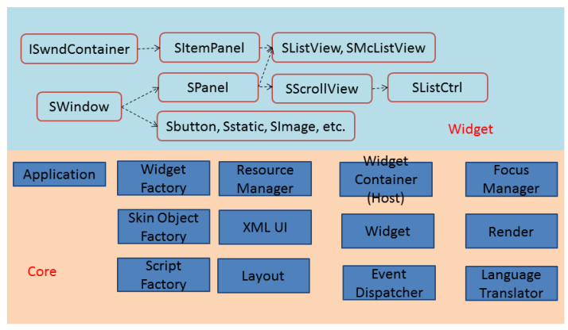
---

## Widget 层（上方蓝色区域）—— 控件体系

以 `SWindow` 为所有控件的基类，衍生出两条继承线：

```
SWindow
 ├── ISwndContainer（容器接口）
 │    └── SItemPanel → SListView / SMcListView   （列表/多列列表）
 ├── SPanel（面板）
 │    └── SScrollView（可滚动容器）
 │         └── SListCtrl（复杂列表控件）
 └── Sbutton / Sstatic / SImage / etc.           （叶子级基础控件）
```

所有控件都是"逻辑窗口"（无独立 HWND），通过自绘实现显示
---

## Core 层（下方橙色区域）—— 框架核心

| 模块 | 作用 |
|------|------|
| **Application** | 应用程序入口，全局生命周期管理 |
| **Widget Factory** | 控件工厂，通过 XML 标签名反射创建控件实例 |
| **Skin Object Factory** | 皮肤对象工厂，管理各类绘制皮肤（图片、颜色、9-patch 等） |
| **Script Factory** | 脚本工厂，支持脚本语言扩展（Lua 等）绑定 |
| **Resource Manager** | 资源管理，统一加载 XML/图片/字符串等 |
| **XML UI** | 解析 XML 布局文件，驱动界面构建 |
| **Layout** | 布局引擎，计算控件位置和尺寸 |
| **Widget Container (Host)** | 宿主容器，是真实 HWND 与逻辑控件树之间的桥梁 |
| **Widget** | 逻辑控件基础层（对应上方 Widget 层） |
| **Event Dispatcher** | 事件分发，处理鼠标/键盘消息并路由到逻辑控件 |
| **Focus Manager** | 焦点管理，维护 Tab 键切换、键盘焦点状态 |
| **Render** | 渲染接口抽象层，可对接 GDI、Skia 等不同后端 |
| **Language Translator** | 多语言翻译，支持界面本地化 |

---

## 源码 soui 2.x
https://github.com/setoutsoft/soui

# 手动创建项目
没找到向导，或者年代久远不好配

## 编译
- cmake 生成项目文件 sln
- vsbuild 编译出依赖库等

## 项目创建
- 新建win32项目
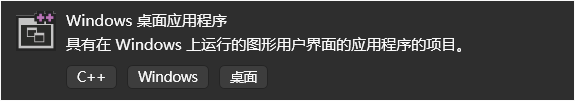

### 项目配置
- 把编出来的SOUI & bin 和源码中下载就有的 config & utilities 放项目中
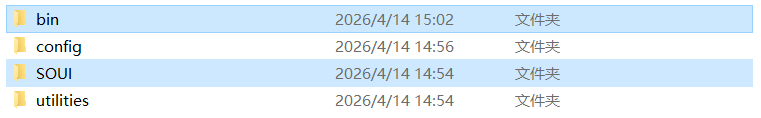

- 设置`附加包含目录`, `附加库目录`，`附加依赖项`
- 项目 属性 c/c++ 常规 
  - $(SolutionDir)extra_lib\config
  - $(SolutionDir)extra_lib\utilities\include
  - $(SolutionDir)extra_lib\SOUI\include
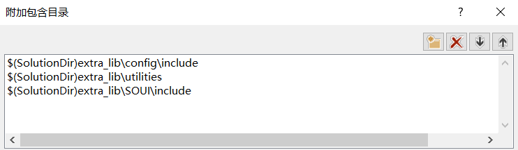

- 项目 属性 链接器 常规 
  - $(SolutionDir)extra_lib/bin
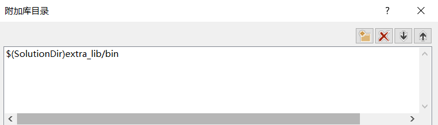

- 项目 属性 链接器 输入
  - utilitiesd.lib
  - souid.lib
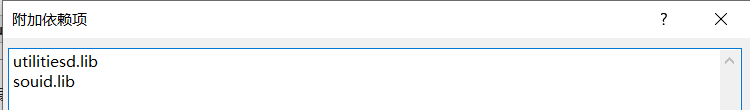

### 头文件目录（编译用）

| 路径 | 职责 |
|------|----------|
| `extra_lib\config` | 放 **`core-def.h` / `com-def.h` / `build.cfg`** 这类由工程生成或随库带的 **编译开关、版本与公共宏**；决定 SOUI 按什么能力/选项参与编译。 |
| `extra_lib\utilities\include` | 放 **`utilities` 库的对外头文件**；里面是字符串、辅助类等 **基础工具 API 的声明**，SOUI 头文件会依赖到它。 |
| `extra_lib\SOUI\include` | 放 **SOUI 主库对外头文件**（如 `souistd.h`、`core/`、`control/`）；**控件、宿主、资源、布局等 UI 框架 API** 的声明在这里。 |

### 库目录与库文件（链接用）

| 项 | 职责 |
|----|----------|
| `extra_lib\bin` | 放 **已经编好的 `.lib`（以及若有 DLL 时同目录的 `dll`）**；链接器来这里 **按文件名找磁盘上的库文件**。 |
| `utilitiesd.lib` | **`utilities` 的实现**：把工具层里 **已编译好的函数/类** 链进exe；。 |
| `souid.lib` | **`soui` 主库的实现**（Debug）：把 **DirectUI 框架主体** 链进 exe； |

### 准备SOUI的程序资源
| 文件名 | 是否固定文件名 | 作用说明 | 备注 |
|---|---|---|---|
| `uires.idx` | 是 | 定义资源索引 | 文件名固定，建议放在资源目录根位置 |
| `init.xml` | 否 | 定义全局 UI 属性（字体、字符串表、`skin`、`style`、`objattr` 等） | 可自定义文件名，但需在加载代码中对应 |
| `dlg_main.xml` | 否 | 主窗口布局 XML | 可自定义文件名，按实际窗口资源组织 |
---

- 关于`uires.idx`的最小可运行资源目录结构
```
uires/
├─ uires.idx                # 资源索引（文件名固定）
├─ init.xml                 # 全局UI定义（可改名）
├─ xml/
│  └─ dlg_main.xml          # 主窗口XML（可改名）
├─ img/                     # 图片资源（png/jpg等）
├─ skin/                    # 皮肤资源
└─ font/                    # 字体资源（可选）
```
| 路径【除了uires.idx的路径其他的都可以在uires里面自己配】 | 必需 | 说明 |
|---|---|---|
| `uires/uires.idx` | 是 | 资源索引入口，文件名固定 |
| `uires/init.xml` | 是 | 全局 UI 属性定义（字体、字符串表、skin、style、objattr 等） |
| `uires/xml/dlg_main.xml` | 是（最小示例） | 主窗口布局 XML（文件名可改） |
| `uires/img/` | 建议 | 存放界面图片资源 |
| `uires/skin/` | 建议 | 存放皮肤相关资源 |
| `uires/font/` | 可选 | 自定义字体文件目录 |
---

### uires.idx 资源索引
```xml
<resource>
<!--指定全局UI属性定义-->
 <UIDEF>
 <file name="XML_INIT" path="xml\init.xml" />
 </UIDEF>

  <!--布局资源-->
 <LAYOUT>
 <file name="XML_MAINWND" path="xml\dlg_main.xml" />
 </LAYOUT>
</resource>
```

### init.xml 全局UI属性定义
```xml
<?xml version="1.0" encoding="utf-8"?>
<UIDEF>
	<font face="宋体" size="15"/>

    <!--定义全局string替换对象-->
	<string>
		<mainTitle value="title ver:1.0"/>
	</string>
	
	<!--定义全局skin对象-->
	<skin src="values:skin"/>

	<style>
		<class name="normalbtn" font="" colorText="#385e8b" colorTextDisable="#91a7c0" textMode="25" cursor="hand" margin-x="0"/>
	</style>

	<objattr>
	</objattr>
</UIDEF>
```

### dlg_main.xml 主窗口xml布局
```xml
<SOUI name="mainWindow" title="@string/mainTitle" width="600" height="400" appWnd="1" margin="20,5,5,5"  resizable="1" translucent="1" >
	<root skin="_skin.sys.wnd.bkgnd">
		<caption pos="0,0,-0,30">
            <!--引用init.xml中定义的字符串对象-->
			<text pos="11,9">@string/mainTitle</text>
			<imgbtn name="btn_close" skin="_skin.sys.btn.close"    pos="-45,0" tip="close" animate="1"/>
			<imgbtn name="btn_max" skin="_skin.sys.btn.maximize"  pos="-83,0" animate="1" />
			<imgbtn name="btn_restore" skin="_skin.sys.btn.restore"  pos="-83,0" show="0" animate="1" />
			<imgbtn name="btn_min" skin="_skin.sys.btn.minimize" pos="-121,0" animate="1" />
		</caption>
		<window pos="5,30,-5,-5">
			<text pos="|0,|0" pos2type="center" colorText="#ff0000">Hellow World! UI? Just so so!</text>
			<button class ="normalbtn" pos="|-50,[20,@100,@30" name="btn_msgbox">show msg box</button>
		</window>
	</root>
</SOUI>
```

### stdafx.h 引用SOUI头文件
```c++
// stdafx.h : 标准系统包含文件的包含文件，
// 或是经常使用但不常更改的
// 特定于项目的包含文件
//

#pragma once

#include "targetver.h"

#define  _CRT_SECURE_NO_WARNINGS
#define     DLL_SOUI   //SOUI是以DLL提供时需要定义这个宏

#include <souistd.h>
#include <core/SHostDialog.h>
#include <control/SMessageBox.h>
#include <control/souictrls.h>

using namespace SOUI;
```

### targetver.h 定义 Windows 版本
```c++
#pragma once

// // 包含 SDKDDKVer.h 可定义可用的最高版本的 Windows 平台。
// 如果希望为之前的 Windows 平台构建应用程序，在包含 SDKDDKVer.h 之前请先包含 WinSDKVer.h 并
// 将 _WIN32_WINNT 宏设置为想要支持的平台。
#include <SDKDDKVer.h>

```

### SOUITemplate.cpp 应用程序入口 找 _tWinMain 为程序入口
```c++
#include "stdafx.h"
#include <com-loader.hpp>
#include "CMainWnd.h"

#ifdef _DEBUG
#define COM_IMGDECODER _T("imgdecoder-wicd.dll")
#define COM_RENDER_GDI _T("render-gdid.dll")
#define SYS_NAMED_RESOURCE _T("soui-sys-resourced.dll")
#else
#define COM_IMGDECODER _T("imgdecoder-wic.dll")
#define COM_RENDER_GDI _T("render-gdi.dll")
#define SYS_NAMED_RESOURCE _T("soui-sys-resource.dll")
#endif
int WINAPI _tWinMain(HINSTANCE hInstance, HINSTANCE /*hPrevInstance*/,
	LPTSTR /*lpstrCmdLine*/, int /*nCmdShow*/)
{
	HRESULT hRes = OleInitialize(NULL);
	SASSERT(SUCCEEDED(hRes));

	int nRet = 0;
	SComLoader imgDecLoader;
	SComLoader renderLoader;
	SComLoader transLoader;
	{
		CAutoRefPtr<SOUI::IImgDecoderFactory> pImgDecoderFactory;
		CAutoRefPtr<SOUI::IRenderFactory> pRenderFactory;

		imgDecLoader.CreateInstance(COM_IMGDECODER, (IObjRef**)&pImgDecoderFactory);

		renderLoader.CreateInstance(COM_RENDER_GDI, (IObjRef**)&pRenderFactory);
		pRenderFactory->SetImgDecoderFactory(pImgDecoderFactory);
		SApplication* theApp = new SApplication(pRenderFactory, hInstance); // （统一管理，对外提供查询 & 加载接口）
		HMODULE hSysResource = LoadLibrary(SYS_NAMED_RESOURCE);
		if (hSysResource)
		{
			CAutoRefPtr<IResProvider> sysSesProvider;
			CreateResProvider(RES_PE, (IObjRef**)&sysSesProvider);
			sysSesProvider->Init((WPARAM)hSysResource, 0);
			theApp->LoadSystemNamedResource(sysSesProvider);
		}
		CAutoRefPtr<IResProvider> pResProvider;  // （资源提供者，负责从哪里读文件）
		CreateResProvider(RES_FILE, (IObjRef**)&pResProvider);
		if (!pResProvider->Init((LPARAM)_T("uires"), 0))
		{
			SASSERT(0);
			return 1;
		}
		theApp->AddResProvider(pResProvider);
		{//在这里加入主窗口运行代码
			//在这里加入主窗口运行代码
			
			//程序结束
		}
		delete theApp;
	}
	OleUninitialize();
	return nRet;
}
```

### CMainWnd 为了方便演示全写在头文件里了
```c++
#pragma once

#include "stdafx.h"

class CMainWnd : public SHostWnd
{
public:
	CMainWnd()
		: SHostWnd(_T("LAYOUT:XML_MAINWND"))//这里定义主界面需要使用的布局文件
	{
		m_bLayoutInited = FALSE;
	}
	void OnClose()
	{
		PostMessage(WM_QUIT);
	}
	void OnMaximize()
	{
		SendMessage(WM_SYSCOMMAND, SC_MAXIMIZE);
	}
	void OnRestore()
	{
		SendMessage(WM_SYSCOMMAND, SC_RESTORE);
	}
	void OnMinimize()
	{
		SendMessage(WM_SYSCOMMAND, SC_MINIMIZE);
	}
	void OnSize(UINT nType, CSize size)
	{
		SetMsgHandled(FALSE);
		if (!m_bLayoutInited) return;
		if (nType == SIZE_MAXIMIZED)
		{
			FindChildByName(L"btn_restore")->SetVisible(TRUE);
			FindChildByName(L"btn_max")->SetVisible(FALSE);
		}
		else if (nType == SIZE_RESTORED)
		{
			FindChildByName(L"btn_restore")->SetVisible(FALSE);
			FindChildByName(L"btn_max")->SetVisible(TRUE);
		}
	}
	void OnBtnMsgBox()
	{
		SMessageBox(NULL, _T("this is a messagebox"),_T("haha"),MB_OK|MB_ICONEXCLAMATION);
		SMessageBox(NULL, _T("this message box includes twobuttons"),_T("haha"),MB_YESNO|MB_ICONQUESTION);
		SMessageBox(NULL, _T("this message box includes threebuttons"),NULL,MB_ABORTRETRYIGNORE);
	}

	BOOL OnInitDialog(HWND hWnd, LPARAM lParam)
	{
		m_bLayoutInited = TRUE;
		return 0;
	}
protected:
	//按钮事件处理映射表
	EVENT_MAP_BEGIN()
		EVENT_NAME_COMMAND(L"btn_close", OnClose)
		EVENT_NAME_COMMAND(L"btn_min", OnMinimize)
		EVENT_NAME_COMMAND(L"btn_max", OnMaximize)
		EVENT_NAME_COMMAND(L"btn_restore", OnRestore)
		EVENT_NAME_COMMAND(L"btn_msgbox", OnBtnMsgBox)
		EVENT_MAP_END()
		//窗口消息处理映射表
		BEGIN_MSG_MAP_EX(CMainWnd)
		MSG_WM_INITDIALOG(OnInitDialog)
		MSG_WM_CLOSE(OnClose)
		MSG_WM_SIZE(OnSize)
		CHAIN_MSG_MAP(SHostWnd)//注意将没有处理的消息交给基类处理
		REFLECT_NOTIFICATIONS_EX()
		END_MSG_MAP()
private:
	BOOL		 m_bLayoutInited;
};
```

### 添加主窗口运行代码 打开主窗口 CMainWnd
```c++
            CMainWnd wndMain;
			wndMain.Create(GetActiveWindow(), 0, 0, 800, 600);
			wndMain.SendMessage(WM_INITDIALOG);
			wndMain.CenterWindow(wndMain.m_hWnd);
			wndMain.ShowWindow(SW_SHOWNORMAL);
			nRet = theApp->Run(wndMain.m_hWnd);
```

## error C2065: “SApplication”: 未声明的标识符
### 根本原因：C++20 严格模式不兼容 SoUI
SoUI 的头文件存在**循环包含**：

```
SApp.h → (内部链) → SSingleton2.h
                        ↓
              #include "../SApp.h"  ← 被 #pragma once 阻断！
                        ↓
              SApplication 未声明 → 报错
```

在 C++14/C++17 或非严格模式下，模板中的非依赖名（`SApplication`）查找是延迟的，这个循环能"侥幸绕过"。但 **C++20 严格一致性模式** (`/permissive-`) 要求模板定义时名字必须已可见，于是直接报错。
### 解决方法

在 Visual Studio 里：

1. 右键项目 → **属性**
2. 配置选择 `Debug / x64`
3. **C/C++ → 语言**，找到以下两项修改：

| 设置项 | 当前值 | 改为 |
|--------|--------|------|
| C++ 语言标准 | C++20 | **C++17** 或更低 |
| 符合性模式 | 是 (`/permissive-`) | **否** |

4. 点确定重新编译
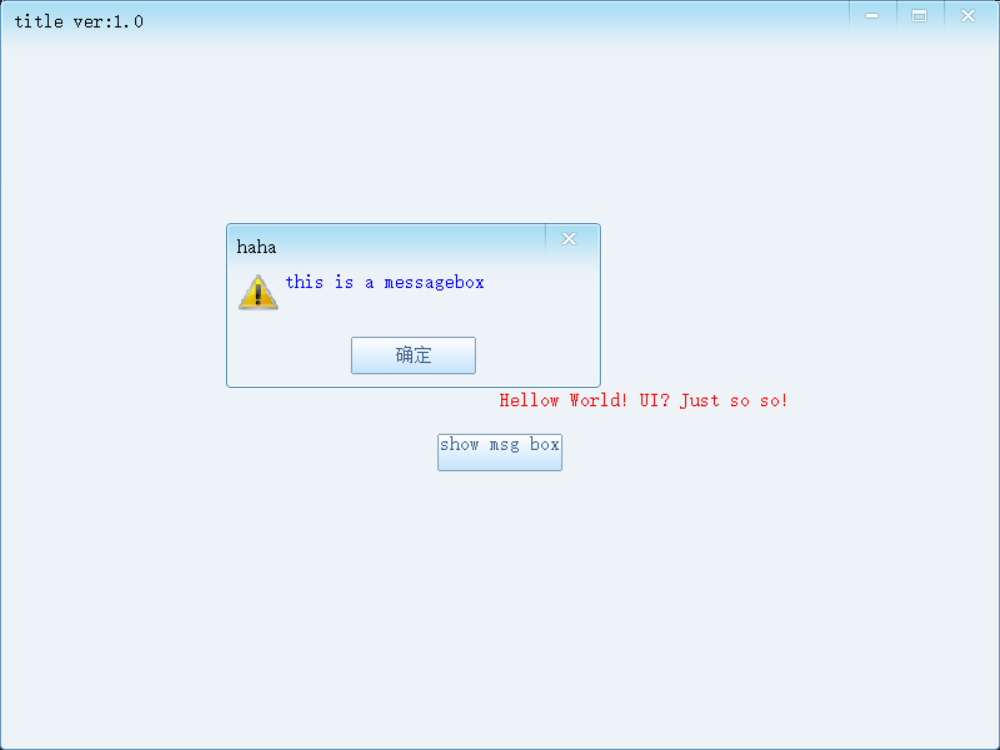
<span style="color:#ff7700;"> 最小示例项目完成 </span>

## 无法解析的外部符号 main
### SoUI 是 Windows 窗口程序，入口函数不是 main，而是 WinMain
SoUI 窗口程序需要改成 Windows 子系统：
右键项目 → 属性
链接器 → 系统 → 子系统
从 控制台 (/SUBSYSTEM:CONSOLE) 改为 窗口 (/SUBSYSTEM:WINDOWS)
改完后链接器才会接受 WinMain 作为入口，不再找 main。


# SOUI 布局、资源 与 事件
- 做 UI 时 页面布局 和 控件事件 大致是最核心、最先上手的两块：
  - 页面布局：控件怎么摆、层级怎么组织、适配不同分辨率
  - 控件事件：点击、输入、选择、焦点变化后触发什么逻辑
- 而资源又是UI必不可少的部分，如皮肤，样式，字体等

## 布局
SOUI 的布局可以理解成：**“统一的锚点坐标布局体系”**，核心靠 `pos` + `size/width/height` + `offset/pos2type`，`在2.5.1.1 开始支持线性布局`。  

### 1) SOUI 布局的核心思路

- SOUI 主要采用**锚点布局**：你直接描述控件矩形四边（或起点+尺寸），控件会随父窗口尺寸变化自动重算。
- 设计目标是减少 `WM_SIZE` 里手写重排。
- 常见写法是 XML 里每个控件给 `pos`，必要时补 `width/height` 或 `offset`。

---

### 2) `pos` ：

`pos` 是布局第一核心，常见两种形式：

- **4 值**：`x1,y1,x2,y2`（left/top/right/bottom）
- **2 值**：`x,y`（配合 `width/height` 或 `size` 才能完整确定矩形）


#### `pos` 关键规则
- 普通正数：相对父窗口左/上偏移
- 普通负数：相对父窗口右/下“内缩”
  - `pos="0,0,-0,-0"` = 填满父区域
  - `pos="10,10,-10,-10"` = 四边各留 10
- 支持特殊标记（官方文档列出）：
  - `|`：相对父窗口中心
  - `%`：按父窗口百分比
  - `[` `]` `{` `}`：相对兄弟控件边界
  - `@`：在 `x2/y2` 位置表达“宽/高”

> 注意：兄弟引用（`[` `]` `{` `}`）写复杂了可能形成循环依赖，官方也提示要谨慎。
> 
| 标志 | 含义（简述） |
|------|----------------|
| **无标志的负数** | 相对父窗口**右边或下边**向内缩进。如 `0,0,-0,-0` 铺满；`10,10,-10,-10` 四边各缩进 10。 |
| **`\|`** | 相对父窗口**中心**。如 `|-10` 表示从中心向左/上偏 10 像素。 |
| **`%`** | 父窗口宽/高的**百分比**（可小数、可负，负的等价于从另一侧算）。 |
| **`[`** | 相对**前一个兄弟**：X 参考其 right，Y 参考其 bottom。 |
| **`]`** | 相对**后一个兄弟**：X 参考其 left，Y 参考其 top。 |
| **`{`** | 相对**前一个兄弟**：X 参考其 left，Y 参考其 top。 |
| **`}`** | 相对**后一个兄弟**：X 参考其 right，Y 参考其 bottom。 |
| **`@`** | 只出现在 **第 3、4 个值**，表示**宽高**（尺寸写在 pos 里）。

--- 

### 3) 尺寸属性：`size` / `width` / `height`

- `size="w,h"`：同时给宽高
- `width` / `height` 可单独给
- 文档中提到可有：
  - 固定非负整数
  - `full`
  - `-1`（按内容自动）
- 一般经验：  
  - 已有 4 值 `pos` 时，尺寸通常已由坐标决定  
  - 2 值 `pos` 时，必须补尺寸信息

---

### 4) 对齐与偏移：`offset` 和 `pos2type`

这两个是第二核心，专门解决“已定位后再平移”的场景。

#### `offset`

- 形如 `offset="-0.5,-0.5"`
- **单位不是像素**，而是“控件最终尺寸倍数”
  - `-0.5,-0.5` = 左移半个自己宽 + 上移半个自己高
- 所以它特别适合做“未知尺寸控件的居中/贴边”

#### `pos2type`

是 `offset` 的预设快捷值（9 个锚点）：

- `center / lefttop / leftmid / ... / rightbottom`
- 例如：
  - `center` 对应 `offset=-0.5,-0.5`
  - `rightbottom` 对应 `offset=-1,-1`

> 如果两者都写，文档说明“后生效者生效”。

---

### 5) 常用示例

- **铺满容器**：`pos="0,0,-0,-0"`
- **四周留白**：`pos="L, T, R, B"`
- **绝对尺寸 + 起点**：`pos="x,y,@w,@h"` 或 `pos="x,y" width="w" height="h"`
- **动态居中（尺寸未知）**：`pos="|0,|0"` + `offset="-0.5,-0.5"`
- **右下角锚定**：负坐标 + 必要时 `offset`
---

### 6) 典型结构：
- **`<SOUI>`**：整窗属性（宽高、标题、`margin` 等）。
- **`<skin>` / `<style>`**（可选）：与全局资源不同 此处定义本窗口**局部**皮肤/样式，随窗口销毁。
- **`<root>`** (非模板布局时必有)：根容器，本质是 `SWindow`，但名字必须是 `root`；**与位置相关的布局属性对 root 无效**，因为它总是铺满宿主客户区。

子控件都在 `<root>` 下面用锚点一层层摆。

### 7) 模块化布局：`include`

被引用的布局文件根节点是 **`<include>`**，里面再写子控件；通过 `src="layout:xxx"` 从 `uires.idx` 里注册的 **LAYOUT** 资源引入。**不能**在纯 `include` 文件里再定义局部 `skin`/`style`


## 加个简单的布局示例页面
- 基础流程：加个 xml 页面 -> 注册 -> 找个类加载xml -> 调这个页面

### 添加xml页面
- 在`\uires\xml`下新建`layoutTest.xml` 【在所有文件模式或资源管理器中建，后面筛选器里添加进来就行】
```xml
<SOUI name="layoutTest" title="@string/mainTitle" width="600" height="400" appWnd="1" margin="20,5,5,5"  resizable="1" translucent="1" >
	<root skin="_skin.sys.wnd.bkgnd">
		<caption pos="0,0,-0,30">
			<text pos="11,9">@string/mainTitle</text>
			<imgbtn name="btn_close" skin="_skin.sys.btn.close"    pos="-45,0" tip="close" animate="1"/>
			<imgbtn name="btn_max" skin="_skin.sys.btn.maximize"  pos="-83,0" animate="1" />
			<imgbtn name="btn_restore" skin="_skin.sys.btn.restore"  pos="-83,0" show="0" animate="1" />
			<imgbtn name="btn_min" skin="_skin.sys.btn.minimize" pos="-121,0" animate="1" />
		</caption>
		
		
			<!--left top right bottom 四边基于父窗口左上作偏移-->
		<window id="999" pos ="10, 10, 100, 100" colorBkgnd="#0000ff"> <!--蓝-->
		</window>
		
			<!--最终几何上必须是 左 ≤ 右、上 ≤ 下，否则容易变成非法/零面积矩形，看起来像不显示-->
		<window pos ="-10, -10, -100, -100" colorBkgnd="#00ffff"> <!--不显示-->
		</window>
		
		<!--负号则基于父窗口右下作偏移-->
		<window pos ="-100, -100, -10, -10" colorBkgnd="#00ffff"> <!--青-->
		</window>
		
			<!--若只提供部分几何信息，则需要通过 width 和 height 补充-->
			<!--width 和 height 为 full 时，代表高度或者宽度和父窗口的客户区大小相等。
			-1 代表根据窗口内容自动计算窗口大小。
			非负整数直接指定窗口大小-->
		<window pos ="{20, {0" width = "90" height ="90" colorBkgnd="#ff0000">	<!--红-->
		</window>

		<!--offset 在 pos 属性完成坐标定位后再将坐标进行偏移，用于调整窗口位置，偏移量以控件最后的大小为单位进行平移，
			-1, -1 代表窗口位置向左上移动一个窗口宽度或者高度
			@ 效果和 width 以及 height效果相同	-->
		<window pos ="{20, |0, @90, @90" offset ="-1, -1" colorBkgnd="#ff00ff">	<!--紫-->
		</window>

		<!--pos 坐标对应控件的左上角。但有时候你想说「这个坐标是我控件的中心」或者「右上角」，就可以用 pos2type 属性来指定  -->
		<!--<window pos ="{20, {0, @90, @90" pos2type="rightbottom" colorBkgnd="#00ff00">	--><!--绿--><!--
		</window>--> <!--不好用 注释掉 带过-->
		<!--pos2type 是 2014 年前的旧写法，只能是 0、-0.5、-1 这几档；
		offset 是 2014 年后新增的，可以写任意小数，更灵活；
		两个属性同时写只有最后一个生效，推荐直接用 offset，pos2type 只是为了向后兼容。-->


		<!--SOUI 2.5.1.1 开始支持线性布局(LinearLayout).
		vbox 为垂直线性布局, hbox 为水平线性布局
		
		gravity 属性, 用来指定子窗口的默认排列模式 [从哪往哪排]
		vbox: left(默认), center, right;
		hbox: top(默认), center, bottom.
		
		线性布局中的子窗口 pos 属性没有意义, 一般直接指定 size="width,height",
		width/height 值: -1 代表 wrap_content, -2 代表 match_parent
		
		使用 extend="left,top,right,bottom", extend_left, extend_top, extend_right,
		extend_bottom 来指定间距. (相当于 android 的 margin)-->
		<window pos ="|20, |0, @100, @90" layout="hbox">  <!--窗口虽然不会截断按钮的显示 但会截掉按钮的点击区域-->
				<button size="100,30">按钮1</button>
				<button size="100,30" extend_left="0">按钮2</button>
				<button size="100,30" extend_left="10">按钮3</button>
		</window>

		<!--相对于特定兄弟窗口进行布局
		被参考窗口（假定为窗口 A）必须要指定窗口的 ID 属性，必须是ID name不行 ID好像还必须是数字，不能是纯字母开头的字符串（虽然文档里没说，但实测是这样的），比如 id="999"。
		当前窗口指定pos时加上 
		sib.left@999:    
		sib.bottom@999: 
		用来指定这两个坐标是相对于被引用窗口的 left,bottom 的值-->
		<window pos ="sib.left@999:100, sib.bottom@999:10, @100, @25" colorBkgnd="#008546">
		</window> <!--草绿-->
	</root>
</SOUI>
```

### 注册
- 在 **uires.idx** <LAYOUT>节点下做页面的索引
```xml
<LAYOUT>
	<file name="XML_MAINWND" path="xml\dlg_main.xml" />
	<file name="XML_LAYOUT_TEST" path="xml\layoutTest.xml" />
</LAYOUT>
```

### 加载xml
- 新建一个加载该布局资源的类
`CLayoutTestWnd.h`【为了方便演示 代码全写头文件里了】
```c++
#pragma once
#include "stdafx.h"

class CLayoutTestWnd : public SHostWnd // 基类
{
public:
	CLayoutTestWnd()
		: SHostWnd(_T("LAYOUT:XML_LAYOUT_TEST")) //这里定义主界面需要使用的布局文件
	{
		m_bLayoutInited = FALSE;
	}
	void OnClose()
	{
		PostMessage(WM_QUIT);
	}
	void OnMaximize()
	{
		SendMessage(WM_SYSCOMMAND, SC_MAXIMIZE);
	}
	void OnRestore()
	{
		SendMessage(WM_SYSCOMMAND, SC_RESTORE);
	}
	void OnMinimize()
	{
		SendMessage(WM_SYSCOMMAND, SC_MINIMIZE);
	}
	void OnSize(UINT nType, CSize size)
	{
		SetMsgHandled(FALSE);
		if (!m_bLayoutInited) return;
		if (nType == SIZE_MAXIMIZED)
		{
			FindChildByName(L"btn_restore")->SetVisible(TRUE);
			FindChildByName(L"btn_max")->SetVisible(FALSE);
		}
		else if (nType == SIZE_RESTORED)
		{
			FindChildByName(L"btn_restore")->SetVisible(FALSE);
			FindChildByName(L"btn_max")->SetVisible(TRUE);
		}
	}

	BOOL OnInitDialog(HWND hWnd, LPARAM lParam)
	{
		m_bLayoutInited = TRUE;
		return 0;
	}
protected:
	//按钮事件处理映射表
	EVENT_MAP_BEGIN()
		EVENT_NAME_COMMAND(L"btn_close", OnClose)
		EVENT_NAME_COMMAND(L"btn_min", OnMinimize)
		EVENT_NAME_COMMAND(L"btn_max", OnMaximize)
		EVENT_NAME_COMMAND(L"btn_restore", OnRestore)
		EVENT_MAP_END()
		//窗口消息处理映射表
		BEGIN_MSG_MAP_EX(CLayoutTestWnd)
		MSG_WM_INITDIALOG(OnInitDialog)
		MSG_WM_CLOSE(OnClose)
		MSG_WM_SIZE(OnSize)
		CHAIN_MSG_MAP(SHostWnd)//注意将没有处理的消息交给基类处理
		REFLECT_NOTIFICATIONS_EX()
		END_MSG_MAP()
private:
	BOOL		 m_bLayoutInited;
};

```

### 调用该类显示页面
- 在主窗口中直接替换类 以展示该布局页面
```c++
CLayoutTestWnd wndMain;
wndMain.Create(GetActiveWindow(), 0, 0, 800, 600);
wndMain.SendMessage(WM_INITDIALOG);
wndMain.CenterWindow(wndMain.m_hWnd);
wndMain.ShowWindow(SW_SHOWNORMAL);
nRet = theApp->Run(wndMain.m_hWnd);
```
- 运行得该窗口显示效果
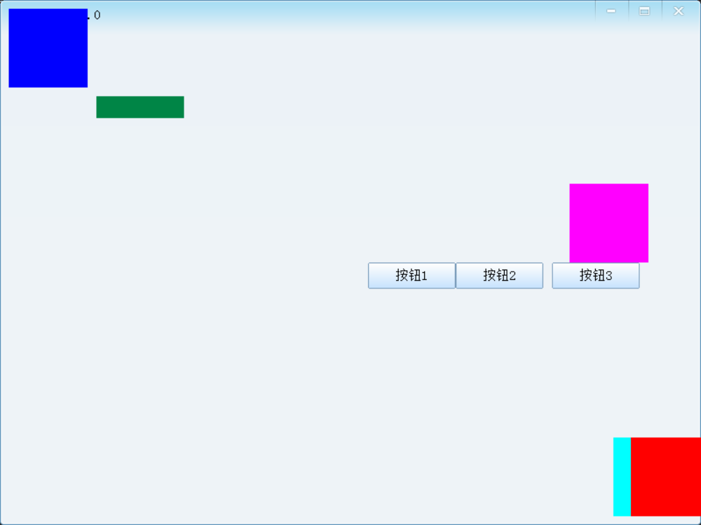

## 模板布局
- 方便复用某些通用页面 提供模板布局相关功能
基础流程：新建模板布局 -> 注册模板布局 -> include引入主布局文件即可

### 新建模板布局
- 新建模板布局 `page_layout.xml`
```xml
<include>
	<text pos="100,10" pos2type="center">center align1</text>
	<text pos="100,30" pos2type="center">center align align</text>
	<text pos="250,50" pos2type="rightTop">align right top</text>
	<text pos="250,70" pos2type="rightTop">align right top 2</text>
	<check pos="250,90" pos2type="rightTop">check right top</check>
	<check pos="250,110" pos2type="rightTop" font="adding:-5">check right top1235</check>

	<text pos="250,130" class="cls_txt_red">text left top</text>
	<button pos="10,150,@150,@30">button 1 using @</button>
	<button pos="10,200" width="150" height="30">button 1 using width</button>

	<button name="btn_hidetst" pos="300,150,@100,@30" display="0" tip="click me to hide me and see how the next image will move">hide test</button>
</include>
```
### 注册
- `uires.idx`注册索引
```xml
<LAYOUT>
	<file name="XML_MAINWND" path="xml\dlg_main.xml" />
	<file name="XML_LAYOUT_TEST" path="xml\layoutTest.xml" />
	<file name="XML_PAGE_LAYOUT" path="xml\page_layout.xml" /> <!--新增模板布局-->
</LAYOUT>
```

### 引入
- `layoutTest.xml` 引入该模板布局
```xml
	<include src="layout:XML_PAGE_LAYOUT">
	</include>
```
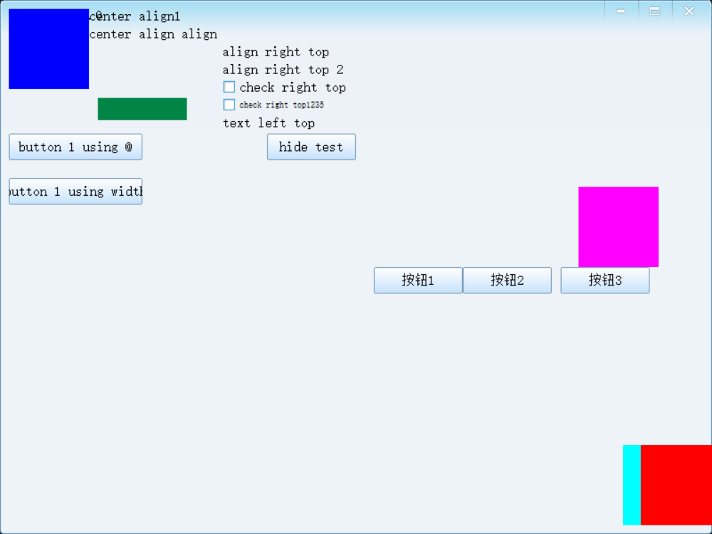

## 资源
---
在 MFC ，资源一般就是位图(Bitmap)，图标(Icon)，光标(Cursor)，对话框模板(Dialog)等资源。

在 SOUI 中，资源主要变成了 XML 布局和 PNG 图片文件
## 一、资源系统的整体结构

SOUI 的资源系统由三层组成：

```
uires.idx（资源索引入口 UI索引文件）
    ↓
IResProvider（资源提供者，负责从哪里读文件）
    ↓
SApplication（统一管理，对外提供查询 & 加载接口）
```

应用程序通过 `SApplication::AddResProvider()` 注册资源提供者，之后所有 XML/图片/皮肤等都通过这个统一体系来查找。

---

## 二、`uires.idx`：资源索引文件 【定义资源】

`uires.idx` 是整个资源体系的**入口**，文件名**固定**。

此文件中可以定义程序的全局配置、XML 文件、字体、图片、文字等资源

**常用资源类型：**
```xml
<?xml version="1.0" encoding="utf-8"?>
<resource>
  <!-- 全局UI定义（必须有，且唯一） -->
  <UIDEF>
    <file name="xml_init" path="xml\init.xml" />
  </UIDEF>

  <!-- 布局XML -->
  <LAYOUT>
    <file name="maindlg" path="xml\dlg_main.xml" />
    <file name="page_layout" path="xml\page_layout.xml" />
  </LAYOUT>

  <!-- 图片资源（PNG/JPG/BMP等） -->
  <IMGX>
    <file name="png_page_icons" path="image\page_icons.png" />
    <file name="png_btn_close"  path="image\btn_close.png" />
  </IMGX>

  <!-- 图标 -->
  <ICON>
    <file name="LOGO" path="image\logo.ico" />
  </ICON>

  <!-- 光标 -->
  <CURSOR>
    <file name="ANI_ARROW" path="image\arrow.ani" />
  </CURSOR>

  <!-- GIF 动画 -->
  <GIF>
    <file name="gif_loading" path="image\loading.gif" />
  </GIF>

  <!-- Lua 脚本 -->
  <script>
    <file name="lua_test" path="lua\test.lua" />
  </script>

  <!-- 多语言翻译文件 -->
  <translator>
    <file name="lang_cn" path="translation files\lang_cn.xml" />
  </translator>
</resource>
```

- 以`<resource>`为根节点。
- 资源类型名可以**自定义**（任意字母，长度 ≤ 30 字符）
- `UIDEF` 是唯一**有特殊语义**的类型（用于 `theApp->Init()`）
- 每个 `<file>` 的 `name` 是**逻辑名**（用于在XML中进行引用），`path` 是实际文件路径
- **资源引用语法**：`类型名:逻辑名`，如 `imgx:png_page_icons`
---

## 三、`init.xml`（UIDEF）【定义变量】
```
uires.idx
  ├── UIDEF → init.xml    ← init.xml 是 uires 里的一个条目
  ├── IMGX  → png_btn_close.png
  └── LAYOUT → dlg_main.xml

init.xml 内部：
  <skin>
    <imglist name="skin_btn" src="imgx:png_btn_close"/>
                                   ↑
                         引用的是 uires.idx 里 IMGX 段的 name
  </skin>
```

`init.xml` 是全局 UI 定义文件，根节点固定为 `<UIDEF>`，且为唯一根节点

`UIDEF` 下可定义可以定义 **font**，**string**，**skins**，**style**，**objattr** 五个子节点

```xml
<?xml version="1.0" encoding="utf-8"?>
<UIDEF>
	
	<!--定义全局字体对象-->
	<font face="宋体" size="15"/>
	
	<!--定义全局string替换对象-->
	<string>
		<mainTitle value="title ver:1.0"/>
	</string>

	<!--定义全局style 控件显式属性-->
	<style>
		<class name="normalbtn" font="" colorText="#385e8b" colorTextDisable="#91a7c0" textMode="25" cursor="hand" margin-x="0"/>
		<class name="boldSongText" font="face:宋体,bold:5" checked ="1"/>	<!--不支持的属性会被静默忽略，不会报错也不会崩溃。-->
	</style>

	<!--定义全局objattr 控件默认继承属性-->
	<objattr>
		<text colorText="#385e8b" />
	</objattr>

	<!--定义全局skin对象-->
	<!--<skin src="values:skin"/>-->
</UIDEF>

```
- `font` 定义 SOUI 中使用的默认字体，只有 face 和 size 两个属性。
- `string` 是一个字符串表，定义一个"name-字符串"映射，在布局的 XML 文件中可以通过
引用字符串的 name 来获得字符串。
- `skins` 定义 SOUI 中使用的全局窗口元素绘制对象，每一个对象都对应一个
SOUI::ISkinObj 的派生类。
- `style` 定义 UI 布局中 SOUI 窗口对象的属性集合，它们是 SWindow 对象的属
性，所有 SWindow 对象都可以通过 class 属性来引用 style 节点中定义的属性集合。
- `objattr` 控件的默认属性。 SOUI 可以为每一类 UI 控件通过 objattr 来提供一种默认属性集合，以减少在 XML 布局中的重复定义

### 3.1 `<font>`：全局默认字体

```xml
<font face="微软雅黑" size="18"/>
```
只有 `face` 和 `size` 两个属性，影响所有没有单独指定字体的控件。全局生效，是所有控件没有单独指定字体时的兜底。

#### 3.1.1 系统已安装的字体
- `face` 直接写字体名即可，只要用户系统里装了就能用，担如果系统中没有则会回退至系统默认字体：

```xml
<font face="微软雅黑" size="16"/>
<font face="Arial" size="16"/>
```

---

#### 3.1.2 嵌入自定义字体文件

把字体文件（`.ttf` / `.otf`）放进资源里，程序启动时注册，之后就可以像系统字体一样用 `face` 引用：

**在 `uires.idx` 里注册字体资源：**
```xml
<font>
    <file name="font_my" path="font\MyFont.ttf"/>
</font>
```

**在代码里加载（`theApp->Init()` 之前）：**

```cpp
// SOUI 提供了加载私有字体的接口
theApp->LoadSystemFont(/* 字体资源名 */);
// 或者用 Win32 API 临时注册
AddFontResourceEx(_T("font\\MyFont.ttf"), FR_PRIVATE, NULL);
```

加载后在 XML 里就能用字体文件里定义的字体名：
```xml
<font face="MyFont" size="16"/>
```
---

### 3.2 `<string>`：字符串表

```xml
<string>
    <mainTitle value="我的应用 v1.0"/>
    <btnOk     value="确定"/>
    <btnCancel value="取消"/>
</string>
```

XML 中引用：`@string/mainTitle`  
代码中引用：`GETSTRING(L"mainTitle")`（根据 SOUI 版本确认 API）

### 3.3 `<style>`：样式类（CSS class 概念）

定义可复用的控件属性集合，控件用 `class="xxx"` 引用：

```xml
<style>
    <!-- 普通按钮样式 -->
    <class name="normalbtn"
           font=""
           colorText="#385e8b"
           colorTextDisable="#91a7c0"
           textMode="25"
           cursor="hand"
           margin-x="0"/>

    <!-- 链接样式 -->
    <class name="cls_btn_link" cursor="hand" colorHover="#0A84D2"/>

    <!-- 红色粗体文字 -->
    <class name="cls_txt_red" font="face:宋体,bold:1" colorText="#FF0000"/>

    <!-- 文字对齐预设 -->
    <class name="centertext"      textMode="25"/>  <!-- 水平+垂直居中 -->
    <class name="toptext"         textMode="20"/>  <!-- 水平居中，垂直顶对齐 -->
    <class name="rightvcentertext" textMode="26"/> <!-- 右对齐，垂直居中 -->
</style>
```

布局中使用：

```xml
<text class="cls_txt_red">红色文字</text>
<button class="normalbtn">普通按钮</button>
```

`textMode` 是位标志，常见值（DT_* 标志组合）：
- `20` = 水平居中 + 顶对齐
- `25` = 水平居中 + 垂直居中
- `22` = 右对齐 + 顶对齐
- `26` = 右对齐 + 垂直居中

### 3.4 `<objattr>`：控件默认属性

为某类控件提供**全局默认值**，所有该类控件自动继承，无需每次在 XML 里重复写：

```xml
<objattr>
    <!-- 所有 button 默认应用 normalbtn 样式 -->
    <button class="normalbtn"/>
    <!-- 所有 imgbtn 默认 cursor=hand -->
    <imgbtn class="linkimage"/>
    <!-- tabctrl 的全局默认外观 -->
    <tabctrl colorText="000000" align="top" tabWidth="70" tabHeight="38" tabSpacing="0"/>
    <!-- edit 默认透明背景和 margin -->
    <edit transParent="1" margin-x="2" margin-y="2"/>
    <!-- treectrl 默认颜色等 -->
    <treectrl colorItemBkgnd="#FFFFFF" colorItemSelBkgnd="#000088"
              colorItemText="#000000" colorItemSelText="#FFFFFF" indent="17"/>
</objattr>
```

- style 是显式引用：你定义一个属性包，控件在 XML 里写 class="xxx" 才会应用，不写就不生效。相当于"我需要的时候主动去套这套衣服"。

- objattr 是隐式继承：按控件类型自动应用，不需要 XML 里做任何声明，同类型的所有控件都默默带上了。相当于"出厂默认就穿这套"。

**最简示例**
`init.xml`
```xml
<?xml version="1.0" encoding="utf-8"?>
<UIDEF>
	
	<!--定义全局字体对象-->
	<font face="宋体" size="15"/>
	
	<!--定义全局string替换对象-->
	<string>
		<mainTitle value="title ver:1.0"/>
	</string>

	<!--定义全局style 控件显式属性-->
	<style>
		<class name="normalbtn" font="" colorText="#385e8b" colorTextDisable="#91a7c0" textMode="25" cursor="hand" margin-x="0"/>
		<class name="boldSongText" font="face:宋体,bold:1" checked ="1"/>	<!--不支持的属性会被静默忽略，不会报错也不会崩溃。-->
	</style>

	<!--定义全局objattr 控件默认继承属性-->
	<objattr>
		<text colorText="#385e8b" />
	</objattr>

	<!--定义全局skin对象-->
</UIDEF>

```
layoutTest.xml
```xml
	<text pos ="160, 400" class="boldSongText"> styleText </text>
```
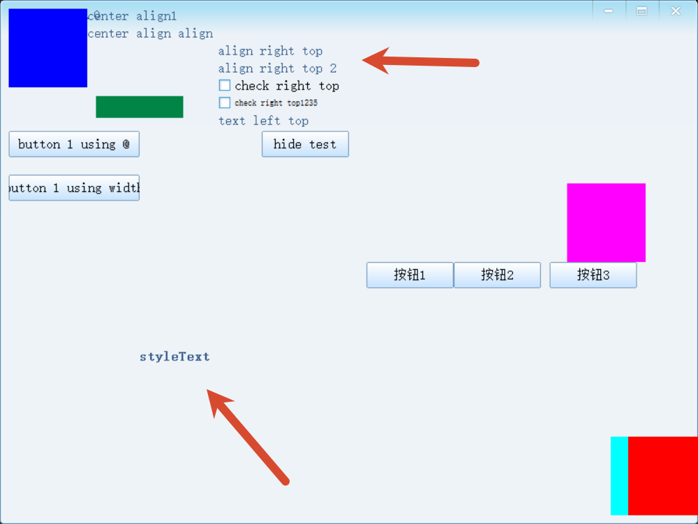

---
### 3.5 `<skin>`：全局皮肤对象

皮肤对象（`ISkinObj`）是 SOUI 的**绘图原语**，控件的外观都委托给皮肤来绘制。
SOUI 系统默认实现了 六种绘图类型。
- SSkinImgList(imglist), 
- SSkinImgFrame(imgframe),
- SSkinButton(button), 
- SSkinGradation(gradation), 
- SSkinScrollbar(scrollbar),
- SSkinMenuBorder(border)

#### `imglist`（图片列表皮肤）

最常用。把一张图片水平/垂直切成 N 份，每份对应一个控件状态（正常/悬停/按下/禁用）：


```xml
<imglist name="skin_btn_close" 
         src="imgx:png_btn_close"    <!-- 引用 uires.idx 中的图片 -->
         states="4"                  <!-- 子图数量 4 个状态：正常/悬停/按下/禁用 -->
         tile="0"                    <!-- 0=拉伸（默认），1=平铺 -->
         vertical="0"/>              <!-- 0=水平排列（默认），1=垂直排列 -->
```

状态顺序（`states=4` 时）：`Normal → Hover → PushDown → Disable`

`uires.idx` 添加skin需要用到的img资源
```xml

	<file name="btn_round_1" path="image\btn_round_1.png"/>
</IMG>
```

`init.xml` 添加 skin 相关配置
```xml
<skin> <!--注意这里是 skin 不是 skins ，doc文件夹下的官方文档中此处有错-->
	<imglist name="skin_btn_round" src="IMG:btn_round_1" states="4" tile="0" vertical="0"/>
</skin>
```

`layoutTest.xml` 控件中使用相关skin
```xml
<window pos ="|20, |0, @90, @90" layout="hbox">
		<button size="100,30" skin="skin_btn_round">按钮1</button> <!--套上imageList skin-->
		<button size="100,30" extend_left="0">按钮2</button>
		<button size="100,30" extend_left="10">按钮3</button>
</window>
```

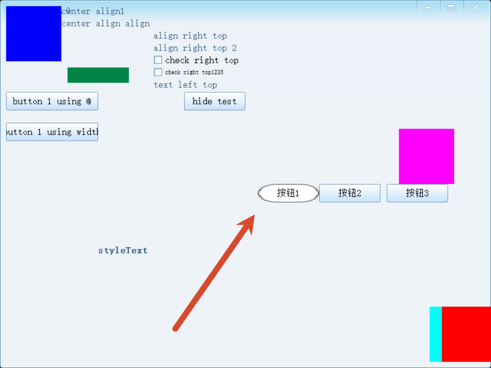


#### `imgframe`（九宫格皮肤）

继承自 `imglist`，在其基础上增加九宫格拉伸控制，适合尺寸可变的背景：

`init.xml`
```xml
<imgframe name="skin_btn_round_imgframe"
		  src="IMG:btn_round_1"
		  states="4" tile="0" vertical="0"
		  left="10" top="10" right="10" bottom="10"/>
```

`layoutTest.xml`
```xml 
<button size="100,30" extend_left="0" skin="skin_btn_round_imgframe">按钮2</button>
</window>
```

九宫格原理：四角固定不缩放，四边单方向缩放，中间双向缩放。
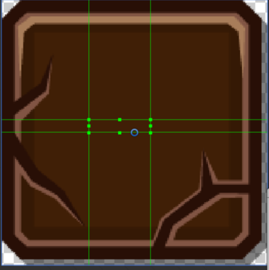
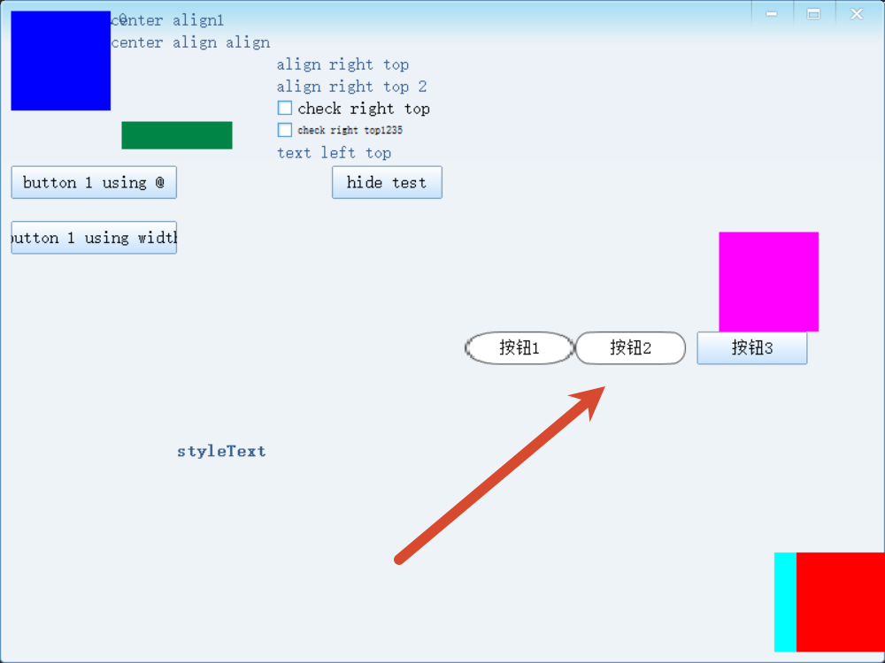


#### `button`（渐变按钮皮肤）

纯色渐变，不需要图片资源：

`init.xml`
```xml
<button name="skin_my_btn"
        colorBorder="#005564"
        colorUp="#546315"      colorDown="#CCCCCC"       <!-- 正常状态：从上到下渐变 -->
        colorUpHover="#FFFFFF" colorDownHover="#DDDDDD"  <!-- 悬停状态 -->
        colorUpPush="#BBBBBB"  colorDownPush="#999999"   <!-- 按下状态 -->
        colorUpDisable="#F0F0F0" colorDownDisable="#E0E0E0"/> <!-- 禁用状态 -->
```
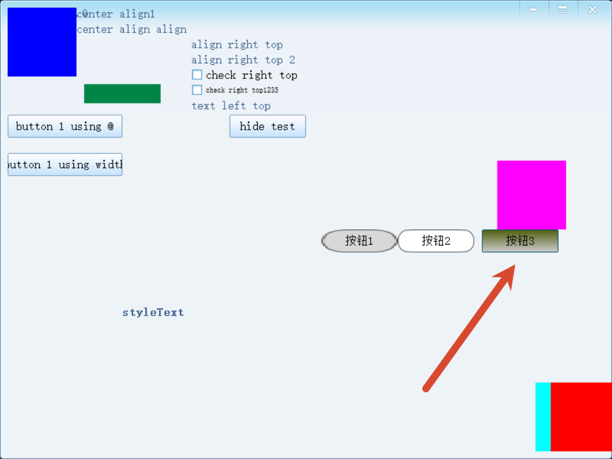

`layoutTest.xml`
```xml 
<button size="100,30" extend_left="10" skin="skin_my_btn">按钮3</button>
```
#### `gradation`（渐变背景皮肤）

简单的背景渐变，只有两色：

`init.xml`
```xml
<gradation name="skin_header_bg"
           colorFrom="#4A90D9"
           colorTo="#2065B0"
           vertical="1"/>   <!-- 0=水平渐变，1=垂直渐变 -->
```

`layoutTest.xml`
```xml 
<window pos ="sib.left@999:100, sib.bottom@999:10, @100, @25" colorBkgnd="#008546" skin="skin_header_bg">
</window>
```
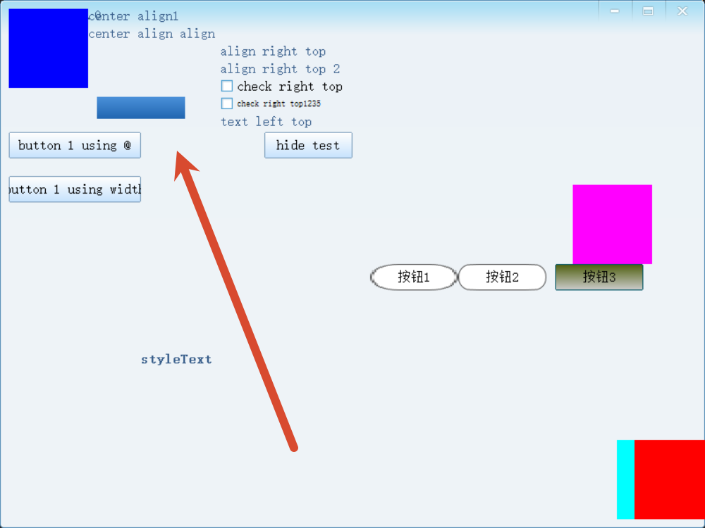

#### `scrollbar`（滚动条皮肤）

专门给滚动条用，派生自 `imglist`，有自己独立的切片规则：

```xml
<scrollbar name="skin_scrollbar"
           src="imgx:png_vscroll"
           margin="8"
           hasGripper="0"    <!-- 滑块上是否有中间的抓手图 -->
           hasInactive="0"/> <!-- 是否有禁用态（增加一行网格） -->
```

图片规格：无 Gripper 无 Inactive = 8×3 网格；有 Gripper 则 X+1 列；有 Inactive 则 Y+1 行。


## 四、`IResProvider`：资源提供者（在程序中从哪里加载）

SOUI 内置三种加载方式，通过 `CreateResProvider()` 创建：

| 类型常量 | 实现类 | 加载来源 | 适用场景 |
|---------|--------|---------|---------|
| `RES_FILE` | `SResProviderFiles` | 文件夹 | 开发调试 |
| `RES_PE` | `SResProviderPE` | EXE/DLL 资源段 | 发布单文件程序 |
| `RES_ZIP`（扩展） | `SResProviderZIP` | ZIP 压缩包 | 资源打包发布 |

**三种方式的代码：**

```cpp
// 方式1：从文件夹加载（开发期常用）
CreateResProvider(RES_FILE, (IObjRef**)&pResProvider);
pResProvider->Init((LPARAM)_T("uires"), 0);  // "uires" 是文件夹名

// 方式2：从 EXE 自身资源段加载
CreateResProvider(RES_PE, (IObjRef**)&pResProvider);
pResProvider->Init((WPARAM)hInstance, 0);

// 方式3：从 ZIP 包加载（需要额外组件）
pComMgr->CreateResProvider_ZIP((IObjRef**)&pResProvider);
ZIPRES_PARAM param;
param.ZipFile(pRenderFactory, _T("uires.zip"), "souizip");
pResProvider->Init((WPARAM)&param, 0);
```

`AddResProvider` 可**多次调用**（叠加多个资源包），采用**后进先查**策略（后加的优先级高，可实现"皮肤覆盖"）。

`程序启动初始化时一次性配置好的，写在 _tWinMain 里，之后整个程序运行期间基本就不管它了。`

---

## 五、系统资源 vs 用户资源

SOUI 资源分为**两部分**：

### 5.1 系统资源（`soui-sys-resource.dll`）

内置了所有标准控件必须的皮肤，以 `_skin.sys.xxx` 命名，比如：

| 系统皮肤名 | 用于 |
|-----------|------|
| `_skin.sys.wnd.bkgnd` | 窗口背景 |
| `_skin.sys.btn.close` | 关闭按钮 |
| `_skin.sys.btn.minimize` | 最小化按钮 |
| `_skin.sys.btn.maximize` | 最大化按钮 |
| `_skin.sys.btn.restore` | 还原按钮 |
| `_skin.sys.btn.normal` | 普通按钮 |
| `_skin.sys.checkbox` | 复选框 |
| `_skin.sys.radio` | 单选框 |
| `_skin.sys.scrollbar` | 滚动条 |
| `_skin.sys.border` | 边框 |
| `_skin.sys.prog.bar` | 进度条 |
| `_skin.sys.slider.thumb` | 滑块 |
| `_skin.sys.tree.toggle` | 树展开图标 |
| `_skin.sys.tab.page` | Tab 页签 |

加载方式：

```cpp
HMODULE hSysResource = LoadLibrary(SYS_NAMED_RESOURCE);  // "soui-sys-resourced.dll"
if (hSysResource) {
    CAutoRefPtr<IResProvider> sysSesProvider;
    CreateResProvider(RES_PE, (IObjRef**)&sysSesProvider);
    sysSesProvider->Init((WPARAM)hSysResource, 0);
    theApp->LoadSystemNamedResource(sysSesProvider);  // 注意是LoadSystemNamedResource
}
```
`也是写在 _tWinMain 里，最小demo中已经配好了`

### 5.2 用户资源

在 `uires.idx` 里自定义的一切皆为用户资源，命名不要以 `_skin.sys` 开头（避免冲突）。

---

## 六、局部皮肤 & 样式（窗口内定义）

除了 `init.xml` 里的全局皮肤/样式，也可以在**单个布局 XML 的 `<SOUI>` 节点内**定义局部的：

```xml
<SOUI name="myWnd" ...>
    <!-- 局部皮肤，只在本窗口有效，窗口销毁后释放 -->
    <skin>
        <imglist name="skin_local_btn" src="imgx:png_local" states="4"/>
    </skin>
    <!-- 局部样式 -->
    <style>
        <class name="local_style" colorText="#FF6600"/>
    </style>
    <root>
        ...
    </root>
</SOUI>
```

注意：`include` 引入的子布局**不能**包含局部 `skin`/`style`。

---

## 七、整体流程

```
程序启动
  ↓
CreateResProvider(RES_FILE)  →  IResProvider（指向 uires/ 文件夹）
  ↓
theApp->AddResProvider()     →  注册到 SApplication
  ↓
加载系统资源 DLL              →  theApp->LoadSystemNamedResource()
  ↓
theApp->Init("xml_init")     →  解析 UIDEF，注册全局 font/string/skin/style/objattr
  ↓
SHostWnd("LAYOUT:XML_MAINWND") →  按需从资源里查找布局 XML，解析控件树
  ↓
控件需要皮肤时                →  按名查找已注册的 ISkinObj，调用 Draw()
```

这套体系的核心思路是：**用 `type:name` 二元组唯一标识一份资源，`IResProvider` 负责从不同介质（文件/PE/ZIP）拿到数据，`ISkinObj` 把图片数据变成可绘制的皮肤对象，布局 XML 通过名称引用皮肤/样式，做到数据与外观分离。**


## 事件

SOUI 事件系统与传统 Win32 的 `WM_COMMAND`/`WM_NOTIFY` 机制完全不同，是一套基于控件树**向上冒泡**的面向对象事件体系。

### 核心概念

| 概念 | 说明 |
|------|------|
| `EventSet` | 每个控件都拥有一个事件集，控件状态变化时通过 `FireEvent()` 发射事件对象 |
| 事件冒泡 | 事件从发生控件出发，沿控件树向上传递，直到被某一层消费（`handled > 0`）或到达宿主 |
| `_HandleEvent` | `SHostWnd` 的核心虚函数，EVENT_MAP 宏就是在重载这个函数 |
| `EventArgs` | <span style="color:#ff7700;"> 事件参数基类（SOUI 2.x 原始命名为 `SOUI::EventArgs`，4.x 起改名为 `SEvtArgs`，用法相同） </span> |

### 两种响应方式
| 方式 | 适用场景 | 特点 |
|------|---------|------|
| **EVENT_MAP 映射表** | 固定控件、编译期确定 | 风格类似 MFC/WTL，集中管理，可读性好；`EVENT_MAP_END` 未匹配时自动交给基类 |
| **subscribeEvent 订阅** | 动态创建控件、Lua 脚本 | 运行期绑定，可随时取消；是 **Lua 脚本响应控件事件的唯一方式** |

### 最简事件响应流程

```cpp
// 1. XML 中为控件命名
// <button name="btn_ok">确定</button>

// 2. 在宿主类 protected 区声明映射表 + 处理函数
void OnBtnOk()
{
    // 处理点击逻辑
}

EVENT_MAP_BEGIN()
    EVENT_NAME_COMMAND(L"btn_ok", OnBtnOk)   // name 匹配 + EVT_CMD
EVENT_MAP_END()
```

---

## SOUI 事件系统详解

SOUI 的事件系统是 DirectUI 框架中控件与宿主之间通信的核心机制，完全不同于传统 Win32 的 `WM_COMMAND`/`WM_NOTIFY`。

---

### 一、整体架构

```
控件（SButton/SListCtrl 等）
    ↓ 产生事件（FireEvent）
EventSet（每个控件都有一个）
    ↓ 冒泡传递（bubbleUp = true）
宿主窗口（SHostWnd）
    ↓ _HandleEvent() 分发
EVENT_MAP 映射表 / subscribeEvent 订阅
```

控件发出事件时，事件对象会沿控件树**向上冒泡**，直到被某一层消费（`handled++`）或到达宿主窗口。

---

### 二、事件冒泡（Bubble Up）

事件从触发控件出发，一层一层往上传递给父控件，直到被处理或传到宿主窗口。
EVENT_MAP就是在宿主窗口重载 `_HandleEvent()` 来统一接收冒泡上来的事件。
所有的事件都会冒泡到宿主窗口，**不需要**在每个子控件上都写事件处理逻辑，避免重复代码。

#### 冒泡的用途：统一处理动态列表控件

比如列表每一行都有一个删除按钮，名字相同都叫 `btn_del`：

```
SListView
  └── ItemPanel（第1行）
        ├── SText "文件A"
        └── SButton name="btn_del"
  └── ItemPanel（第2行）
        ├── SText "文件B"
        └── SButton name="btn_del"
```

不管哪行的按钮被点击，事件都会冒泡到宿主窗口，只需在顶层写**一次**处理：

```cpp
EVENT_MAP_BEGIN()
    EVENT_NAME_COMMAND(L"btn_del", OnBtnDel)  // 不管哪行的按钮，都冒泡到这里
EVENT_MAP_END()

void OnBtnDel(EventArgs* pEvt)
{
    SWindow* pBtn  = sobj_cast<SWindow>(pEvt->sender);
    SWindow* pItem = pBtn->GetParent(); // 就是所在的那一行
    // 然后删除这一行的数据
}
```

#### 何时阻断冒泡

子控件和父控件对同一事件都有响应逻辑，但不想两个都触发时，在子控件处理完后设 `bubbleUp = FALSE`。

**典型场景：卡片列表，点击整张卡片 = 选中，点击卡片内的"收藏"按钮 = 收藏（不应同时触发选中）**

```
ItemPanel（整张卡片）← 监听点击 → 选中这行
  ├── SText "文件A"
  └── SButton name="btn_fav"  ← 点击 → 收藏，但不应该同时触发"选中"
```

```cpp
bool OnBtnFav(EventArgs* pEvt)
{
    DoFavorite();           // 执行收藏逻辑
    pEvt->bubbleUp = FALSE; // 阻断，不再冒泡到 ItemPanel 的选中逻辑
    return true;
}
```

其他常见需要阻断的情况：

| 场景 | 原因 |
|------|------|
| 弹出层内的按钮点击 | 不想同时触发弹出层背景的关闭逻辑 |
| 输入框内按回车 | 自己处理了提交，不想冒泡触发外层的默认行为 |
| 右键菜单已弹出 | 阻止右键事件继续往上，避免父级也弹一个菜单 |

---

### 三、事件参数基类 `SEvtArgs`

所有事件的参数类都继承自 `SEvtArgs`：

| 字段 | 类型 | 说明 |
|------|------|------|
| `sender` | `IObject*` | 发出事件的控件对象 |
| `idFrom` | `int` | 发送者的 `id` 属性 |
| `nameFrom` | `LPCWSTR` | 发送者的 `name` 属性 |
| `handled` | `UINT` | 处理计数，`> 0` 表示已处理 |
| `bubbleUp` | `BOOL` | 是否继续向父级冒泡 |

处理函数中可通过 `pEvt->sender` 拿到原始控件指针，`pEvt->idFrom` / `pEvt->nameFrom` 做判断。

---

### 四、响应事件的两种方式

两种方式的区别体现在两个维度，**挂载位置**与**绑定时机**：

| 维度 | EVENT_MAP | subscribeEvent |
|------|-----------|----------------|
| 挂载位置 | 类级别，只能挂在有类定义的地方（如 `SHostWnd` 派生类） | 控件实例级别，可挂到任意控件对象上 |
| 能挂中间层控件吗 | **不能**（无法在运行时挂到某个 SPanel 实例） | **可以** |
| 能阻断冒泡吗 | 不行（事件到达这里已经是冒泡终点） | 可以，在回调里设 `bubbleUp = FALSE` |
| 编写时机 | 编译期 | 运行期 |

> 所以：想在**中间层控件**（如某个 Panel）上拦截子控件的事件，或者需要**阻断冒泡**防止上层误触发，必须用 `subscribeEvent`。EVENT_MAP 只适合在顶层宿主窗口统一收取所有冒上来的事件。

---

#### 方式 1：EVENT_MAP 事件映射表（静态、编译期）

在 `SHostWnd` 派生类的 `protected` 区域声明，类似 MFC 消息映射：

```cpp
EVENT_MAP_BEGIN()
    EVENT_ID_COMMAND(SOUI::R.id.btn_ok,    OnBtnOk)      // 按 id 匹配 EVT_CMD
    EVENT_NAME_COMMAND(L"btn_close",        OnBtnClose)   // 按 name 匹配 EVT_CMD
    EVENT_NAME_CONTEXTMENU(L"edit_input",   OnEditMenu)   // 右键菜单
	// 用法场景：你想自定义某个输入框、列表等控件的右键菜单，而不是用系统默认菜单时。
    EVENT_HANDLER(EVT_TAB_SELCHANGED,       OnTabChanged) // 任何控件触发事件 by 事件ID
	EVENT_NAME_HANDLER(L"btn_msgbox", EVT_MOUSE_LEAVE, OnBtnLeave) // 任何鼠标离开 btn_msgbox 的事件
EVENT_MAP_END()
```

`EVENT_MAP_BEGIN/END` 展开后就是 `_HandleEvent(SEvtArgs*)` 函数的实现，内部按顺序逐条匹配，匹配到则调用处理函数并返回 `TRUE`，未匹配则交给 `__super::_HandleEvent`。

```c++
virtual BOOL _HandleEvent(SEvtArgs* pEvt)
{
    UINT uCode = pEvt->GetID();

    // EVENT_NAME_COMMAND(L"btn_save", OnSave) 展开成：
    if (pEvt->nameFrom == L"btn_save" && uCode == EVT_CMD)
    { OnSave(); return TRUE; }

    // EVENT_NAME_COMMAND(L"btn_delete", OnDelete) 展开成：
    if (pEvt->nameFrom == L"btn_delete" && uCode == EVT_CMD)
    { OnDelete(); return TRUE; }

    // EVENT_MAP_END 展开成：
    return __super::_HandleEvent(pEvt);  // 没匹配到，交给基类
}
```

```c++
void OnBtnMsgBox()
{
	CLayoutTestWnd* pWnd = new CLayoutTestWnd();
	pWnd->Create(m_hWnd, 0, 0, 400, 300);  // 父窗口是当前窗口的 HWND
	pWnd->CenterWindow(m_hWnd);
	pWnd->ShowWindow(SW_SHOWNORMAL);
}
EVENT_MAP_BEGIN()
EVENT_NAME_COMMAND(L"btn_msgbox", OnBtnMsgBox)
EVENT_MAP_END()
```
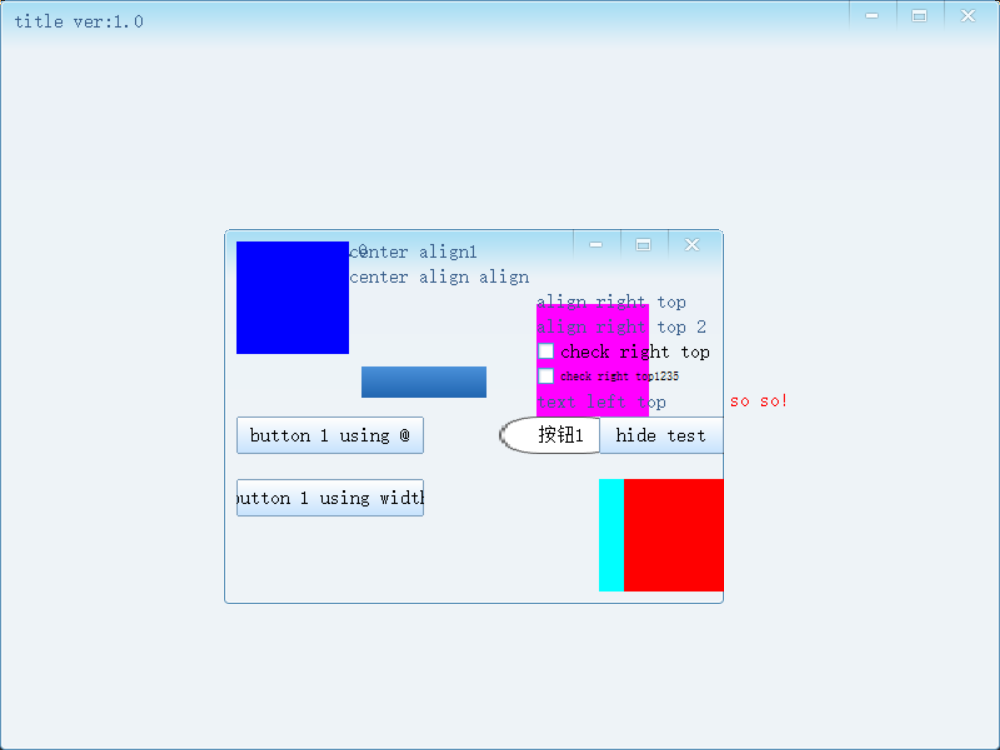

常用匹配宏：

| 宏 | 匹配条件 |
|----|---------|
| `EVENT_ID_COMMAND(id, fn)` | `sender->id == id` 且事件是 `EVT_CMD` |
| `EVENT_NAME_COMMAND(name, fn)` | `sender->name == name` 且事件是 `EVT_CMD` |
| `EVENT_ID_HANDLER(id, evtId, fn)` | 按 id + 任意事件类型 |
| `EVENT_NAME_HANDLER(name, evtId, fn)` | 按 name + 任意事件类型 |
| `EVENT_HANDLER(evtId, fn)` | 仅按事件类型匹配（所有同类事件都走） |
| `EVENT_NAME_CONTEXTMENU(name, fn)` | `EVT_CTXMENU` 右键菜单 |

#### 方式 2：subscribeEvent 事件订阅（动态、运行期）

适合运行时动态创建的控件，或需要在非宿主类中处理事件，也就是说在冒泡链中间需要将某个事件拦截处理的情况。

```cpp
// 向表头订阅点击事件
SListCtrl *pList = FindChildByName2<SListCtrl>(L"lc_test");
SWindow   *pHeader = pList->GetWindow(GSW_FIRSTCHILD);
pHeader->GetEventSet()->subscribeEvent(
    EVT_HEADER_CLICK,
    Subscriber(&CMainDlg::OnListHeaderClick, this)
);

// 处理函数（注意返回 bool）
bool CMainDlg::OnListHeaderClick(EventArgs *pEvtBase)
{
    EventHeaderClick *pEvt = (EventHeaderClick*)pEvtBase;
    int iClickedCol = pEvt->iItem;
    // ...
    return true; // true = 已处理，停止冒泡
}
```

也可以用 lambda：

```cpp
pCtrl->GetEventSet()->subscribeEvent(EVT_CMD, [](EventArgs* p) -> bool {
    // ...
    return true;
});
```

---

### 五、内置事件类型全览

> 下表主要参考 soui4，来源：[soui4 SEvents.h](https://github.com/soui4/soui)。  
> SOUI **2.x** 中的常用事件（`EVT_CMD`、`EVT_TAB_SELCHANGED`、`EVT_LB_SELCHANGED`、`EVT_HEADER_CLICK` 等）命名基本一致；  
> `EVT_MOUSE_MOVE`、`EVT_KEYDOWN`、`EVT_KEYUP`、`EVT_CHAR` 等底层输入事件在 2.x 中**不一定存在**，实际使用请以项目 include 目录下的头文件为准。

#### 通用 / 基础窗口事件

| 事件ID | 事件类 | 关键字段 | 说明 |
|--------|--------|---------|------|
| `EVT_CMD` | `EventCmd` | — | 按钮点击等命令事件（最常用）|
| `EVT_CTXMENU` | `EventCtxMenu` | `pt`, `bCancel` | 右键菜单请求 |
| `EVT_SETFOCUS` | `EventSetFocus` | `wndOld` | 获得焦点 |
| `EVT_KILLFOCUS` | `EventKillFocus` | `wndFocus` | 失去焦点 |
| `EVT_CREATE` | `EventSwndCreate` | — | 控件创建完成 |
| `EVT_DESTROY` | `EventSwndDestroy` | — | 控件销毁 |
| `EVT_SIZE` | `EventSwndSize` | `szWnd` | 尺寸变化 |
| `EVT_POS` | `EventSwndPos` | `rcWnd` | 位置变化 |
| `EVT_VISIBLECHANGED` | `EventSwndVisibleChanged` | `bVisible` | 可见性变化 |
| `EVT_STATECHANGED` | `EventSwndStateChanged` | `dwOldState`, `dwNewState` | 状态变化（hover/press等）|
| `EVT_MOUSE_CLICK` | `EventMouseClick` | `pt`, `clickId` | 鼠标点击（含左/右/中/双击）|
| `EVT_MOUSE_HOVER` | `EventSwndMouseHover` | — | 鼠标悬停 |
| `EVT_MOUSE_LEAVE` | `EventSwndMouseLeave` | — | 鼠标离开 |
| `EVT_MOUSE_MOVE` | `EventSwndMouseMove` | `pt`, `nFlags` | 鼠标移动 |
| `EVT_KEYDOWN` | `EventKeyDown` | `nChar`, `nFlags` | 键盘按下 |
| `EVT_KEYUP` | `EventKeyUp` | `nChar`, `nFlags` | 键盘释放 |
| `EVT_CHAR` | `EventChar` | `nChar` | 字符输入 |
| `EVT_SCROLL` | `EventScroll` | `nSbCode`, `nPos`, `bVertical` | 滚动条 |
| `EVT_TIMER` | `EventTimer` | `uID`, `uData` | 定时器触发 |

#### Tab 控件（`STabCtrl`）

| 事件ID | 事件类 | 关键字段 |
|--------|--------|---------|
| `EVT_TAB_SELCHANGING` | `EventTabSelChanging` | `uOldSel`, `uNewSel`, `bCancel`（可拦截）|
| `EVT_TAB_SELCHANGED` | `EventTabSelChanged` | `uOldSel`, `uNewSel` |
| `EVT_TAB_ITEMHOVER` | `EventTabItemHover` | `iHover` |
| `EVT_TAB_ITEMLEAVE` | `EventTabItemLeave` | `iLeave` |

#### 列表框（`SListBox`）

| 事件ID | 事件类 | 关键字段 |
|--------|--------|---------|
| `EVT_LB_SELCHANGING` | `EventLBSelChanging` | `nNewSel`, `nOldSel`, `bCancel` |
| `EVT_LB_SELCHANGED` | `EventLBSelChanged` | `nNewSel`, `nOldSel` |
| `EVT_LB_DBCLICK` | `EventLBDbClick` | `nCurSel`, `pt` |
| `EVT_LB_RCLICK` | `EventLBRClick` | `nCurSel`, `pt` |

#### 列表控件（`SListCtrl`，带表头）

| 事件ID | 事件类 | 关键字段 |
|--------|--------|---------|
| `EVT_LC_SELCHANGING` | `EventLCSelChanging` | `nNewSel`, `nOldSel`, `bCancel` |
| `EVT_LC_SELCHANGED` | `EventLCSelChanged` | `nNewSel`, `nOldSel` |
| `EVT_LC_DBCLICK` | `EventLCDbClick` | `nCurSel`, `pt` |
| `EVT_LC_RCLICK` | `EventLCRClick` | `nCurSel`, `pt` |
| `EVT_LC_ITEMDELETED` | `EventLCItemDeleted` | `nItem`, `dwData` |
| `EVT_HEADER_CLICK` | `EventHeaderClick` | `iItem`（列索引）|
| `EVT_HEADER_ITEMCHANGED` | `EventHeaderItemChanged` | `iItem`, `nWidth` |

#### 树控件（`STreeCtrl`）

| 事件ID | 事件类 | 关键字段 |
|--------|--------|---------|
| `EVT_TC_SELCHANGING` | `EventTCSelChanging` | `hOldSel`, `hNewSel`, `bCancel` |
| `EVT_TC_SELCHANGED` | `EventTCSelChanged` | `hOldSel`, `hNewSel` |
| `EVT_TC_EXPAND` | `EventTCExpand` | `hItem`, `bCollapsed` |
| `EVT_TC_CHECKSTATE` | `EventTCCheckState` | `hItem`, `uCheckState` |
| `EVT_TC_DBCLICK` | `EventTCDbClick` | `hItem`, `bCancel` |
| `EVT_TC_RCLICK` | `EventTCRClick` | `pt`, `hItem` |

#### 组合框（`SComboBox`）

| 事件ID | 事件类 | 关键字段 |
|--------|--------|---------|
| `EVT_CB_SELCHANGE` | `EventCBSelChange` | `nCurSel` |
| `EVT_CB_DROPDOWN` | `EventCBDropdown` | `pDropDown`, `strInput` |
| `EVT_CB_BEFORE_CLOSEUP` | `EventCBBeforeCloseUp` | `bCloseBlock`（可阻止关闭）|

#### 滑块（`SSliderBar`）

| 事件ID | 事件类 | 关键字段 |
|--------|--------|---------|
| `EVT_SLIDER_POS` | `EventSliderPos` | `nPos`, `action`（DOWN/MOVING/UP）|

#### ItemPanel 相关（列表视图中的子面板）

| 事件ID | 说明 |
|--------|------|
| `EVT_ITEMPANEL_CLICK` | 面板左键单击 |
| `EVT_ITEMPANEL_RCLICK` | 面板右键单击 |
| `EVT_ITEMPANEL_DBCLICK` | 面板双击 |
| `EVT_ITEMPANEL_HOVER` | 面板悬停 |
| `EVT_ITEMPANEL_LEAVE` | 面板离开 |

这类事件通过 `EVT_OFPANEL` 包装后冒泡，通常在 `getView` 中用 `subscribeEvent` 订阅。

---

### 六、事件分发 CHAIN_EVENT_MAP_MEMBER
当 UI 有多个 Tab 页、每页逻辑独立时，可以将事件分发到不同的 handler 对象，避免主窗口的事件映射表过于臃肿：

```cpp
CPageOneHandler m_pageOneHandler;  // 第一个页面的事件处理器
CPageTwoHandler m_pageTwoHandler;  // 第二个页面的事件处理器

// 主窗口的事件映射表
EVENT_MAP_BEGIN()
    EVENT_NAME_COMMAND(L"btn_close", OnClose)
    CHAIN_EVENT_MAP_MEMBER(m_pageOneHandler)   // 转发给第一个页面的处理器
    CHAIN_EVENT_MAP_MEMBER(m_pageTwoHandler)   // 转发给第二个页面的处理器
EVENT_MAP_END()
```

子处理器类（不继承 `SHostWnd`，可以是任意类）：

```cpp
class CPageOneHandler {
public:
    void OnInit(SWindow* pRoot) { m_pRoot = pRoot; }
private:
    void OnBtnSave() { /* ... */ }
    void OnBtnLoad() { /* ... */ }

    EVENT_MAP_BEGIN()
        EVENT_CHECK_SENDER_ROOT(m_pRoot)  // 只处理本页面内的事件
        EVENT_NAME_COMMAND(L"btn_save", OnBtnSave)
        EVENT_NAME_COMMAND(L"btn_load", OnBtnLoad)
    EVENT_MAP_BREAK()  // 注意：子处理器用 BREAK 而非 END

    SWindow* m_pRoot = nullptr;
};
```
```c++
class CLBSectionModel 
{
public:
	CLBSectionModel(LbKnCanvas*);
	~CLBSectionModel(void);
public:
	void ShowView(const templ_guid_t & guid);
	void ShowView(SPLbCompTempl& pCompTempl);
	void OnSave();
	void OnInit(SOUI::SWindow *pRoot, LbKnCanvas*);
	//@brief 全部纵筋
	void OnBtnAllSteel();
	//@brief 转角
	void OnBtnConnerSteel();
	//@brief 中部筋
	void OnBtnCenterSteel();
	//@brief 任意纵筋
	void OnBtnAnySteel();
	//@brief 箍筋
	void OnBtnGujinSteel();
	//@brief 转为角筋
	void OnBtnToConnerSteel();
	//@brief 纵筋对齐
	void OnBtnAlginSteel();
	//@brief 拉筋
	void OnBtnLajinSteel();
	//@brief 分布筋
	void OnBtnFenbujinSteel();

	void OnBtnSectionCopy();//复制断面
	void OnBtnSectionSet();//设置
	void OnBtnQuicklyCreateSections();//快速创建
private:
	bool CheckAndDrawSectionPoly();
public:
	EVENT_MAP_BEGIN()
		EVENT_NAME_COMMAND(L"btn_save", OnSave)
		EVENT_ID_COMMAND(SOUI::R.id.btn_section_all_steel, OnBtnAllSteel)
		EVENT_ID_COMMAND(SOUI::R.id.btn_section_conner_steel, OnBtnConnerSteel)
		EVENT_ID_COMMAND(SOUI::R.id.btn_section_center_steel, OnBtnCenterSteel)
		EVENT_ID_COMMAND(SOUI::R.id.btn_section_any_steel, OnBtnAnySteel)
		EVENT_ID_COMMAND(SOUI::R.id.btn_section_gujin_steel, OnBtnGujinSteel)
		EVENT_ID_COMMAND(SOUI::R.id.btn_section_to_conner_steel, OnBtnToConnerSteel)
		EVENT_ID_COMMAND(SOUI::R.id.btn_section_algin_steel, OnBtnAlginSteel)
		EVENT_ID_COMMAND(SOUI::R.id.btn_section_CopySection, OnBtnSectionCopy)
		EVENT_ID_COMMAND(SOUI::R.id.btn_section_Options, OnBtnSectionSet)
		EVENT_ID_COMMAND(SOUI::R.id.btn_section_QuicklyCreateSections, OnBtnQuicklyCreateSections)
	EVENT_MAP_BREAK()

private:
	SOUI::SWindow *m_pRoot;
	LbKnCanvas* m_pKnCanvas;
	templ_guid_t m_strTemplGuid;
	SPLbSection m_spCurShowSection;
};
```

`EVENT_MAP_END` vs `EVENT_MAP_BREAK`：
- `EVENT_MAP_END`：未匹配时调用 `__super::_HandleEvent`（用于有基类的场景）
- `EVENT_MAP_BREAK`：直接 `return FALSE`（用于独立 handler 类）

- `EVENT_MAP_END`：如果事件没有被当前类的 EVENT_MAP 处理，就会把事件继续交给父类（基类）的 `_HandleEvent` 方法处理。适用于你的类有继承体系（比如继承自 SHostWnd），这样父类还能继续处理未被子类处理的事件。

- `EVENT_MAP_BREAK`：如果事件没有被当前类的 EVENT_MAP 处理，直接返回 `FALSE`，不再往上交给父类。适用于“独立事件处理器”这种没有基类、只想自己处理事件的场景。

简单记：
- 有继承链、希望父类还能处理 → 用 `EVENT_MAP_END`
- 只想本类处理，没父类可交 → 用 `EVENT_MAP_BREAK`

---

### 七、可拦截事件（bCancel）

部分 `*Changing` 类事件（切换前触发）支持取消操作：

```cpp
bool OnTabSelChanging(EventArgs* pBase) {
    EventTabSelChanging* pEvt = (EventTabSelChanging*)pBase;
    if (/* 不允许切换 */) {
        pEvt->bCancel = TRUE;  // 阻止切换
    }
    return true;
}
```

- `*Changing` 事件：指的是在某些操作“即将发生”时触发的事件，比如选项卡切换前（TabSelChanging）、列表项选择前（LbSelChanging）等。
- 可以通过设置 `bCancel` 字段来阻止后续操作。比如在选项卡切换、列表选择等事件中，可以在事件回调里根据条件设置 `bCancel = TRUE`，从而阻止切换或选择行为。
- 适用场景：如表单未保存、权限校验、数据校验等场合，阻止用户误操作。

#### 支持 `bCancel` 的事件：
- `EVT_TAB_SELCHANGING`：Tab 切换前
- `EVT_LB_SELCHANGING`：ListBox 选择前
- `EVT_LC_SELCHANGING`：ListCtrl 选择前
- `EVT_TV_SELCHANGING`：TreeView 选择前
- `EVT_TC_SELCHANGING`：TabCtrl 切换前
- `EVT_TC_DBCLICK`：TabCtrl 双击
- `EVT_CB_BEFORE_CLOSEUP`：ComboBox 下拉关闭前
- 其他部分“Changing”类事件

```cpp
// 以 Tab 切换为例
bool OnTabSelChanging(EventArgs* pBase) {
    EventTabSelChanging* pEvt = (EventTabSelChanging*)pBase;
    // 比如：当前内容未保存，阻止切换
    if (IsCurrentTabDirty()) {
        SMessageBox(NULL, L"请先保存当前内容！", L"提示", MB_OK | MB_ICONWARNING);
        pEvt->bCancel = TRUE;  // 阻止切换
    }
    return true;
}
```
**注意事项：**
- 只有“Changing”类事件才支持 `bCancel`，普通的“Changed”事件（如切换后）不支持。
- 设置 `bCancel` 后，UI 控件会自动阻止本次操作，无需额外处理。

---

### 八、自定义事件

给自定义控件添加事件：

```cpp
// 1. 在控件类中用 DEF_EVT_EXT 定义事件类
DEF_EVT_EXT(EventMyCustom, EVT_EXTERNAL_BEGIN + 1, {
    int nSomeData;
    BOOL bSomeFlag;
})

// 2. 控件类注册事件
class SMyControl : public SWindow {
    void OnInitFinish() {
        m_evtSet.addEvent(EVENTID(EventMyCustom));
    }
};

// 3. 控件内触发
EventMyCustom evt(this);
evt.nSomeData = 42;
FireEvent(evt);

// 4. 宿主订阅（subscribeEvent 或 EVENT_HANDLER）
pMyCtrl->GetEventSet()->subscribeEvent(
    EventMyCustom::EventID,
    Subscriber(&CMainDlg::OnMyCustomEvent, this)
);
```

自定义事件 ID 应从 `EVT_EXTERNAL_BEGIN`（10000000）开始，避免与内置事件冲突。
---

### 九、两种方式选择建议

| 场景 | 推荐方式 |
|------|---------|
| 按钮、菜单等固定控件的命令响应 | `EVENT_MAP` + `EVENT_NAME_COMMAND` |
| 运行时动态创建的控件 | `subscribeEvent` |
| 列表/树的选择变化、表头点击 | `subscribeEvent`（更清晰）|
| 多 Tab 大型界面解耦 | `CHAIN_EVENT_MAP_MEMBER` |
| Lua 脚本响应控件事件 | 只能用 `subscribeEvent` |
| **中间层控件需要响应子控件事件** | 只能用 `subscribeEvent`（EVENT_MAP 无法挂到控件实例） |
| **需要阻断冒泡，防止中间层误触发** | `subscribeEvent` + `pEvt->bubbleUp = FALSE` |


## 控件

SOUI 提供了一套完整的逻辑控件体系，所有控件都继承自 `SWindow`，以 XML 标签名映射到对应 C++ 类。

---

### 一、控件属性查询方法

查找一个控件支持哪些 XML 属性，官方推荐的方法（来源：[SOUI Wiki 第二十七篇](https://github.com/SOUI2/soui/wiki/%E7%AC%AC%E4%BA%8C%E5%8D%81%E4%B8%83%E7%AF%87%EF%BC%9ASOUI%E4%B8%AD%E6%8E%A7%E4%BB%B6%E5%B1%9E%E6%80%A7%E6%9F%A5%E8%AF%A2%E6%96%B9%E6%B3%95)）：

1. **查目标控件源码中的属性映射表** `SOUI_ATTRS_BEGIN() ... SOUI_ATTRS_END()`
2. **查基类的属性映射表**（大多数属性在 `SWindow` 的映射表里）
3. **查 `DefAttributeProc`**（有些属性不在映射表，在这个函数里手动处理，如 `SRichEdit` 的 `multiLines`、`password` 等）

属性映射宏说明：

| 宏 | 含义 |
|----|------|
| `ATTR_INT(name, member, bLoading)` | 整数属性，直接写入成员变量 |
| `ATTR_STRINGW(name, member, bLoading)` | 宽字符串属性 |
| `ATTR_SKIN(name, member, bLoading)` | 皮肤对象属性，自动从注册表查找 |
| `ATTR_CUSTOM(name, fn)` | 自定义处理函数 |
| `ATTR_CHAIN(m_style)` | 将剩余属性交给 `m_style`（样式对象）处理 |
| `ATTR_I18NSTRT(name, member, bLoading)` | 支持语言包翻译的字符串属性 |

---

### 二、`SWindow` 基类通用属性

所有控件都继承以下属性（来源：SOUI 源码 `SWindow::SOUI_ATTRS_BEGIN`）：

| XML 属性 | 类型 | 说明 |
|---------|------|------|
| `id` | int | 控件数字 ID，通过 `R.id.xxx` 引用 |
| `name` | string | 控件名称，通过 `name="xxx"` 引用，也用于生成 `R.id` |
| `skin` | skin名 | 控件背景/前景皮肤，引用已注册的 `ISkinObj` |
| `ncskin` | skin名 | 非客户区皮肤 |
| `class` | style名 | 引用 `init.xml` 中 `<style>` 定义的属性集合 |
| `data` | int | 用户自定义整数数据（`m_uData`） |
| `enable` | 0/1 | 控件是否启用（禁用时呈灰色且不响应鼠标） |
| `visible` / `show` | 0/1 | 是否可见（隐藏后仍占据布局空间） |
| `display` | 0/1 | 是否显示（`0`=隐藏且不占布局空间，类似 CSS `display:none`） |
| `pos` | 见布局章节 | 控件位置 |
| `offset` | x,y 倍数 | 在 `pos` 计算完后的额外偏移，以自身尺寸为单位 |
| `pos2type` | 枚举 | `offset` 的预设快捷值，9个锚点 |
| `tip` | string | 鼠标悬停 Tooltip 文字，支持 `@string/xxx` 引用 |
| `msgTransparent` | 0/1 | 消息穿透（鼠标事件不被该控件拦截） |
| `maxWidth` | int | 控件最大宽度（px） |
| `clipClient` | 0/1 | 是否裁剪子控件超出自身范围的部分 |
| `focusable` | 0/1 | 是否可获得键盘焦点 |
| `float` | 0/1 | 浮动控件（不参与普通布局流） |
| `alpha` | 0-255 | 控件透明度 |
| `cache` | 0/1 | 是否启用位图缓存（复杂控件可提升重绘性能） |
| `trackMouseEvent` | 0/1 | 是否追踪鼠标离开事件（`EVT_MOUSE_LEAVE` 需要此项为 1）|

#### Style 样式属性（通过 `ATTR_CHAIN(m_style)` 传入）

这些属性既可写在 XML 控件标签上，也可写在 `<style>` 里复用：

| 属性 | 说明 |
|------|------|
| `colorText` | 文字颜色，如 `#FF0000` |
| `colorBkgnd` | 背景填充色，如 `#FFFFFF` |
| `font` | 字体，格式 `face:微软雅黑,size:14,bold:1,italic:1` |
| `textMode` | 文字对齐，DT_* 标志组合（`25`=水平+垂直居中，`20`=水平居中顶对齐）|
| `margin-x` / `margin-y` | 水平/垂直内边距 |
| `cursor` | 鼠标样式，如 `hand` |
| `transParent` | 背景透明（`1`=不绘制背景色）|

---

### 三、控件速查表

| XML 标签 | C++ 类 | 说明 |
|---------|--------|------|
| `<window>` | `SWindow` | 通用容器/面板 |
| `<caption>` | `SWindow`（标题条语义）| 可拖动的标题栏区域 |
| `<text>` | `SStatic` | 静态文本 |
| `<button>` | `SButton` | 普通按钮（含 checkbox/radio 衍生）|
| `<imgbtn>` | `SImageButton` | 图片按钮 |
| `<check>` | `SCheckBox` | 复选框 |
| `<radio>` | `SRadioButton` | 单选框 |
| `<edit>` | `SEdit` | 单行输入框 |
| `<richedit>` | `SRichEdit` | 富文本编辑框（多行/密码等）|
| `<progress>` | `SProgress` | 进度条 |
| `<slider>` | `SSliderBar` | 滑动条 |
| `<combobox>` | `SComboBox` | 下拉组合框 |
| `<listbox>` | `SListBox` | 列表框 |
| `<listctrl>` | `SListCtrl` | 带表头的列表控件（类似 Win32 ListView Report 模式）|
| `<treectrl>` | `STreeCtrl` | 传统树形控件（数据与控件绑定）|
| `<treeview>` | `STreeView` | 高性能树形控件（数据与 UI 分离，需 Adapter）|
| `<tabctrl>` | `STabCtrl` | 标签页控件 |
| `<scrollview>` | `SScrollView` | 可滚动容器 |
| `<listview>` | `SListView` | 高性能列表（数据与 UI 分离，需 Adapter）|
| `<mclistview>` | `SMcListView` | 多列列表视图（Adapter 模式）|
| `<line>` | `SLine` | 分隔线 |
| `<gif>` | `SGifPlayer` | GIF 动画播放 |
| `<hotkey>` | `SHotKeyCtrl` | 热键控件 |
| `<spinedit>` | `SSpinButtonCtrl` | 数字微调框（含上下箭头）|
| `<header>` | `SHeaderCtrl` | 表头控件（通常由 `listctrl` 内部管理）|

---

### 四、各控件详解

#### 4.1 `<window>` — 通用容器

最基础的容器，无任何视觉效果，也无特有属性。常用于：
- 用 `colorBkgnd` 设置纯色背景区域
- 配合 `layout="hbox"/"vbox"` 做线性布局容器
- 作为命中测试区域（`msgTransparent="0"` 时可接收点击）

```xml
<window pos="0,0,-0,-0" colorBkgnd="#F0F0F0">
    <!-- 子控件 -->
</window>
```

---

#### 4.2 `<caption>` — 标题栏拖动区域

`<caption>` 本质是 `SWindow`，框架会对其内区域做"模拟标题栏"处理，允许用户通过拖拽来移动整个宿主窗口。

```xml
<caption pos="0,0,-0,30">
    <text pos="11,9">标题</text>
    <imgbtn name="btn_close" skin="_skin.sys.btn.close" pos="-45,0"/>
</caption>
```

> 注意：窗口可缩放（`resizable="1"`）需配合 `<SOUI>` 标签上的 `margin` 属性，`margin` 决定边缘拖拽检测区宽度，设为 0 则拖不动。

---

#### 4.3 `<text>` / `SStatic` — 静态文本

| 属性 | 说明 |
|------|------|
| `colorText` | 文字颜色 |
| `font` | 字体 |
| `textMode` | 对齐方式（DT_* 组合）|
| `multiLines` | 0/1，是否允许自动换行 |
| (内容) | 直接在标签体内写文字，或用 `@string/xxx` 引用字符串表 |

```xml
<text pos="10,10,200,30" colorText="#333333" textMode="25">Hello SOUI</text>
<text pos="10,40">@string/mainTitle</text>
```

---

#### 4.4 `<button>` / `SButton` — 按钮

| 属性 | 说明 |
|------|------|
| `skin` | 按钮皮肤（imglist/imgframe/button 类型均可）|
| `class` | 引用 style 样式 |
| `colorText` | 文字颜色 |
| `enable` | 0=禁用（自动呈现禁用态皮肤切片）|
| `animate` | 0/1，是否启用鼠标悬停动画 |
| (内容) | 按钮上显示的文字 |

```xml
<button name="btn_ok" pos="10,100,@80,@30" skin="skin_btn_round">确定</button>
<button class="normalbtn" pos="100,100,@80,@30">取消</button>
```

点击事件：`EVT_CMD`，在 `EVENT_MAP` 里用 `EVENT_NAME_COMMAND(L"btn_ok", OnOk)` 响应。

---

#### 4.5 `<imgbtn>` / `SImageButton` — 图片按钮

纯图片按钮，无文字渲染。常用于标题栏关闭/最大化/最小化等图标按钮。

| 属性 | 说明 |
|------|------|
| `skin` | imglist 皮肤（必须，提供各状态图片）|
| `animate` | 0/1，是否启用悬停动画 |
| `tip` | Tooltip 文字 |

```xml
<imgbtn name="btn_close" skin="_skin.sys.btn.close" pos="-45,0" tip="关闭" animate="1"/>
```

---

#### 4.6 `<check>` / `SCheckBox` — 复选框

| 属性 | 说明 |
|------|------|
| `skin` | 复选框图片皮肤（通常 2 或 4 状态：未选/已选/悬停/禁用）|
| `checked` | 0/1，初始选中状态 |
| `colorText` | 文字颜色 |
| (内容) | 复选框旁的文字 |

```xml
<check name="chk_option" pos="10,10,@120,@20" checked="1">启用选项</check>
```

代码中读写：
```cpp
SCheckBox* pChk = FindChildByName2<SCheckBox>(L"chk_option");
BOOL bChecked = pChk->IsChecked();
pChk->SetCheck(TRUE);
```

---

#### 4.7 `<radio>` / `SRadioButton` — 单选框

同一父容器下的 `<radio>` 自动组成互斥组（同一时刻只有一个选中）。

| 属性 | 说明 |
|------|------|
| `checked` | 0/1，初始选中状态 |
| `skin` | 单选框皮肤 |
| (内容) | 单选框旁文字 |

```xml
<radio name="radio_a" checked="1">选项A</radio>
<radio name="radio_b">选项B</radio>
```

---

#### 4.8 `<edit>` / `SEdit` — 单行输入框

| 属性 | 说明 |
|------|------|
| `transParent` | 0/1，背景透明（常设 1 配合父控件背景）|
| `margin-x` / `margin-y` | 文字与边缘的内边距 |
| `readOnly` | 0/1，只读 |
| `password` | 0/1，密码模式（显示 `*`）|
| `number` | 0/1，仅允许数字输入 |
| `cueText` | 未输入时的占位提示文字（Cue Banner）|
| `maxChar` | 最大可输入字符数 |

```xml
<edit name="edit_input" pos="10,10,200,30" transParent="1" cueText="请输入..." margin-x="4"/>
```

代码读写：
```cpp
SEdit* pEdit = FindChildByName2<SEdit>(L"edit_input");
SStringW str = pEdit->GetWindowText();
pEdit->SetWindowText(L"Hello");
```

---

#### 4.9 `<richedit>` / `SRichEdit` — 富文本编辑框

继承自 `SEdit`，支持多行、富文本格式、拖放等。属性通过 `DefAttributeProc` 处理（来源：SOUI 源码）：

| 属性 | 说明 |
|------|------|
| `multiLines` | 0/1，是否多行 |
| `readOnly` | 0/1，只读 |
| `hscrollBar` | 0/1，水平滚动条 |
| `vscrollBar` | 0/1，垂直滚动条 |
| `autoHscroll` | 0/1，自动水平滚动 |
| `autoVscroll` | 0/1，自动垂直滚动 |
| `password` | 0/1，密码模式 |
| `passwordChar` | 密码替换字符（单字符）|
| `number` | 0/1，仅数字 |
| `wantReturn` | 0/1，回车键插入换行（而非触发默认按钮）|
| `enableDragdrop` | 0/1，允许拖放 |
| `autoSel` | 0/1，获得焦点时自动全选 |

```xml
<richedit name="edit_note" pos="10,50,-10,-10"
          multiLines="1" vscrollBar="1" wantReturn="1"/>
```

---

#### 4.10 `<progress>` / `SProgress` — 进度条

| 属性 | 说明 |
|------|------|
| `skin` | 进度条皮肤（通常用 imglist 2 帧：背景+前景，或系统皮肤 `_skin.sys.prog.bar`）|
| `min` | 最小值（默认 0）|
| `max` | 最大值（默认 100）|
| `value` | 当前值 |
| `vertical` | 0/1，是否垂直方向 |
| `showPercent` | 0/1，是否显示百分比文字 |

```xml
<progress name="prog_load" pos="10,100,-10,120" min="0" max="100" value="60"
          skin="_skin.sys.prog.bar"/>
```

代码：
```cpp
SProgress* pProg = FindChildByName2<SProgress>(L"prog_load");
pProg->SetValue(80);
```

---

#### 4.11 `<slider>` / `SSliderBar` — 滑动条

| 属性 | 说明 |
|------|------|
| `skin` | 轨道皮肤 |
| `thumbSkin` | 滑块皮肤（`_skin.sys.slider.thumb`）|
| `min` / `max` / `value` | 范围和当前值 |
| `vertical` | 0/1，垂直方向 |
| `tickStep` | 每次 tick 的步长 |

```xml
<slider name="slider_vol" pos="10,10,-10,30"
        skin="_skin.sys.prog.bar" thumbSkin="_skin.sys.slider.thumb"
        min="0" max="100" value="50"/>
```

事件：`EVT_SLIDER_POS`，参数 `EventSliderPos::nPos`（当前值）、`action`（DOWN/MOVING/UP）。

---

#### 4.12 `<combobox>` / `SComboBox` — 下拉组合框

| 属性 | 说明 |
|------|------|
| `dropHeight` | 下拉列表高度（px）|
| `skin` | 整体皮肤 |
| `curSel` | 初始选中项（0 起始）|
| `enableFocus` | 0/1，是否可编辑（0=纯下拉，1=可输入过滤）|

XML 中预置选项（静态列表）：
```xml
<combobox name="cb_type" pos="10,10,150,30" dropHeight="120" curSel="0">
    <item>选项一</item>
    <item>选项二</item>
    <item>选项三</item>
</combobox>
```

代码动态操作：
```cpp
SComboBox* pCb = FindChildByName2<SComboBox>(L"cb_type");
pCb->AddString(L"新选项");
int nSel = pCb->GetCurSel();
SStringW strText;
pCb->GetLBText(nSel, strText);
```

事件：`EVT_CB_SELCHANGE`（选择变化）、`EVT_CB_DROPDOWN`（下拉展开）。

---

#### 4.13 `<listbox>` / `SListBox` — 列表框

单列列表，每项只有文字。

| 属性 | 说明 |
|------|------|
| `skin` | 列表背景皮肤 |
| `itemHeight` | 每行高度（px）|
| `multiSel` | 0/1，是否支持多选 |

代码：
```cpp
SListBox* pLb = FindChildByName2<SListBox>(L"lb_list");
pLb->AddString(L"项目1");
int nSel = pLb->GetCurSel();
```

事件：`EVT_LB_SELCHANGED`（选择变化）、`EVT_LB_DBCLICK`（双击）。

---

#### 4.14 `<listctrl>` / `SListCtrl` — 带表头列表

报表模式列表，带列头（`SHeaderCtrl`），类似 Win32 `ListView` 的 Report 模式。

| 属性 | 说明 |
|------|------|
| `skin` | 列表背景皮肤 |
| `headerHeight` | 表头高度 |
| `itemHeight` | 行高 |
| `gridLines` | 0/1，是否显示网格线 |
| `multiSel` | 0/1，多选 |

**列定义**（XML 内嵌 `<column>`）：
```xml
<listctrl name="lc_data" pos="0,0,-0,-0" headerHeight="24" itemHeight="22">
    <column width="100" colorText="#333333">名称</column>
    <column width="80">数量</column>
    <column width="120">备注</column>
</listctrl>
```

代码添加数据：
```cpp
SListCtrl* pLc = FindChildByName2<SListCtrl>(L"lc_data");
int nRow = pLc->InsertItem(0, L"项目A");
pLc->SetSubItem(nRow, 1, L"100");
pLc->SetSubItem(nRow, 2, L"备注内容");
```

事件：`EVT_LC_SELCHANGED`（选择变化）、`EVT_HEADER_CLICK`（表头列点击，用于排序）。

---

#### 4.15 `<treectrl>` / `STreeCtrl` — 传统树形控件

数据与控件绑定在一起，适合数据量不大的树结构。

| 属性 | 说明 |
|------|------|
| `skin` | 背景皮肤 |
| `toggleSkin` | 展开/折叠图标皮肤（`_skin.sys.tree.toggle`）|
| `checkSkin` | 复选框皮肤（若需要复选功能）|
| `itemHeight` | 行高 |
| `indent` | 子节点缩进宽度（px）|
| `hasCheckBox` | 0/1，是否带复选框 |
| `hasLines` | 0/1，是否画连接线 |
| `colorItemBkgnd` | 普通行背景色 |
| `colorItemSelBkgnd` | 选中行背景色 |
| `colorItemText` | 文字颜色 |
| `colorItemSelText` | 选中行文字颜色 |

```xml
<treectrl name="tc_tree" pos="0,0,-0,-0"
          toggleSkin="_skin.sys.tree.toggle"
          itemHeight="22" indent="17"
          colorItemSelBkgnd="#0078D7"/>
```

代码添加节点：
```cpp
STreeCtrl* pTc = FindChildByName2<STreeCtrl>(L"tc_tree");
HTREEITEM hRoot = pTc->InsertItem(L"根节点", NULL);
HTREEITEM hChild = pTc->InsertItem(L"子节点", hRoot);
pTc->Expand(hRoot, TVE_EXPAND);
```

事件：`EVT_TC_SELCHANGED`（选择变化）、`EVT_TC_EXPAND`（展开/折叠）。

---

#### 4.16 `<treeview>` + Adapter — 高性能树形控件

数据与 UI 分离，适合大数据量。详见笔记中"TreeView + Adapter 用法"章节。

XML 需内嵌 `<template>` 定义每行布局：
```xml
<treeview name="tv_tree" pos="0,0,-0,-0">
    <template>
        <window size="-1,24">
            <check name="chk_item" size="16,16"/>
            <text name="txt_label" size="-1,-1" colorText="#333333"/>
        </window>
    </template>
</treeview>
```

---

#### 4.17 `<tabctrl>` / `STabCtrl` — 标签页控件

| 属性 | 说明 |
|------|------|
| `skin` | 标签条皮肤（`_skin.sys.tab.page`）|
| `tabWidth` | 每个 Tab 标签的固定宽度（px）|
| `tabHeight` | Tab 标签高度 |
| `tabSpacing` | Tab 标签间距 |
| `align` | Tab 标签位置：`top`（默认）/ `bottom` / `left` / `right` |
| `curSel` | 初始选中页（0 起始）|
| `animateSteps` | 切换动画步数（0=无动画）|
| `colorText` | 标签文字颜色 |
| `colorSelText` | 选中标签文字颜色 |

**页面定义**（XML 内嵌 `<page>`）：
```xml
<tabctrl name="tab_main" pos="0,30,-0,-0" tabHeight="30" tabWidth="80" align="top">
    <page title="页面一">
        <text pos="10,10">第一页内容</text>
    </page>
    <page title="页面二">
        <text pos="10,10">第二页内容</text>
    </page>
</tabctrl>
```

代码切换/获取：
```cpp
STabCtrl* pTab = FindChildByName2<STabCtrl>(L"tab_main");
pTab->SetCurSel(1);       // 切换到第二页
int nSel = pTab->GetCurSel();
```

事件：`EVT_TAB_SELCHANGING`（切换前，可 `bCancel=TRUE` 阻止）、`EVT_TAB_SELCHANGED`（切换后）。

---

#### 4.18 `<scrollview>` / `SScrollView` — 可滚动容器

当子控件超出容器范围时自动出现滚动条。

| 属性 | 说明 |
|------|------|
| `skin` | 背景皮肤 |
| `scrollbarSkin` | 滚动条皮肤（`_skin.sys.scrollbar`）|
| `contentSize` | 内容区尺寸 `w,h`，超出部分触发滚动 |

```xml
<scrollview pos="0,0,-0,-0" scrollbarSkin="_skin.sys.scrollbar"
            contentSize="0,500">
    <!-- 高度超出容器的子控件 -->
</scrollview>
```

---

#### 4.19 `<listview>` / `SListView` — 高性能列表

与 `STreeView` 类似，数据与 UI 分离，通过 `ILvAdapter` 接口提供数据，适合超大列表（虚列表）。

XML：
```xml
<listview name="lv_items" pos="0,0,-0,-0">
    <template>
        <window size="-1,40">
            <text name="txt_name" size="-2,24"/>
            <text name="txt_desc" size="-2,-1" colorText="#888888"/>
        </window>
    </template>
</listview>
```

---

#### 4.20 `<line>` / `SLine` — 分隔线

| 属性 | 说明 |
|------|------|
| `lineStyle` | 线条样式：`solid`（实线）/ `dash`（虚线）|
| `lineSize` | 线条粗细（px）|
| `colorLine` | 线条颜色 |
| `vertical` | 0/1，垂直方向（默认水平）|

```xml
<line pos="0,50,-0,52" colorLine="#CCCCCC" lineStyle="solid"/>
```

---

#### 4.21 `<mclistview>` / `SMcListView` — 多列列表视图（Adapter 模式）

与 `SListView` 类似，但支持多列，每列宽度由表头控制，数据与 UI 分离通过 `IMcAdapter` 接口提供。适合需要多列显示且数据量大的场景（如文件列表、属性表格等）。

| 属性 | 说明 |
|------|------|
| `scrollbarSkin` | 滚动条皮肤 |
| `headerHeight` | 表头高度（px）|
| `itemHeight` | 行高（px）|
| `gridLines` | 0/1，是否显示网格线 |

XML 中用 `<column>` 定义列头，`<template>` 定义每行内容布局：

```xml
<mclistview name="mlv_data" pos="0,0,-0,-0" headerHeight="24" itemHeight="24">
    <column width="120">名称</column>
    <column width="80">类型</column>
    <column width="100">大小</column>
    <template>
        <window size="-1,24">
            <text name="txt_name"  size="120,24"/>
            <text name="txt_type"  size="80,24" colorText="#666666"/>
            <text name="txt_size"  size="100,24" colorText="#666666"/>
        </window>
    </template>
</mclistview>
```

与 `SListCtrl` 的区别：

| 维度 | `SListCtrl` | `SMcListView` |
|------|------------|---------------|
| 数据绑定 | 直接调用 `InsertItem`/`SetSubItem` | 通过 `IMcAdapter` 接口 |
| 每行外观 | 纯文字 | 任意控件（XML template）|
| 适用规模 | 中小数据量 | 大数据量（虚列表）|

---

#### 4.22 `<gif>` / `SGifPlayer` — GIF 动画播放

用于显示 GIF 动态图（如加载中转圈、进度动画等）。

| 属性 | 说明 |
|------|------|
| `skin` | GIF 皮肤资源，引用 `uires.idx` 中 `<GIF>` 类型注册的资源 |
| `autoPlay` | 0/1，是否自动播放（默认 1）|
| `loop` | 0/1，是否循环播放（默认 1）|

**资源注册**（`uires.idx`）：
```xml
<GIF>
    <file name="gif_loading" path="image\loading.gif"/>
</GIF>
```

**`init.xml` 定义皮肤**：
```xml
<skin>
    <gif name="skin_loading" src="GIF:gif_loading"/>
</skin>
```

**XML 使用**：
```xml
<gif name="gif_load" pos="|0,|0,@32,@32" offset="-0.5,-0.5"
     skin="skin_loading" autoPlay="1" loop="1"/>
```

代码控制播放：
```cpp
SGifPlayer* pGif = FindChildByName2<SGifPlayer>(L"gif_load");
pGif->Play();     // 开始播放
pGif->Stop();     // 停止播放
pGif->Rewind();   // 重置到第一帧
```

---

#### 4.23 `<hotkey>` / `SHotKeyCtrl` — 热键控件

用于让用户设置全局/局部热键组合（如 Ctrl+Alt+K），通常用在设置对话框中。

| 属性 | 说明 |
|------|------|
| `transParent` | 0/1，背景透明 |
| `margin-x` / `margin-y` | 内边距 |

```xml
<hotkey name="hk_shortcut" pos="10,10,180,30" transParent="1"/>
```

代码读写：
```cpp
SHotKeyCtrl* pHk = FindChildByName2<SHotKeyCtrl>(L"hk_shortcut");

// 读取当前热键（返回 WORD，高字节 modifier，低字节 VK）
WORD wHotKey = pHk->GetHotKey();
BYTE vk  = LOBYTE(wHotKey);   // 虚键码，如 VK_F5
BYTE mod = HIBYTE(wHotKey);   // 修饰键：HOTKEYF_CONTROL | HOTKEYF_ALT 等

// 设置热键
pHk->SetHotKey(MAKEWORD(VK_F5, HOTKEYF_CONTROL | HOTKEYF_ALT));
```

---

#### 4.24 `<spinedit>` / `SSpinButtonCtrl` — 数字微调框

上下箭头 + 编辑框的组合控件，用于步进式数字输入。

| 属性 | 说明 |
|------|------|
| `min` | 最小值（默认 0）|
| `max` | 最大值（默认 100）|
| `value` | 初始值 |
| `step` | 每次点击步长（默认 1）|
| `skin` | 上下箭头按钮皮肤 |
| `buddy` | 关联的 `<edit>` 控件的 `name`，数值显示在该编辑框 |

```xml
<!-- 独立使用（内置数字显示区）-->
<spinedit name="sp_count" pos="10,10,@80,@24" min="0" max="999" value="1" step="1"/>

<!-- 关联外部 edit（更常见）-->
<edit   name="edit_val" pos="10,10,100,30" transParent="1"/>
<spinedit name="sp_val" pos="100,10,@20,@30" min="0" max="100" step="5" buddy="edit_val"/>
```

代码读写：
```cpp
SSpinButtonCtrl* pSpin = FindChildByName2<SSpinButtonCtrl>(L"sp_count");
int nVal = pSpin->GetPos();
pSpin->SetPos(42);
```

---

#### 4.25 `<header>` / `SHeaderCtrl` — 表头控件

通常作为 `SListCtrl` / `SMcListView` 的内部子控件自动创建，一般**不需要手动在 XML 中声明**。但若需要单独定制列头（如在 `SScrollView` 上方手写表头），可以独立使用。

| 属性 | 说明 |
|------|------|
| `skin` | 表头背景皮肤 |
| `itemHeight` | 列头高度 |
| `sortHeader` | 0/1，是否显示排序箭头 |

**列头定义**（内嵌 `<item>`）：
```xml
<header name="hdr_custom" pos="0,0,-0,24" itemHeight="24">
    <item width="120" align="left">名称</item>
    <item width="80"  align="center">数量</item>
    <item width="100" align="right">金额</item>
</header>
```

事件：`EVT_HEADER_CLICK`（点击列头，`EventHeaderClick::iItem` 为列索引，用于排序逻辑）。

```cpp
// 通常在 subscribeEvent 中处理表头点击（用于排序）
SHeaderCtrl* pHdr = pListCtrl->GetHeaderCtrl();
pHdr->GetEventSet()->subscribeEvent(EVT_HEADER_CLICK,
    Subscriber(&CMyDlg::OnHeaderClick, this));

bool CMyDlg::OnHeaderClick(EventArgs* pBase)
{
    EventHeaderClick* pEvt = (EventHeaderClick*)pBase;
    int iCol = pEvt->iItem;  // 被点击的列索引
    // 根据 iCol 执行排序逻辑
    return true;
}
```

---

### 五、控件查找 API

在代码中通过名字或 ID 查找逻辑控件：

```cpp
// 按 name 查找，返回 SWindow*（需手动 cast）
SWindow* pWnd = FindChildByName(L"btn_ok");

// 按 name 查找并自动 cast（推荐，cast 失败返回 nullptr）
SButton* pBtn = FindChildByName2<SButton>(L"btn_ok");

// 按 id 查找
SWindow* pWnd2 = FindChildByID(SOUI::R.id.btn_ok);
SButton* pBtn2 = FindChildByID2<SButton>(SOUI::R.id.btn_ok);
```

> `FindChildByName2<T>` 和 `FindChildByID2<T>` 在内部做 `sobj_cast<T>`，如果实际类型不匹配会返回 `nullptr`，不会崩溃。

---

### 六、控件动态属性修改

SOUI 控件支持在运行时通过代码修改属性：

```cpp
SWindow* pWnd = FindChildByName(L"my_wnd");

// 设置可见/隐藏
pWnd->SetVisible(TRUE);
pWnd->SetVisible(FALSE);

// 启用/禁用
pWnd->EnableWindow(FALSE);

// 设置文字（SStatic/SButton 等带文字的控件）
pWnd->SetWindowText(L"新文字");

// 设置皮肤（运行时换肤）
ISkinObj* pSkin = GETSKIN(L"skin_my_btn");
pWnd->SetSkin(pSkin);

// 触发重绘
pWnd->Invalidate();

// 移动/改变大小（单位px，相对父窗口客户区）
pWnd->Move(CRect(10, 10, 110, 40));
```

---

### 七、自定义控件

继承 `SWindow`（或其派生类），注册到控件工厂后即可在 XML 中使用：

```cpp
class SMyCtrl : public SWindow
{
    SOUI_CLASS_NAME(SMyCtrl, L"myctrl")  // 注册 XML 标签名
public:
    // 在属性映射表中声明 XML 属性
    SOUI_ATTRS_BEGIN()
        ATTR_INT(L"myValue", m_nMyValue, FALSE)
        ATTR_CHAIN_PTR(SWindow)  // 继续链给基类处理剩余属性
    SOUI_ATTRS_END()

    // 重写绘制
    void OnPaint(IRenderTarget* pRT) override { /* 自绘逻辑 */ }

private:
    int m_nMyValue = 0;
};

// 程序启动时注册
SApplication::getSingleton().RegisterWndFactory(TplSWindowFactory<SMyCtrl>());
```

之后即可在 XML 中使用 `<myctrl myValue="42" pos="0,0,100,30"/>`。


--------------------------------------------------------------------------
# SOUI：TreeView + Adapter 用法笔记

## 1. 整体关系

| 部分 | 作用 |
|------|------|
| XML `<treeview>` | 定义树控件，内含 `<template>` 作为**每一行**的子布局 |
| `STreeAdapterBase<T>` | 在内存里维护逻辑树，每个节点挂一个类型为 **`T`** 的数据 |
| `getView` | 把节点数据 `T` 填到该行对应的 `SWindow`（文字、勾选等） |
| `InsertItem` / `DeleteAllItems` / `notifyBranchChanged` | 修改数据后通知 `STreeView` 刷新 |
| 对话框代码 | `FindChildByID2<STreeView>(SOUI::R.id.xxx)` → `SetAdapter(adapter)` |
---

## 2. XML 要点

- 使用 **`<treeview>`**，内部提供 **`<template>...</template>`**。
- 模板内控件用 **`name`**（或项目约定的 `id`），与 **`SOUI::R.id.xxx`** 一致。
- **`name` 会参与生成 `R.id`**：例如 `name="filterTree"` → 代码里 `SOUI::R.id.filterTree`（需重新编译 UI 资源）。
- 不需要再套一层 MFC 的 `IDC_` 数字 id；**`name` 即逻辑 id**。

## 3. 节点数据类型 `T`

为每个节点定义一个 POD/结构体，挂在 `STreeAdapterBase<T>` 的 `ItemInfo::data` 上，例如（楼层树示例）：

```cpp
struct FloorsTreeItemData {
    bool bGroup{ true };
    SOUI::Check3State sCheck{ SOUI::Check3State::C3S_normal };
    tstring strName;
    storey_guid_t strGuid;
};
```

业务不同则换字段（如指向业务节点指针、是否分组等）。

## 4. 自定义 Adapter

```cpp
class CMyTreeAdapter : public SOUI::STreeAdapterBase<MyItemData>
{
public:
    void RebuildTree();  // 内部：清空 + InsertItem + notify
    void getView(SOUI::HTREEITEM loc, SOUI::SWindow* pItem,
                 SOUI::pugi::xml_node xmlTemplate) override;
};
```

## 5. 建树与刷新（典型流程）

1. `m_tree.DeleteAllItems();`
2. `notifyBranchChanged(ITEM_ROOT);`（与项目现有写法一致即可）
3. 根节点：`HSTREEITEM h = InsertItem(data, false);`，需要时 `ExpandItem(h, SOUI::ITvAdapter::TVC_EXPAND);`
4. 子节点：`InsertItem(childData, false, hParent);` 递归
5. 最后再 `notifyBranchChanged(ITEM_ROOT);` 刷新界面

说明：

- **`InsertItem`** 签名大意：`InsertItem(const T& data, bool bAutoSortRowIndex, HSTREEITEM hParent = STVI_ROOT, ...)`
- 取节点数据：`m_tree.GetItemPt(hItem)` → `->data`（类型为 `T`）
- 根相关：使用基类中的 **`ITEM_ROOT` / `STVI_ROOT`**（与 `STreeAdapterBase` 一致）

## 6. `getView`：绑定一行 UI

- 若 `pItem` 尚无子窗口：`pItem->InitFromXml(xmlTemplate);`
- `auto pii = m_tree.GetItemPt((HSTREEITEM)loc);`，用 `pii->data` 更新文案、勾选等
- 子控件：`pItem->FindChildByID2<...>(SOUI::R.id.xxx)`
- 交互：`pCheck->GetEventSet()->subscribeEvent(SOUI::EVT_CMD, Subscriber(&CMyTreeAdapter::OnXxx, this));`
- 在事件里通过 **`SItemPanel::GetItemIndex()`** 得到当前 **`HTREEITEM`**，改 `m_tree.GetItemPt(...)->data`，再 **`notifyBranchChanged(ITEM_ROOT)`**（按需）

## 7. 对话框里挂载

```cpp
BOOL CMyDlg::OnInitDialog(HWND wndFocus, LPARAM lInitParam)
{
    auto* pTree = FindChildByID2<SOUI::STreeView>(SOUI::R.id.filterTree);
    if (pTree)
    {
        m_pAdapter = new CMyTreeAdapter(/* 业务数据根指针 */);
        m_pAdapter->RebuildTree();
        pTree->SetAdapter(m_pAdapter);
    }
    return TRUE;
}
```

注意：**`R.id` 必须与当前布局 XML 里该控件的 `name` 对应**，不要用别的界面里的名字（例如楼层里的 `floorsTree`）。

## 8. 生命周期

- Adapter 多为引用计数；若 `new` 后需要释放，析构里可 **`m_pAdapter->Release()`**（与 `CLbFloorSelectDlg` 一致），避免泄漏。

## 9. 与 MFC `CTreeCtrl` 的对应

| MFC | SOUI |
|-----|------|
| `InsertItem` + `SetItemData` | `InsertItem(T{...}, false, parent)`，数据在 `T` 里 |
| `DeleteAllItems` | `m_tree.DeleteAllItems()` + `notifyBranchChanged` |
| `GetItemData` / 遍历 | `GetItemPt(h)->data` + 基类提供的父子/兄弟遍历 |
| 通知消息 | `getView` 内 `subscribeEvent` 或 XML 事件 |

## 10. 与「可缩放窗口」相关（同项目经验）

- 根节点 **`resizable="1"`** 时，常需配合非零 **`margin`**，否则边缘拖拽区域过窄（`margin` 在 `SHostWndAttr` 里注释为拉伸边缘检测宽度）。


# soui SMcListView 笔记
---

## `SMcListView` 详解

### 核心设计思路

`SMcListView` 借鉴 Android ListView 的 **虚列表（Virtual List）+ Adapter** 模式：

- **只为可见行创建 `SItemPanel`（容器）**，滚动时复用；
- 数据不存在控件里，而是全部由你实现的 **`IMcAdapter`** 提供；项目中继承SOUI::SMcAdapterBase
- 列头由 XML 中的 `<column>` 声明，每行的控件布局由 `<template>` 声明。

---

### 完整使用步骤

#### 1. XML 布局

```xml
<mclistview name="mlv_files" pos="0,0,-0,-0"
            headerHeight="26" itemHeight="26" gridLines="1">

    <!-- 定义列头，width 与 template 中子控件 size 的宽度对应 -->
    <column width="200">文件名</column>
    <column width="80">类型</column>
    <column width="100">大小</column>
    <column width="120">修改时间</column>

    <!-- 定义每行的控件模板，size="-1,26" 表示宽度自适应、高度26 -->
    <template>
        <window size="-1,26">
            <text name="txt_name" pos="0,0,200,26" style="left_text"/>
            <text name="txt_type" pos="200,0,@80,26" colorText="#888888"/>
            <text name="txt_size" pos="280,0,@100,26" colorText="#888888"/>
            <text name="txt_time" pos="380,0,@120,26" colorText="#888888"/>
        </window>
    </template>
</mclistview>
```

> `<template>` 里的控件 x 坐标需要与列宽累加对齐，否则会错位。

---

#### 2. 实现 `IMcAdapter`

`IMcAdapter` 继承自 `SAdapterBase`，核心是重写以下三个方法：

```cpp
#include <interface/SAdapterBase.h>   // SAdapterBase
#include <control/SMCListView.h>      // SMcListView

struct FileInfo {
    SStringW name;
    SStringW type;
    SStringW size;
    SStringW time;
};

class CFileListAdapter : public SAdapterBase
{
public:
    CFileListAdapter(SMcListView* pOwner)
        : m_pOwner(pOwner)
    {}

    // ① 总行数
    virtual int getCount() override
    {
        return (int)m_data.size();
    }

    // ② 填充第 position 行的数据到 pItem 容器
    virtual void getView(int position, SWindow* pItem) override
    {
        // 首次使用该容器时从 XML 模板初始化（复用时跳过）
        if (pItem->GetChildrenCount() == 0)
            pItem->InitFromXml(m_pOwner->GetTemplate());

        const FileInfo& fi = m_data[position];

        pItem->FindChildByName2<SStatic>(L"txt_name")->SetWindowText(fi.name);
        pItem->FindChildByName2<SStatic>(L"txt_type")->SetWindowText(fi.type);
        pItem->FindChildByName2<SStatic>(L"txt_size")->SetWindowText(fi.size);
        pItem->FindChildByName2<SStatic>(L"txt_time")->SetWindowText(fi.time);
    }

    // ③ 行类型（通常返回 0；多种行模板时才区分）
    virtual int getItemViewType(int position) override { return 0; }
    virtual int getViewTypeCount()            override { return 1; }

    // 外部填充数据
    void AddItem(const FileInfo& fi) { m_data.push_back(fi); }

    // 通知控件数据变化，触发重绘
    void Refresh() { notifyDataSetChanged(); }

private:
    SMcListView*         m_pOwner;
    std::vector<FileInfo> m_data;
};
```

---

#### 3. 在窗口初始化时绑定 Adapter

```cpp
LRESULT CMainDlg::OnInitDialog(HWND hWnd, LPARAM lParam)
{
    SetMsgHandled(FALSE);

    SMcListView* pMlv = FindChildByName2<SMcListView>(L"mlv_files");
    if (pMlv)
    {
        // Adapter 用引用计数管理，SetAdapter 后 Release 交还所有权
        CFileListAdapter* pAdapter = new CFileListAdapter(pMlv);

        // 填充测试数据
        pAdapter->AddItem({L"readme.txt",  L"文本", L"12 KB",  L"2026-04-17"});
        pAdapter->AddItem({L"main.cpp",    L"C++",  L"48 KB",  L"2026-04-16"});
        pAdapter->AddItem({L"icon.png",    L"图片", L"256 KB", L"2026-04-10"});

        pMlv->SetAdapter(pAdapter);
        pAdapter->Release();   // 控件持有引用，这里释放本地所有权
    }
    return 0;
}
```

---

#### 4. 动态更新数据

```cpp
// 追加一条记录后通知控件刷新
pAdapter->AddItem({L"new_file.log", L"日志", L"1 KB", L"2026-04-17"});
pAdapter->Refresh();   // 内部调用 notifyDataSetChanged()
```

---

#### 5. 响应行点击事件

在 `OnInitDialog` 中订阅事件（或在 XML 中用 `onLvNmClick`）：

```cpp
pMlv->GetEventSet()->subscribeEvent(
    EVT_LV_NMCLICK,
    Subscriber(&CMainDlg::OnListViewClick, this));
```

```cpp
bool CMainDlg::OnListViewClick(EventArgs* pEvt)
{
    EventLVNmClick* pClick = sobj_cast<EventLVNmClick>(pEvt);
    int iRow = pClick->iItem;   // 被点击的行索引
    // ...
    return true;
}
```

---

### 关键注意事项

| 要点 | 说明 |
|------|------|
| **容器复用判断** | `getView` 里必须用 `pItem->GetChildrenCount()==0` 判断是否首次初始化，否则会重复 `InitFromXml` |
| **列宽对齐** | `<template>` 中子控件的 x/width 须与 `<column width>` 累加一致，否则错位 |
| **`notifyDataSetChanged()`** | 数据变更后必须调用，否则不会触发重绘 |
| **引用计数** | `SetAdapter` 后立即 `Release()`，生命周期交给控件管理 |
| **大数据量** | 万级行数据完全没问题，因为任意时刻只有可见行的 `SItemPanel` 存在于内存中 |


