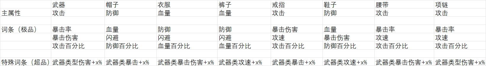

倒计时 + progressBar
UI飘金币
tips  // 已完成按钮升级tips
还需完成 兵种，建筑升级tips


用steer behavior做群体逻辑
用ai库navmesh做群体避障，路径规划

需要实现群体跟随
群体之间的分离
再接上navmesh的寻路避障


先写属性Vo供装备细节信息调用


洗练
- ~~先写展示装备词条，洗练界面~~

- ~~点击洗练前就是纯展示词条，即做头部视图 ok~~

- 点击洗练后展示洗练预览，先令change视图不可见，点击洗练后填充数据并置为可见
  - 用洗练信息视图盖在上面，设计到三种洗练方式，所以也是先UI显隐做，可能会单独做三种洗练变化cmt
  ~~- 新属性和旧属性全出，各占一列，用洗练index做变化箭头逻辑，锁住的保持位置~~
  - ~~换Vo~~


~~1.洗练的proxy 数据流整理完成~~
~~2.中转的数据结构清理~~
~~3.数据的来源是proxy ~~


更新pb中baseAttr为list

整理逻辑

展示界面进change ，change初始状态为preview， 展示界面分三块放按钮洗三个部分，change界面为同一界面，change界面以preview为初始，在下方添加cost列表，点击洗练进行洗练

分两部分，show和refresh

show只需要装备信息equipinfo即可

refresh界面则是将之前的change跳出的逻辑合过来

- 先写show（命名refresh界面）
  - ~~数据展示~~
  - ~~洗练按钮事件~~
    - ~~开pop，传类型~~
    
- 然后是change界面
  - ~~拿数据判断类型，渲染数据~~
  - 锁，updateNew，addlist
  - ~~更改 item~~
  - ~~保留~~
  - ~~返回~~


- 检查遍逻辑
  - ~~锁、洗练预览等都需要重新触发预览刷新Noti~~
- ~~拼UI~~

- 迁逻辑
  - ~~各种初始化~~
  - 基础属性洗练
    - ~~列表渲染~~
    - ~~按钮事件~~


- 联调
  - 服务器
    - ~~基础属性预览~~
    - ~~基础属性洗练~~
    - ~~基础属性洗练确认~~
    - ~~技能属性预览~~
    - ~~技能属性洗练~~
    - ~~技能属性洗练确认~~
- 完善洗练后续逻辑新增
  - 基础属性
    - 洗练锁逻辑
      - ~~锁换为本地~~
      - 洗练锁锁定后的属性展示
      - 未锁定部分的默认展示
      - 洗练锁数量弹窗
    - 重铸锁逻辑
      - 重铸锁弹窗
    - 文本展示
      - 武力值的变色
  - 技能属性
    - ~~增加保留功能~~
    - 文本变色
    - 默认技能属性展示？
    - 界面数据加载提前，防止展示时的闪数据问题
  - UI逻辑修改与新增
    - ~~洗练与保留按钮显示逻辑~~
    - ~~若存在待确认属性，洗练按钮进行属性的放弃与开始洗练两个步骤~~
    - ~~未确认处理的属性进行后续处理~~


- 联调
  - 服务器
    - ~~基础属性预览~~
    - ~~基础属性洗练~~
    - ~~基础属性洗练确认~~
    - ~~技能属性预览~~
    - ~~技能属性洗练~~
    - ~~技能属性洗练确认~~
- 完善洗练后续逻辑新增
  - 基础属性
    - 洗练锁逻辑
      - ~~锁换为本地~~
      - ~~洗练锁锁定后的属性展示~~
      - ~~未锁定部分的默认展示~~
      - ~~洗练锁数量弹窗~~（自带）
    - 重铸锁逻辑
      - 重铸锁弹窗
    - 文本展示
      - 武力值的变色
  - 技能属性
    - ~~增加保留功能~~
    - 文本变色
    - 默认技能属性展示？
    - 界面数据加载提前，防止展示时的闪数据问题
  - UI逻辑修改与新增
    - ~~洗练与保留按钮显示逻辑~~
    - ~~若存在待确认属性，洗练按钮进行属性的放弃与开始洗练两个步骤~~
    - ~~未确认处理的属性进行后续处理~~


- 联调
  - 服务器
    - 数据验证
- 完善洗练后续逻辑新增
  - 基础属性
    - 洗练锁逻辑
      - 自己的bug修复
    - 重铸锁逻辑
      - 重铸锁弹窗
    - 文本展示
      - 武力值的变色
  - 技能属性
    - 文本变色
    - 默认技能属性展示？
    - 界面数据加载提前，防止展示时的闪数据问题
- 代码整理
  - ~~判空~~
  - ~~分class~~
  - 参考  
- 升级
  - ~~页面~~
  - ~~当弹窗弹~~
  - ~~通包数据~~
  - ~~属性用id展示就行~~
  - `看下生命周期，mediator的`


  - 属性面板7.9日调
    - ~~UI~~

基础属性不存在是否显示
按钮组 toggle
icon  显示
战力显示 对pb 产品 王磊
适配
技能属性


0709

- ~~tab按钮单选功能完善，优化UI显示~~
- 基础属性调包
  - 新的随机词条 王振虎
  - ~~词条数值无变化  数值 - > 张登元~~
  - ~~基础属性无词条时对比（问策划）~~ 【就我的显示方式就行】
  - ~~前后战力对比 对策划 王磊（单件还是人物： 文档： ~~只计算装备3条基础属性的武力~~，~~张登元与殷昊对过是用的装备的总体武力值~~
） ~~可能要对服务器，加字段 张登元 添加武力字段~~

- 技能属性 张登元
  - 技能属性是否变化 对策划 与服务端确认接口返回信息
    - ~~技能确认属性返回值不正确，确认包返回的还是原属性[就是服务端的响应标志位问题]~~
  - ~~技能属性确认包服务端修复（替换标志位）~~

- 物品头部信息展示
- ~~网络请求异步顺序问题修复~~
- 适配调整
- ~~技能属性优化 服务 功能~~
- ~~重铸锁 逻辑~~
- 重铸锁弹窗
- 人物属性面板联调
  - ~~面板数据~~
  - List动态添加


0710

- 基础属性调包
  - 新的随机词条 王振虎 已添加部分

- 技能属性 张登元
  - 技能属性是否变化 对策划 与服务端确认接口返回信息

- 洗练pb变更
  - ~~切本地分支上传pb~~
  - ~~修改id 包名等~~
  - ~~修改有关于chain的命名【部分工具类相关设计部分后面需要跟着改】~~

- 物品头部信息展示
  - ~~icon 调整icon位置~~
  - ~~ele 服务器还没给数据~~
  - 赛季 文字

- ~~适配调整~~
- 整理洗练代码
  - 数据展示优化【ui增减变色等】
  - 重洗练流程优化
    - 下面两个按钮不要闪


- ~~重铸锁弹窗~~ 
- ~~重铸锁UI~~
- 属性全锁的提示可能要和服务端改

- 人物属性面板联调
  - List动态添加
- 人物属性 ui
  - 字体【目前是对设计稿样式，没对设计稿数据】
  - 高斯
  - 属性ui 数值和ui没对好，服务器传的数据没对好
  - ~~设计图ui~~


0712
- 人物属性面板多属性组展示
- 增加五行洗练功能
- 调整重铸锁pb与逻辑
- 增加洗练后数据刷新
- 修复部分ui与功能问题

0714
- 坐骑装备洗练
- 洗练功能自测
- 人物属性面板相关

- 白：
  - 对功能
  - 开坐骑装备
  - 赛季显示

- 晚:
  - 属性全锁确认请求禁止
  - 五行
  - icon
  - 


0715
- 重铸锁修复，五行属性替换为列表
- 添加技能洗练双进度条展示
- 添加判空优化
- 添加五行洗练流程限制
- 修复技能洗练页面刷新问题，添加百、万分比数值显示

0716 
- 完成坐骑装备洗练相关
  - ~~proxy假数据~~
- 人物装备洗练
  - ~~武力值变化UI优化，增减箭头~~
  - ~~五行洗练切换时按钮战力显示修复~~
  - ~~优化整理代码~~


0717
- 完成坐骑装备洗练相关
  - 服务器联调
- cmd 的 vo
- 日志
- 语法糖太长，不好确定报错地方
- Ui冗余
- mediator里面 if后再传数据
- 先三个请求一起发刷新ui

- 坐骑info页面展示，与升星渲染分开
  - 列表展示
    - 排序
  - view展示
    - 初始化展示


0718
- 完成坐骑装备洗练联调
- 坐骑装备与角色装备洗练测试bug修复
- 相关代码整理

0719
- ui修改
- 坐骑洗练功能完成逻辑

0721
- 完成坐骑洗练功能特殊属性洗练调试
- 坐骑洗练功能自测

0722
- ~~完成坐骑洗练功能特殊属性洗练调试~~
  - ~~上传pb，更新vo~~
  - ~~调包~~
- 完成坐骑信息页面与坐骑获得调试
  - 
- 功能自测

`洗练出更高武力值再洗练加弹窗`
`自动跳转未选择新属性页面`


0723
- 人物装备洗练UI替换
- 人物装备洗练功能修改
  - icon
  - visible
  - 洗练锁toast
  - 
- `人物与坐骑装备洗练tab修改，无法洗出原不存在的属性类型`

0724
- ~~消耗弹窗，洗练锁限制~~
- UI修改
  - ~~headinfo bg~~
  - ~~refine bg 九宫格~~
  - list自动大小，bg自动大小
  - 武力字体，value位置
  - 让美术出适配？
  - font style 字体问题
- 坐骑升级弹窗
  - ~~原型ui~~
  - ~~升级包，数据渲染~~ 
- 代码整理
  - refresh
    - 明确数据流向，数据集中于proxy处理，cmpt中只存放缓存数据
      - 洗练锁

0725
- 代码整理
  - refresh
    - 明确数据流向，数据集中于proxy处理，cmpt中只存放缓存数据
    - 复杂逻辑移cmd
- bug修复
- 需求更改
0728
- 优化
  - 页面闪烁
  - 连点洗练过快会显示新属性未选择`当confirm回包并立即发送refresh时，在第一次refresh回包之前点击洗练按钮会继续发送第二次请求，因为第一次回包数据没更新，所以第二次请求数据错误，还是添加标志位解决`
  - `confirm同理`
    - 
    ```
    _isrefreshing = false;

    void sendRefresh(){
      _isrefreshing = true;
    }

    void recvRefresh(){
      _isrefreshing = false;
    }

    void sendRefreshConfirm(){
      _isrefreshing = true;
    }

    void recvRefreshConfirm(){
      _isrefreshing = false;
    }

    ```
    - 界面闪烁刷新，目前公司里的解决方案大致思路以真正需要的数据到达时控制直接刷新。应该控制请求流程或是修复UI更新流程 `使用标志位控制，这个模块部分的控制偏简单，即使用标志位记录当前confirm请求如果是giveup时不进行confirm的刷新`
  - ~~优化下重铸锁的显示逻辑吧，点下并摁住手指划走时不会刷新，状态变化可能还是手动控制靠谱，或者调调~~ ~~一个按钮多个选中图就行~~
- 重构Vo proxy通过update更新核心状态

、

0729
- 优化网络请求逻辑
- 优化闪烁刷新标志位的解决方法
- 坐骑装备洗练原型
  - UI更改
    - 属性洗练又从单栏变双栏
    - ~~head变~~
      - ~~分选择状态与洗练处理状态，改headcmpt的位置大小~~
    - ~~技能属性洗练List变~~
  - 界面合并
  - 装备选择页面迁移 马
  - `操作按钮cmpt添加`
    - UI
    -发 Noti
      - `save`
      - `process`
    - 收 Noti
      - `state Change Noti`
        - 收vo: ENUM, (进 对应功能后自己查proxy数据刷新界面状态)  
        - 


- 坐骑装备洗练代码整理
  - Vo
  - 核心状态数据
    - 装备信息
    - 洗练后信息
    - 锁信息
    - 消耗信息


- 原型问题

  - 改动确认
    - 重铸锁与洗练锁互不影响，并持久化保存
    - 坐骑装备的属性洗练和人物装备的属性洗练现在是用同一套UI吗
    - 
  
  - 问题
    - 档位换为三档，数据由服务器传还是前端计算写死
    - 中间只供展示还是有其他交互，点击是否为卸下操作，和重铸类似的那种
    - 洗练功能内，坐骑装备洗练中切换洗练页面时装备选择是否保存

0730
- 坐骑洗练代码整理
- 新增千机宝盒洗练界面
- 相关逻辑补全
- 

- 千机宝盒洗练功能逻辑补全以及洗练锁逻辑修改
- 底部通用组件添加
- 完善千机宝盒逻辑与代码自测


洗练UI使用同一套，先通逻辑，再换同一套
 - 界面切换完善下  在界面切换的架子里加的
 - 把装备界面换了 `

通用组件要么cmd，要么让别人自己传回调与数据

增加装备选中逻辑

对pb，修改锁逻辑
  - `进行中`等服务器公共方法好


0731
- 千机宝盒人物装备洗练功能添加
- 装备与坐骑洗练UI统一
- 补全交互逻辑
- 词条锁展示，档位展示，空属性展示优化，确认下低品质要不要锁


`等服务器对表`
洗练锁状态管理不对，不能有本地数据


老马列表有问题


0731 

- 锁的状态切换表现截停
- 背包进入的洗练锁信息对不上
- 对锁
- 合UI
- 加卸下按钮


0802 、
需求变更
通用逻辑整理
  - 数据为各自的proxy，mediator为各自的mediator进行各自的监听与事件处理，cmpt共用同一个UI，渲染通过重载完成
    - 人物
    - 坐骑
  - 初次渲染
    - 背包详情进入
      - 完成注册后直接接收数据进行数据的初始化与渲染
    - 千机宝盒进入
      - 即选择状态进入，重置各自proxy数据，走统一渲染逻辑
        - 统一渲染逻辑（两模块分开，接UI刷新通知触发【洗练，界面切换，保留，装备切换】）： 
          - 1. 获取背包状态（各自触发各自的，但因为是hide，所以两个页面都会接，因此需要背包状态），洗练模式，当前存在数据
          - 2. 切换选择界面
          - 3. 刷新头部信息，中间数据展示，底部按钮展示
            - 头部信息
              - 无现存洗练信息则重置至装备选择状态
            - 中间数据展示
              - 对应的页面进对应的渲染逻辑
            - 底部按钮
              - 根据当前状态进行刷新

  - 界面切换渲染
    - 不使用onchange方法不好控制，以界面切换通知为准
      - 背包间进行切换不重置proxy数据
      - 洗练模式之间进行切换则重置各自proxy的数据
    - 切换后即上面的走各自的渲染逻辑，通过数据和当前状态决定数据的展示


- 问题
  - 两份代码，以及数据结构不同，可以找时间合成一种数据类型，或者说命名相同的层级相同的数据类型
  - 界面切换逻辑比较影响用户体验，随时会更改

进度安排
- 因为马具存在两个洗练模式，则先进行单个的马具洗练的代码整理
  - ~~初始化渲染的确认与通用渲染方法的提取~~
  - ~~点击~~
  - ~~界面切换 洗练子界面切换重置状态，背包切换不进行数据重置~~
  - ~整理并明确核心状态管理【guid单独管理，后面优化进statvo】~
  - ~~弃用cmpt中的缓存guid，以proxy为准~~
- ~~整理人物装备~~
  - ~~提取~~
  - ~~进入方式~~
  - ~状态管理~
  - ~~仅使用一份数据~~


- 后续处理
  - ~~适配~~ 初步提交
  - 子界面渲染方法整理与清理
  - 清理FGUI
  - 清理锁逻辑
  - 确认卸下按钮是否留存
  - 整理并统一proxy数据结构


- 洗练需求更改
1. 基础属性洗练锁移除
2. 在基础属性界面通过选择某条属性进行单独的属性洗练

- pb更改
1. 洗练锁与重铸锁移除验证，传null即可
2. index_list修改为需要进行洗练的词条索引
3. newattr保持全量传输


0804
- 网络请求需要加限制，否则会出现当第一个预览请求没有回包时，比如网不行或是回包慢啥的，会在网络恢复的时候将用户的点击队列预览请求批量发出并一一返回，当然也有可能是其他原因，需要进行排查
- 原型修改
- FGUI整理
- 代码整理

- 进度安排
  - 试试新pb逻辑是否合理
  - `先进行坐骑洗练的更改`
    - 各个锁的逻辑与请求进行清理或是注释
    - 将原洗练锁上锁逻辑变为用户选中的需要进行洗练的属性的选中逻辑`基本没变啥`
    - 修改原型，基本上就是用原坐骑的属性洗练原型，即单栏的那种，改下渲染啥的就行
      - 改名，注释
      - 展示还是全量展示，选择按钮只影响显隐其实，然后存个当前洗练词条的Index给proxy就好
    - 底部通用组件展示逻辑调整
    - 交互逻辑调整
    - 每个词条单独在装备上保存，一个词条在洗练过程中可以洗练另一个词条
      - 那洗练和preview的回包不能回全量了，服务端说要大改


暴漏需要的数据接口
回包的状态更新

`通用组件的数据来源如何明确`

~~添加卸下按钮~~
~~支持点击出现tips~~

转连续洗练的处理逻辑
- 确认需求后进行修改

快速点击直接禁用UI取代标志位
  - 在回包前禁用洗练按钮
  - 发包时禁用回包时解开
~~func提取~~
~~词条转pb，pb在proxy中存的越少越好~~
  ~~ - 转pb方法 ~~
  ~~ - 替换发送信息 ~~

装备详细信息弹窗
ShowPopupCmpt(MountEquipDetailInputCmpt.NAME, new MountEquipDetailInputMediator.CfgVo
            {
                EquipInfoVo = roleEquip
            });


添加需求当存在洗练结果继续点击洗练时对比装备的武力值弹二次确认弹窗
添加当上锁的属性洗炼出更高的值时弹二次确认是否替换弹窗
当存在洗练结果时不可进行词条锁定（服务器添加）
当不能进行锁定时隐藏锁的展示

0806
需求更改与进度安排

添加需求当存在洗练结果继续点击洗练时对比装备的武力值弹二次确认弹窗
- refresh之前发送cmd进行验证
- 添加至底部组件回调处
  - cmd 包所有展示信息给弹窗，弹窗仅负责展示
      - 有洗练后信息点击`洗练`，且`武力值高`，弹窗武力提升是否保留，不保留则直接发洗练请求，保留就保留确认请求
      - 有洗练后信息点击`退出`，且`武力值高`, 弹窗武力提升是否保留，不保留则直接发放弃保留请求`疑议`，保留就保留确认请求
      - 有洗练后信息点击`保留`，但新`武力值低`，弹窗武力降低是否保留，不保留则发放弃保留请求，保留则发保留确认请求


      - 全部发同一个cmd， cmd自己找洗练后武力信息与装备当前武力信息，带个clickType吗，还是说做三个不同的cmd，不要cmd，直接showpop得了
        - 带个clickType吧，都是点击事件，后面扩展也是加clickType

添加当上锁的属性洗炼出更高的值时弹二次确认是否替换弹窗
- recv refresh后发送cmd进行验证

~~通用组件UI修改与tips修改~~
- ~~缩背包，拉底部，换tip位置，做高级组控制有字无字时的伸缩，接同一个底部noti通知控制显隐~~
- ~~高级组好像不行，自己手动设置load吧~~不行，用高级组禁用自动伸缩可以试试
- 基本上好了，但适配有问题，先把需求实现完再说，还是那种在FGUI上是对的，到unity上不行，应该还是底层的问题？


当存在洗练结果时不可进行词条锁定（服务器添加）
- 处理特定错误码进行操作拦截
当不能进行锁定时隐藏锁的展示
- 现在去掉了档位锁的逻辑，所以只要锁快满时进行锁的隐藏
取消档位上锁逻辑
- 注释相关代码
删 onclick 标志位
属性洗出来更高确认


~~可能需要添加放弃按钮~~ 沿用原逻辑


洗练后的属性中上锁的属性存在更大值的情况下出弹窗

取消则使用旧的锁定的属性的值

确定则使用新的全量数据


0807

[2025-08-07 11:52:05.430] [NET_PACKET] SendRQ: DressMountEquipPreviewRQ rqID=16532 {'equip_pos':4,'preview_guid':22,'self_guid':0,'op_src':0}

[2025-08-07 11:52:05.467] [NET_PACKET] 2025/8/7 11:52:05 recvData: DressMountEquipPreviewRS rsID=16533 {'err_info':{'err_code':2147483648,'err_msg':0,},'header':{'session':1754538282-181,'protocol':338,'ranch_protocol':1,},'mount_equip_info':[{'equip_id':51564001,'equip_guid':22,'base_attrs':[{'attr_info':{'attr_id':6520101,'value':300,'min_value':150,'max_value':300,'attr_desc':坐骑防御,'figure':1,'score_tap':2,},'index':1,},{'attr_info':{'attr_id':6000605,'value':124,'min_value':75,'max_value':150,'attr_desc':满血时减伤,'figure':1,'score_tap':1,'special_symbol':,'attr_units':},'index':2,},{'attr_info':{'attr_id':6000606,'value':150,'min_value':75,'max_value':150,'attr_desc':闪避后防御,'figure':1,'score_tap':2,'special_symbol':,'attr_units':},'index':3,'refresh_lock':1},],'equip_name':紫金马缰,'pos':4,'equip_quality':6,'force_value':4680,'lock':0,'equip_season_id':1,'force_arrow':4680,'rand_attrs':[{'attr_info':{'attr_id':6500511,'value':1,'min_value':1,'max_value':1,'attr_desc':虚弱,'figure':1,'score_tap':2,'special_symbol':,'attr_units':},'index':1},{'attr_info':{'attr_id':6500512,'value':2,'min_value':2,'max_value':2,'attr_desc':封印,'figure':1,'score_tap':2,'special_symbol':,'attr_units':},'index':2},{'attr_info':{'attr_id':6500513,'value':1,'min_value':1,'max_value':1,'attr_desc':落雷,'figure':1,'score_tap':2,'special_symbol':,'attr_units':},'index':3},{'attr_info':{'attr_id':6500514,'value':2,'min_value':2,'max_value':2,'attr_desc':木乃伊,'figure':1,'score_tap':2,'special_symbol':,'attr_units':},'index':4},{'attr_info':{'attr_id':6500516,'value':1,'min_value':1,'max_value':1,'attr_desc':冰冻,'figure':1,'score_tap':2,'special_symbol':,'attr_units':},'index':5},{'attr_info':{'attr_id':6500517,'value':2,'min_value':2,'max_value':2,'attr_desc':净化,'figure':1,'score_tap':2,'special_symbol':,'attr_units':},'index':6},],'best':False,},],'op_src':0,}

[2025-08-07 11:55:25.616] [NET_PACKET] SendRQ: QueryMountEquipDetailRQ rqID=16737 {'equip_guids':[22,],'query_type':0}

[2025-08-07 11:55:25.682] [NET_PACKET] 2025/8/7 11:55:25 recvData: QueryMountEquipDetailRS rsID=16738 {'err_info':{'err_code':2147483648,'err_msg':0,},'header':{'session':1754538282-197,'protocol':338,'ranch_protocol':1,},'equip_list':[{'equip_id':51564001,'equip_guid':22,'base_attrs':[{'attr_info':{'attr_id':6520101,'value':300,'min_value':150,'max_value':300,'attr_desc':坐骑防御,'figure':1,'score_tap':2,},'index':1,'refresh_lock':1},{'attr_info':{'attr_id':6000605,'value':124,'min_value':75,'max_value':150,'attr_desc':满血时减伤,'figure':1,'score_tap':1,'special_symbol':,'attr_units':},'index':2,},{'attr_info':{'attr_id':6000606,'value':150,'min_value':75,'max_value':150,'attr_desc':闪避后防御,'figure':1,'score_tap':2,'special_symbol':,'attr_units':},'index':3,'refresh_lock':1},],'equip_name':紫金马缰,'pos':4,'equip_quality':6,'lock':0,'equip_season_id':1,'force_arrow':4680,'rand_attrs':[{'attr_info':{'attr_id':6500511,'value':1,'min_value':1,'max_value':1,'attr_desc':虚弱,'figure':1,'score_tap':2,'special_symbol':,'attr_units':},'index':1},{'attr_info':{'attr_id':6500512,'value':2,'min_value':2,'max_value':2,'attr_desc':封印,'figure':1,'score_tap':2,'special_symbol':,'attr_units':},'index':2},{'attr_info':{'attr_id':6500513,'value':1,'min_value':1,'max_value':1,'attr_desc':落雷,'figure':1,'score_tap':2,'special_symbol':,'attr_units':},'index':3},{'attr_info':{'attr_id':6500514,'value':2,'min_value':2,'max_value':2,'attr_desc':木乃伊,'figure':1,'score_tap':2,'special_symbol':,'attr_units':},'index':4},{'attr_info':{'attr_id':6500516,'value':1,'min_value':1,'max_value':1,'attr_desc':冰冻,'figure':1,'score_tap':2,'special_symbol':,'attr_units':},'index':5},{'attr_info':{'attr_id':6500517,'value':2,'min_value':2,'max_value':2,'attr_desc':净化,'figure':1,'score_tap':2,'special_symbol':,'attr_units':},'index':6},],'best':False,'new_flag':0},],'query_type':0}

- 背包数据不可靠，背包进入后拿guid自己再查一遍
- 会有闪烁


测元宝买材料用号
py370205995@v8.com
243723	

测装备账号
fpy350132989@v8.com
275324

代码整理


去popview


当tip不可见时重新调整适配
但目前调整适配的时间点在load改变之前了，需要一个load调整完后的通知
而且底部的适配也有些问题


0808
生命周期管理混乱
洗练pb还是暂定单条洗，否则战力不好算
 - 服务器的新战力应该是当前装备上的没有新属性的旧词条加有新属性的新词条的总战力

底部工具更新可以合
  - 函数的设计应该是通用，通过传值就能用，而不是单纯的代码分块
  - 底部工具通用数据、
    - gid
    - cost
    - 有无 refreshed
    - funcType不需要，与数据无关
    - 这种状态信息，应该从函数就开始明确，
渲染逻辑可以合
- 用适配器将两份数据整合
- preview 数据只要战力 + List<MountBase/RandAttrInfoVo> + RefreshLockList
- 装备数据要 List<MountBase/RandAttrInfoVo> + ForceValue

attr适配


0809
- 先写cmpt的通用渲染
- 适配器
  - 适配器里加了个选择索引
- vo更改
  -  能统一最好吧
  -  统一不了一点，单洗时preview里面服务只回选择的那一条信息，渲也要改下
  -  检查下渲染逻辑的合理性


`attr_unit`字段还没带回来

0811
洗练属性达到上限 tip
- 首次 preview 的时候进行检查
- 每次confirm确认之后进行检查
- - pb与proxy更改
- 服务部署
- 原代码清理


可以很强，调两下就通
待解决
- ~~换装备时重置selectIndex为0，即界面展示重置为未选择状态~~
  - 未选择的重置界面 通过重置为0实现
  - 退界面清
  - 换装备清
  - 可清，并添加了放重复预览请求的验证
  - `有个小问题是通过一级菜单切换时，选中状态会闪，后面慢慢修复`
- ~~战力变化的箭头需要作隐藏处理~~
  - 渲染处，hide和show分别加上attrarrow就行
- 试一下测试包的按钮也是双击吗
- 列表或许可以不进行滑动
- ~~max不允许进行选中~~
  - 设touchable为false即可
- `重置为未选择状态的代码是否可以优化或是变的通用`
- ~~底部状态修改~~
- ~~当属性在洗练时变为max时需要移除选中状态~~
  - `当属性变为max，且用户点击保留后，清除其select状态，并使其无法选中`
    - 当用户没有选择保留，则还是可以洗的
    - 但估计后面会加弹窗进行确认
    - 验证环节在confirm recv以及 preview recv，
      - 全部max验证通过则senddownnoti   # confirm 与 preview
      - 当前选中index与对应的属性为max则清选中状态 # 仅confirm
- proxy 添加全部max属性状态获取
      先进行单条验证再全部验证


0812
- 人物装备也作相应的修改即可


0812 
- 洗练改了
- 只需要洗练请求加回包即可，不需要进行确认逻辑，类似强化的逻辑，随机上涨

0813
- ✌，洗练又改了

- `是否可以将请求的发送集中，无论是在Cmd还是在Mediator里的`


0814
- ~~洗练功能模块重构初步提交~~
- ~~优化事项~~
  1. ~~基础属性洗练bar的展示string~~
  2. ~~基础属性洗练bar的大小~~
  3. ~~基础属性洗练attrItem的属性展示适配~~
  4. ~~UI换包~~

- 勋章 || 基础属性 洗练
  - ~~完成测试页面~~
  - ~~添加消耗品以及物品剩余组件~~
  - ~~在UI层阻断用户快速连续洗练事件~~
- 技能洗练
  - 重新添加连续洗练功能 `移交给服务器完成`


快点出洗练原型把  T-T


0815
- 洗练界面马具与装备切换需求更改
  - 马具与装备在背包处切换时不影响上方的界面展示
- 分两个还是合一个
- 合一个后续改动舒服

洗练时要防止多手指操作，即将所有的按钮都进行屏蔽1


`洗练初步改动`
- 人物装备分
  - 主属性
    - 主属性到一定范围内才会变成极品装备，主属性的变化是通过合成来赌极品装备
  - 基础词条
    - 词条有三个，洗练既洗值也洗属性，当三条词条全洗对了，会开超品词条
  - 超品词条
  

- 马具改动
  - 马具只有使用极品的马装备外加付费道具进行合成才会处带有魔法属性的马装备
  - 每个马具固定对应三条魔法属性


1、赛季勋章没有t1、t2的概念，只有一个赛季勋章


洗人装备属性 礼包（日、周、月）
洗马装备属性 礼包（日、周、月）  小白龙掉一部分
洗马装备魔法加成道具（日礼包、周礼包、月礼包）（只卖rmb，免费的就不能出魔法加成，马装备合到极品装备，极品还可以继续合成用一个付费道具，一定出极品，且会刷出魔法属性）
魔法对应马装备条数1:3条，坐骑装备增加到7个，相当于1-9星，会变

【关于人物装备洗练】
赛季勋章不洗练了，用材料往里填，材料免费放出，也可以付费购买，免费的两个赛季追一个赛季
洗练洗的是普通词条（每次洗一条，词条会变，属性值也会变，可保留或不保留）
特殊词条不能洗，是改造出来的
改造是消耗x个极品装备+付费道具进行改造，改造有成功率，失败了损失所有材料，但原装备不变，改造成功了会给装备增加特殊词条，装备变为超极品：特定武器类的属性加成（有保留、不保留）

增加武器伤害百分比的词条，增加防御类、暴击类、暴击伤害类，每种武器分开
橙色装备合成时有概率出极品装备
装备tips上词条范围，最大值要吐出来

船的技能加成，实际效果为杀人数上增加，要有1:1.3 or 1.4的提升
重点：不到极品的装备，没有洗练功能，只有极品才能洗




`普通词条洗练`
 - 每次洗一条 
 - 词条属性变，不关心
 - 保留和不保留回来了
 - 又回到选择版本了估计

`改造 【超品词条 “洗” 】`


- 看情况把Select和downNode写回来
- Select
  - 
- DownNode


怎么能把select添加自如？？
这是一个由页面到


维护选择索引状态数据是必须的


人物的select和downNode完成
底部适配完成
测试bug修复


0818
- 一个列表绑定两个数据的问题
- setData通用性提取问题（优先）  `待确认`
- ~~只用了一次的变量直接用，不用var~~

1.战力详情 属性图标显示 
2.通用加载 属性图标的方法  attribute_icon_atlas
参考之前金星写的那个，没有的configId就弹toast和输出日志

`服务端洗练收包传回来的新战力数据不对`


改造的和合成的功能差不多，页面UI也差不多
拉配置，放装备，洗词条


注册完后拉配置
slot各自完成初始化，addclick啥的
改造按钮
保留与不保留按钮


装备改造
- 主属性 不关心
- 基础属性 只涉及到改值改属性，然后加武力啥的，，并且只有极品装备才能洗基础属性，这里不关心
- 超品
  - 极品或者超品可以进行改造
  - 通过消耗物品进行改造    `消耗会变吗` `消耗的装备只要极品，然后类型不做限制，`
    - 极品改造：
      - 类似于突破，有成功与不成功，成功就加超品词条，失败就扣除道具包括吃的装备，原装备属性不变 `改造是否不影响基础属性`
    - 超品改造：
      - 即洗超品词条，`概率是百分百吗` ，然后是保留不保留那一套

改造极品和改造超品他们的消耗会有变化吗  `不会`
改造是否不影响装备的其他属性            `不影响`
超品进行改造即类似洗练，不存在失败或者成功的说法是吗        `百分百`

超品装备可以作为材料吗


cost没变那就是config拉配置

改造应答加成功失败

搞清除为什么str里面路径错也不行，它不是个单纯的key
pb
- 振虎说用原 randAttr 作为超品字段
- 超品洗练返回的randattr为空时表示改造失败


UI版本暂时未定，先写核心逻辑
- ~~注册后拉配置~~
- 先选进行改造的装备，更mainSlot视图
- 封一个拉preview方法
- 选材料和装备, 更itemSlot视图，发改造请求

0820
- 基础属性洗练移到tips上，仍有保留与不保留的逻辑
`需求更改，只有极品能洗练，只有神品能改造`


cfg拉付费道具替换橙装的消耗
preview中回包给手续费消耗


改造发包加手续费


-  TIPS 洗练
-  洗练的消耗放在Cfg中，在compare窗口出现时请求preview拉回数据，【后面再看着合请求包】
-  基础的人物装备的tips洗练功能完成
-  添加预览判断
-  

人物升级界面修改，list取消点击穿透，超过三行前不允许滑动

`tips洗练占位`
`让服务改preview中newAttr的回包`


0821
- 洗练弹窗原型
- 洗练弹窗逻辑添加
- 洗练消耗移动到背包拉去中


人物装备的弹窗洗练完成
等装备详情原型更新后把马的也更新上去

开始做改造功能

- ~~进入页面自动放入装备 ok~~
- ~~选择装备放入  出预览 & 装备的卸下~~
- ~~放入神装后的装备列表叠加覆盖，消耗品的选择~~ 【完成半个】
- 
- 消耗品列表 ，拉背包的且不拉装备中的，再拉物资背包中的橙装道具并分开展示，给一个临时序号或者其他的以区分唯一性【完成，但实现方式应该可以优化优化】
- ~~神装卸下时取消消耗品列表的覆盖，并取消所有选中状态回到默认未选择神装状态~~ 【数据清空还需要看下】
- ~~消耗品放满后出打造按钮等操作~~

后面再改加页面方式


消耗品slot 装备详情 ， 当前的实现方式并不通用，需要修改
橙装替代消耗品的添加删除
整理部分逻辑至cmd


列表道具和装备可以分开渲

确认下道具存在哪个背包里，拿ID包通知刷背包用


- 代码整理
`是否有重复渲染的问题`

- 刷新部分
  - refresh costslot
  - refresh mainequip
  - refresh bag visible 

- 道具导表确认
  - 人物
  - ~~坐骑~~

装备存在新属性，处于保留状态则不显示消耗品背包
消耗品未满时显示

- 鉴定成功toast
- 筛选
- 锁
- 详情按钮
- 未鉴定是否入背包
- 锁定的装备是否入背包


0831
~~鉴定~~
改造


0902
- 改造按钮点击
  - costSlot出光球
    - 获取cost位置
  - cost光球到最大隐藏卸下按钮
    - 汇聚动画 获取主装备位位置
  - 炸得时候某帧白屏
    - 白屏后时切换为改造和保留按钮显示
  - 主装备泛光后半段开始刷改造后词条
    - 词条一条一条刷，某个词条位置金光到中间时才开始显示该词条信息
  - 全刷完后泛金光泛一阵子，结束


if (_oldMountAttrInfoList is { Count: > 1 })
            _tideCountDownSchedule = ScheduleClosureHelper.SetClosureSchedule(
                delay: 1.0f, // 每秒触发一次
                actionClosure: ActionClosure.Create(static (inst) =>
                {
                    inst.setv(i);
                }, this), 
                count: 3 
            );


                private static int i = 0;


                public void setv(int index)
    {
        if (i == 2)
            i = 0;
        MountRandAttrList.GetChildAt(index).visible = false;
        i++;
    }

        private ClosureSchedule _tideCountDownSchedule;


private List<MountEquipInfoVo> _mountCostEquips;
    private List<TempItemVoWithIndex> _mountCostItemVo;
    private List<InfoForCostListShowVo> _mountCostListShowVo;
    
    private List<RoleEquipInfoVo> _roleCostEquips;
    private List<TempItemVoWithIndex> _roleCostItemVo;
    private List<InfoForCostListShowVo> _roleCostListShowVo;

    private Action<long, bool> _costsUnloadAction;
    private Action<long, bool, int> _costsDetailAction;

    protected override void Init()
    {
        ResetTipsAndMsgVisible();
    }

    private void ResetTipsAndMsgVisible()
    {
        MsgGroup.visible = false;
        RecastTips.visible = false;
        CostTip.visible = false;
        CostTipBg.visible = false;
        EquipItemCostList.visible = false;
        ForceCmpt.visible = false;
    }
    
    public void SetData(RecastRolePreviewVo vo)
    {
        ResetTipsAndMsgVisible();
        
        if (vo == null || vo?.EquipInfo is { Guid: <= 0 })
        {
            MainEquipSlot.SetData(0, ENUM_TREASURE_BOX_BAG_TYPE.MOUNT, null, null);
            RecastEquipTypeTip.text = "请选择要改造得装备";
            RecastTypeTip.text = "【极】";
            RecastTips.visible = true;
            EquipItemCostList.visible = true;
            RecastEquipTypeTip.visible = true;
            RecastTypeTip.visible = true;
            return;
        }

        if (vo.NewBaseAttrList is { Count: > 0 })
        {
            MsgGroup.visible = true;
        }
        else
        {
            MsgGroup.visible = true;
            EquipItemCostList.visible = true;
        }
        ForceCmpt.visible = true;
        
        NewRandAttrMsgCmpt.BgLoader.url = "ui://MountEuipmentRecast/layer_877_copy";
        
        CurRandAttrMsgCmpt.SetActiveTips(vo.EquipInfo.IsRandActive);
        CurRandAttrMsgCmpt.SetData(vo.EquipInfo.BaseAttrInfo);
        
        NewRandAttrMsgCmpt.SetActiveTips(true);
        NewRandAttrMsgCmpt.SetData(vo.NewBaseAttrList, vo.EquipInfo.BaseAttrInfo);

        ForceCmpt.CurValue.text = vo.EquipInfo.ForceValue.ToString();
        if (vo.NewForce == -1)
            ForceCmpt.NewValue.text = "???";
        else
            ForceCmpt.NewValue.text = vo.NewForce.ToString();
        
        ForceCmpt.ArrowLoader.url = GetMountAttrCompareUrl(vo.EquipInfo.ForceValue, vo.NewForce);

        CurRandAttrMsgCmpt.PanelController.selectedIndex = (int)UIRandAttrPanelCmpt.PanelControllerControllerType.Mount;
        NewRandAttrMsgCmpt.PanelController.selectedIndex = (int)UIRandAttrPanelCmpt.PanelControllerControllerType.Mount;
    }

    public void SetData(RecastMountPreviewVo vo)
    {
        ResetTipsAndMsgVisible();
        if (vo == null || vo?.EquipInfo is { Guid: <= 0 })
        {
            MainEquipSlot.SetData(0, ENUM_TREASURE_BOX_BAG_TYPE.MOUNT, null, null);
            RecastEquipTypeTip.text = "请选择要改造得马具";
            RecastTypeTip.text = "【极】";
            RecastEquipTypeTip.visible = true;
            RecastTypeTip.visible = true;
            RecastTips.visible = true;
            EquipItemCostList.visible = true;
            return;
        }

        if (vo.NewBaseAttrList is { Count: > 0 })
        {
            MsgGroup.visible = true;
        }
        else
        {
            MsgGroup.visible = true;
            EquipItemCostList.visible = true;
        }
        ForceCmpt.visible = true;
        NewRandAttrMsgCmpt.BgLoader.url = "ui://MountEuipmentRecast/layer_877_copy";
        
        CurRandAttrMsgCmpt.SetActiveTips(vo.EquipInfo.IsRandActive);
        
        CurRandAttrMsgCmpt.SetData(vo.EquipInfo.BaseAttrInfo);
        
        NewRandAttrMsgCmpt.SetActiveTips(true);
        // if (!vo.EquipInfo.IsRandActive)
        //     NewRandAttrMsgCmpt.SetData(vo.EquipInfo.BaseAttrInfo, vo.EquipInfo.BaseAttrInfo);
        // else
            NewRandAttrMsgCmpt.SetData(vo.NewBaseAttrList, vo.EquipInfo.BaseAttrInfo);
        
        
        ForceCmpt.CurValue.text = vo.EquipInfo.ForceValue.ToString();
        if (vo.NewForce == -1)
            ForceCmpt.NewValue.text = "???";
        else
            ForceCmpt.NewValue.text = vo.NewForce.ToString();
        
        ForceCmpt.ArrowLoader.url = GetMountAttrCompareUrl(vo.EquipInfo.ForceValue, vo.NewForce);
        
        
        CurRandAttrMsgCmpt.PanelController.selectedIndex = (int)UIRandAttrPanelCmpt.PanelControllerControllerType.Mount;
        NewRandAttrMsgCmpt.PanelController.selectedIndex = (int)UIRandAttrPanelCmpt.PanelControllerControllerType.Mount;
    }

    public void SetCostSlotsData(List<InfoForCostListShowVo> showCostVoList, int slotCount, bool isRoleEquip, Action<long, bool> unloadAction, Action<long, bool, int> detailAction)
    {
        EquipItemCostList.itemRenderer = isRoleEquip ? RoleCostSlotsRender : MountCostSlotsRender;
        
        if (isRoleEquip)
            _roleCostListShowVo = showCostVoList;
        else
            _mountCostListShowVo = showCostVoList;
        
        if (showCostVoList == null)
            return;
        
        if (showCostVoList.Any(t => t != null))
        {
            RecastTips.visible = false;
            CostTip.visible = false;
            CostTipBg.visible = false;
        }
        else
        {
            CostTip.visible = true;
            CostTipBg.visible = true;
            if (isRoleEquip)
                CostTip.text = "请放入消耗的材料装备";
            else
                CostTip.text = "请放入消耗的材料马具";
        }
        
        EquipItemCostList.numItems = slotCount;
        _costsUnloadAction = unloadAction;
        _costsDetailAction = detailAction;
    }
    
    private void MountCostSlotsRender(int index, GObject item)
    {
        UIItemSlotCmpt cell = item as UIItemSlotCmpt;
        if (cell == null)
            return;
        
        if (_mountCostListShowVo[index] == null)
        {
            cell.SetData(null, null, false, false, null);
            return;
        }
        // 马具
        if (_mountCostListShowVo[index].IsCostEquip)
            cell.SetData(_mountCostListShowVo[index].ItemOrConfigId, () => _costsUnloadAction?.Invoke(_mountCostListShowVo[index].Guid, false), false, false, () => _costsDetailAction?.Invoke(_mountCostListShowVo[index].Guid, false, _mountCostListShowVo[index].Index));
        else
            cell.SetData(_mountCostListShowVo[index].ItemOrConfigId, () => _costsUnloadAction?.Invoke(_mountCostListShowVo[index].Index, true), true, false, () => _costsDetailAction?.Invoke(_mountCostListShowVo[index].ItemOrConfigId, true, _mountCostListShowVo[index].Index));
    }
    
    // Role
    private void RoleCostSlotsRender(int index, GObject item)
    {
        UIItemSlotCmpt cell = item as UIItemSlotCmpt;
        if (cell == null)
            return;
        
        if (_roleCostListShowVo[index] == null)
        {
            cell.SetData(null, null, false, true, null);
            return;
        }
        // 装备
        if (_roleCostListShowVo[index].IsCostEquip)
            cell.SetData(_roleCostListShowVo[index].ItemOrConfigId, () => _costsUnloadAction?.Invoke(_roleCostListShowVo[index].Guid, false), false, true, () => _costsDetailAction?.Invoke(_roleCostListShowVo[index].Guid, false, _roleCostListShowVo[index].Index));
        else
            cell.SetData(_roleCostListShowVo[index].ItemOrConfigId, () => _costsUnloadAction?.Invoke(_roleCostListShowVo[index].Index, true), true, true,  () => _costsDetailAction?.Invoke(_roleCostListShowVo[index].ItemOrConfigId, true, _roleCostListShowVo[index].Index));
    }
    
    
    public void SetMsgGroupVisible(bool visible)
    {
        MsgGroup.visible = visible;
    }
    
    private string GetMountAttrCompareUrl(long curForce, long newForce)
    {
        if (newForce <= 0)
            return null;
        
        if (newForce > curForce)
        {
            return "ui://MountEuipmentRecast/green_arrow";
        }
        if (newForce < curForce)
        {
            return "ui://MountEuipmentRecast/red_arrow";
        }
        return null;
    }


    public partial class UITreasureEquipRetrofitPopCmptContent
{
    private List<ItemVo> _costsList;
    
    protected override void Init()
    {
        base.Init();
        CostList.itemRenderer = RetrofitCostItemsRender;
    }

    public void SetData(RetrofitRoleRandPreviewVo previewVo, List<ItemVo> cfgVoCostList)
    {
        _costsList = cfgVoCostList;
        
        ConfirmPopController.selectedIndex = (int)ConfirmPopControllerControllerType.Role;
        
        CostList.numItems = cfgVoCostList.Count;
        
        CurSpecialAttrMsgCmpt.SetData(previewVo.RoleEquipInfo.SpecialAttrInfo);
        NewSpecialAttrMsgCmpt.SetData(previewVo.NewRandAttrInfoVos);
        RefreshBtnsVisible(previewVo?.NewRandAttrInfoVos is { Count: > 0 });
    }

    public void SetData(RetrofitMountRandPreviewVo previewVo, List<ItemVo> cfgVoCostList)
    {
        _costsList = cfgVoCostList;
        ConfirmPopController.selectedIndex = (int)ConfirmPopControllerControllerType.Mount;
        CurRandAttrMsgCmpt.PanelController.selectedIndex = (int)UIRandAttrPanelCmpt.PanelControllerControllerType.Mount;
        NewRandAttrMsgCmpt.PanelController.selectedIndex = (int)UIRandAttrPanelCmpt.PanelControllerControllerType.Mount;
        
        CostList.numItems = cfgVoCostList.Count;
        
        CurRandAttrMsgCmpt.SetData(previewVo.MountEquipInfo.RandAttrs, null);
        NewRandAttrMsgCmpt.SetData(previewVo.NewRandAttrInfoVos, previewVo.MountEquipInfo.RandAttrs);
        
        RefreshBtnsVisible(previewVo?.NewRandAttrInfoVos is { Count: > 0 });
    }

    public void SetEvent(Action retrofitAction, Action<int> confirmAction)
    {
        RetrofitBtn.onClick.Set(() =>
        {
            retrofitAction?.Invoke();
        });
        
        SaveBtn.onClick.Set(() =>
        {
            confirmAction?.Invoke(1);
        });
        
        GiveUpBtn.onClick.Set(() =>
        {
            confirmAction?.Invoke(2);
        });
    }
    
    private void RetrofitCostItemsRender(int index, GObject item)
    {
        UICommonNewItemCostCmpt cell = item as UICommonNewItemCostCmpt;
        
        if (cell == null)
            return;
        cell.SetData(_costsList[index]);
    }

    private void RefreshBtnsVisible(bool hasNewAttr)
    {
        GiveUpBtn.visible = false;
        SaveBtn.visible = false;
        RetrofitBtn.visible = false;

        if (hasNewAttr)
        {
            GiveUpBtn.visible = true;
            SaveBtn.visible = true;
        }
        else
            RetrofitBtn.visible = true;
    }
}


- 2025 0908
- 人物装备五行洗练
  - 写下拉菜单
  - 部位激活五行列表展示
  - 洗练成功弹窗
- 马具改造
  - 服务部署
  - 和装备的一起BUG修改
- 动画，UI


1757334613-147   
[2025-09-08 20:38:27.519] [NET_PACKET] SendRQ: RoleRetrofitEquipPreviewRQ rqID=17006 {'equip_guid':935}


0909


- 改造
- 动画
- 测试
- 背包筛选


- 老虎机结束回调再重新发洗练请求
- 遮罩
- 元素激活和元素对应弹窗


0910
- 道具Icon
- 界面闪烁
- ~~说明~~
- ~~鉴定标志位~~
- ~~马具全满~~
- ~~cost tip~~
- ~~五行enough 屏蔽~~
- ~~按钮颜色~~
- ~~卸下切换bug~~
- ~~消耗品背包显示bug~~
- ~~马具背包点击已经选中装备出tips bug~~
- ~~确认弹窗UI~~


改造需要先放入一件[color=#F0A14C]装备[/color][color=#FF4848]【极】[/color]作为主体，再依次放入两件[color=#F0A14C]橙色装备[/color]作为材料\n改造后，主体只有[color=#FF8B19]特殊属性词条[/color]会发生变化，其他属性保持不变；材料会被消耗掉\n改造后的结果可以选择保留或者不保留，若未选择，下次选择该[color=#F0A14C]装备[/color][color=#FF4848]【极】[/color]作为主体时依旧可以进行选择

改造需要先放入一件[color=#F0A14C]马具[/color][color=#FF4848]【极】[/color]作为主体，再依次放入两件[color=#F0A14C]橙色装备[/color]作为材料\n改造后，主体只有[color=#FF8B19]特殊属性词条[/color]会发生变化，其他属性保持不变；材料会被消耗掉\n改造后的结果可以选择保留或者不保留，若未选择，下次选择该[color=#F0A14C]马具[/color][color=#FF4848]【极】[/color]作为主体时依旧可以进行选择


0911
- ~~消耗品背包切换bug~~
- ~~空背包文本~~
- ~~改造按钮显隐~~
- ~~动画不屏蔽返回按钮，其他的屏蔽（看看要不要缩动画时间）~~
- ~~适配~~
- ~~动画适配~~
- ~~说明文本~~
- ~~消耗不足通用弹窗文本配置~~
- ~~消耗背包空背包跳转~~
- 闪烁再看看

0912
- ~~改造底部按钮调整~~
- ~~动画校对~~
- ~~消耗槽位背景填充添加~~
- ~~消耗tips展示逻辑修改~~
- ~~页面闪烁  现在只有背包会闪下~~ 未加载不展示 解决
- ~~合成按钮闪烁~~


0913
- 代码整理
- 背包切换那个看下  
- 整理前端用的表    整理下
- ~~图集    看下整理下不用的资源~~
- ~~橙装替代道具取消 equipItem为null~~
- 千机宝盒遮罩多验证验证
  - 改
  - 计时器
  - mask
  - 更改来源 enum
- drawcall


0914 
- ~~完善日志~~
- ~~完善禁止触摸，视图隐藏等操作~~
- ~~背包切换逻辑验证添加~~
- ~~max显示添加~~


- hook 初始化逻辑修改
- hook set 判错添加，防止崩溃
- toArray
- panel 渲染 整理
- 无用代码清理


0916
- cmd 方法分装 状态放proxy
- ui逻辑与mediator分离
- hook移
- 函数职责单一化
- 


改造需要先放入一件作为主体，再依次放入两件[color=#F0A14C]橙色装备[/color]作为材料\n改造后，主体只有[color=#FF8B19]特殊属性词条[/color]会发生变化，其他属性保持不变；材料会被消耗掉\n改造后的结果可以选择保留或者不保留，若未选择，下次选择该[color=#F0A14C]装备[/color][color=#FF4848]【极】[/color]作为主体时依旧可以进行选择


[color=#F0A14C]装备[/color][color=#FF4848]【极】[/color]需要通过洗练来[color=#FF8B19]激活五行[/color]，激活[color=#FF8B19]任意[/color]五行后，该装备的特殊属性词条会获得[color=#FF8B19]数值翻倍[/color]的效果\n洗练会随机转动机器的每一列，机器停止后若每一列中央的[color=#FF8B19]五行一致[/color]时，则[color=#FF8B19]洗练成功[/color]\n[color=#F0A14C]装备[/color][color=#FF4848]【极】[/color]已经拥有五行，仍可以[color=#FF8B19]继续洗练[/color]：若洗练失败，不会[color=#FF8B19]移除[/color]原本的五行；若[color=#FF8B19]洗练成功[/color]，则将洗练后的五行[color=#FF8B19]替换[/color]原本的五行\n当所有部位的五行均为同一种时，会激活[color=#FF8B19]五行套装效果[/color]


-  ~~说明文本~~
-  ~~对动画~~
-  换光晕Icon
-  ~~改造页面主装备槽位置调整~~
-  改造背包new标记重新排序
-  


洗练功能回退
- 底部按钮cmd
- 装备选取 背包通知添加， 少了橙装槽位，消耗背包等逻辑
- 俩属性面板
- toggle切换【是否需要和改造一致】
- vo 【带主属性和基础属性】
- proxy 和之前一样
‘


- 0917 
- 确认洗练形式，是弹窗还是千机宝盒
- 修改五行洗练bug，做需求同步


0918
- 马具/装备改造说明标题修改
- 洗练交互逻辑
- 

新增洗炼功能（改装备和马具上的主属性以及三条副属性）：
极品装备（马具）才能洗炼
每次洗炼主属性以及三条副属性一起变
洗炼后提升，点击“再次洗炼”会二次弹窗确认
主属性和三条属性都会根据词条范围百分比，改变字色（白绿红三档）
某一词条洗满后，tips词条后会有MAX代替范围
单词条达到max，而有其他词条未max的时候，再次洗炼该词条不会掉
当所有词条都满时，洗炼入口按钮消失
洗炼入口，在恭喜获得和主界面时会有


- 属性洗练说明

只有[color=#FF4848]装备【极】[/color]才可以洗练。\n每次洗练同时将主属性和三条副属性的[color=#FF4848]数值[/color]分别进行随机，但属性词条[color=#FF4848]不会变[/color]。\n洗练后的结果，需要选择[color=#FF4848]保留[/color]方可[color=#FF4848]生效[/color]。\n当主属性或副属性中的某一条达到MAX时，该属性在后续的洗练中则[color=#FF4848]不会变化[/color]。

只有[color=#FF4848]马具【极】[/color]才可以洗练。\n每次洗练同时将主属性和三条副属性的[color=#FF4848]数值[/color]分别进行随机，但属性词条[color=#FF4848]不会变[/color]。\n洗练后的结果，需要选择[color=#FF4848]保留[/color]方可[color=#FF4848]生效[/color]。\n当主属 性或副属性中的某一条达到MAX时，该属性在后续的洗练中则[color=#FF4848]不会变化[/color]。

- 改造说明

改造需要先放入一件[color=#FF4848]装备【极】[/color]作为主体，再依次放入两件[color=#F0A14C]橙色装备[/color]作为材料。\n改造后，主体只有[color=#4A9EFF]特殊属性词条[/color]会发生变化，其他属性保持不变；材料会被消耗掉。\n改造后的结果可以选择保留或者不保留；若未选择，下次选择该[color=#FF4848]装备【极】[/color]作为主体时依旧可以进行选择。

改造需要先放入一件[color=#FF4848]马具【极】[/color]作为主体，再依次放入两件[color=#F0A14C]橙色装备[/color]作为材料。\n改造后，主体只有[color=#4A9EFF]魔法加成[/color]会发生变化，其他属性保持不变；材料会被消耗掉。\n改造后的结果可以选择保留或者不保留；若未选择，下次选择该[color=#FF4848]马具【极】[/color]作为主体时依旧可以进行选择。

- 五行转换
[color=#FF4848]装备【极】[/color]需要通过转换来[color=#FF4848]激活五行[/color]，激活[color=#FF4848]任意[/color]五行后，该装备的特殊属性词条会获得[color=#FF4848]数值翻倍[/color]的效果\n转换会随机转动机器的每一列，机器停止后若每一列中央的[color=#FF4848]五行一致[/color]时，则[color=#FF4848]转换成功[/color]\n[color=#FF4848]装备【极】[/color]已经拥有五行，仍可以[color=#FF4848]继续转换[/color]：若转换失败，不会[color=#FF4848]移除[/color]原本的五行；若[color=#FF4848]转换成功[/color]，则将转换后的五行[color=#FF4848]替换[/color]原本的五行\n当所有部位的五行均为同一种时，会激活[color=#FF4848]五行套装效果[/color]


0920
- ~~消耗品反了bug~~
- ~~锁定窗口维持显示~~
- ~~说明~~
- ~~进度条~~
- ~~字体收缩~~


- 马具改造
改造需要先放入一件[color=#FF4848]马具【极】[/color]作为主体，再依次放入两件[color=#F0A14C]橙色装备[/color]作为材料。\n改造后，主体只有[color=#4A9EFF]魔法加成[/color]会发生变化，其他属性保持不变；材料会被消耗掉。\n改造后的结果可以选择保留或者不保留；若未选择，下次选择该[color=#FF4848]马具【极】[/color]作为主体时依旧可以进行选择。

- 五行转换
[color=#FF4848]装备【极】[/color]需要通过转换来[color=#FF4848]激活五行[/color]，激活[color=#FF4848]任意[/color]五行后，该装备的特殊属性词条会获得[color=#FF4848]数值翻倍[/color]的效果。\n转换会随机转动机器的每一列，机器停止后若每一列中央的[color=#FF4848]五行一致[/color]时，则[color=#FF4848]转换成功[/color]。\n[color=#FF4848]装备【极】[/color]已经拥有五行，仍可以[color=#FF4848]继续转换[/color]：若转换失败，不会[color=#FF4848]移除[/color]原本的五行；若[color=#FF4848]转换成功[/color]，则将转换后的五行[color=#FF4848]替换[/color]原本的五行。\n当所有部位的五行均为同一种时，会激活[color=#FF4848]五行套装效果[/color]。

- 属性洗练说明

只有[color=#FF4848]装备【极】[/color]才可洗练。\n每次洗练同时将主属性和三条副属性的[color=#FF4848]数值[/color]分别进行随机，但属性词条[color=#FF4848]不会变[/color]。\n洗练后的结果，需要选择[color=#FF4848]保留[/color]方可[color=#FF4848]生效[/color]。\n当主属性或副属性中的某一条达到MAX时，该属性在后续的洗练中则[color=#FF4848]不会变化[/color]。

只有[color=#FF4848]马具【极】[/color]才可洗练。\n每次洗练同时将主属性和三条副属性的[color=#FF4848]数值[/color]分别进行随机，但属性词条[color=#FF4848]不会变[/color]。\n洗练后的结果，需要选择[color=#FF4848]保留[/color]方可[color=#FF4848]生效[/color]。\n当主属 性或副属性中的某一条达到MAX时，该属性在后续的洗练中则[color=#FF4848]不会变化[/color]。


0921
- ~~人物属性面板 默认数据删除~~
- 升星界面 默认数据删除
- 五行洗练 默认数据删除
- ~~人物属性面板 背景适配~~
- ~~马具魔法改造 属性动画在进入页面后第一次触发时会显示第一帧~~
- 皮肤列表来源文本遮盖获取按钮
- new标记是否需要显示 ： 恭喜获得处点击进入五行洗练或改造，退出后new标记仍在

- 五行洗练说明文本修改
- 跟说明文本进度
- Icon确认
- 战力确认 攻击词条


改造icon 53400001 51300001 工匠石  【这俩id的是一个图】
洗练icon 51600001 51600001 工匠石
五行icon 51300001 53400001 五行石


[2025-09-22 23:50:17.561] [NET_PACKET] 2025/9/22 23:50:17 recvData: RoleRefreshEquipRS rsID=17096 {'err_info':{'err_code':2147483648,'err_msg':0,},'header':{'session':1758556181-129,'protocol':338,'ranch_protocol':1,},'equip_info':{'equip_id':42761001,'equip_guid':1660,'main_info':{'main_attrs':{'attr_info':{'attr_id':6010101,'value':1167,'min_value':94,'max_value':1167,'attr_desc':攻击,'figure':1,'score_tap':2,},'index':2,}},'base_info':{'base_attrs':[{'attr_info':{'attr_id':6000301,'value':175,'min_value':14,'max_value':175,'attr_desc':暴击率,'figure':2,'score_tap':2,},'index':1,},{'attr_info':{'attr_id':6000401,'value':280,'min_value':23,'max_value':280,'attr_desc':暴击伤害,'figure':2,'score_tap':2,},'index':2,},{'attr_info':{'attr_id':6001202,'value':100,'min_value':8,'max_value':100,'attr_desc':当前装备攻击加成,'figure':2,'score_tap':2,},'index':3,},],},'rand_info':{'rand_attrs':[{'attr_info':{'attr_id':62205,'value':80,'min_value':80,'max_value':2000,'attr_desc':五船攻防,'figure':2,'score_tap':0,},'index':1,},],'is_rand_active':2,},'five_elem_type':3,'equip_name':紫金刀,'pos':1,'equip_quality':6,'force_value':5145,'lock':0,'equip_season_id':1,'make_time':1758531002,'best':1,'new_flag':0,},'elem_slot_list':[{'slot_id':1,'elem_list':[1,2,3,4,5,],'cur_elem_type':3},{'slot_id':2,'elem_list':[1,2,3,4,5,],'cur_elem_type':3},{'slot_id':3,'elem_list':[1,2,3,4,5,],'cur_elem_type':3},],'is_auto_refresh':1,'hope_elem_type':2}


[2025-09-22 23:50:15.693] [REFRESH_SYSTEM] SetMaskNodeVisible True

[2025-09-22 23:50:16.426] [REFRESH_SYSTEM] SetMaskNodeVisible False


- 手动洗练，如果该次洗练成功，阻止用户继续点击手动洗练，直到动画播完
- 自动洗练，未达到期望元素时，中途元素也走亮起和转换动画，但不弹窗

- 转换 字
- 激活弹窗 弹的不对
- 三个不一样的icon也放动画吗


只有[color=#F0A14C]装备[/color][color=#FF4848]【极】[/color]才可洗练\n每次洗练同时将主属性和三条副属性随机[color=#FF8B19]一条[/color]进行[color=#FF8B19]数值[/color]的随机，但属性词条[color=#FF8B19]不会变[/color]\n洗练后的结果，需要选择[color=#FF8B19]保留[/color]方可生效\n当主属性或副属性中的某一条达到[color=#8FFF5A]MAX[/color]时，该属性在后续的洗练中则[color=#FF8B19]不会变化[/color]\n当主属性和三条副属性均洗炼到[color=#8FFF5A]MAX[/color]后，可激活[color=#FF4848]该装备武力+5%[/color]


- 0924

- ~~装备主页等级tips添加与UI替换~~
- 改造
  - ~~调整改造pb，动画~~
  - ~~装备改造红点添加~~
  - ~~保底添加 与 UI~~
- 五行转化
  - 红点添加 没逻辑
  - spine跟进  晓蒙
  - 套装跟进  马健
  - 保底添加 与 UI
  - 五行转换弹窗动画
- 属性洗练
  - ~~保底添加 与 UI~~
  - ~~红点添加~~
GetFamilyEquipPosInfoVoByGuid
GetRolePosCheckTipsStateFunc(pos)


- 新 装备改造
只有[color=#F0A14C]装备[/color][color=#FF4848]【极】[/color]才可以改造。\g改造后，只有[color=#4A9EFF]特殊属性词条[/color]会发生变化，其他属性保持不变。\g改造后的结果可以[color=#FF8B19]选择[/color]保留或者不保留；若未选择，下次对此装备进行改造时仍可[color=#FF8B19]选择[/color]。\g以下词条[color=#90FF59]增加武力[/color]:\n[color=#E154FF]攻击[/color]\n[color=#E154FF]攻速[/color]\n[color=#E154FF]暴击率[/color]\n[color=#E154FF]暴击伤害[/color]\g以下词条[color=#90FF59]不增加武力[/color]：\n[color=#E154FF]声望[/color]\n[color=#E154FF]X船攻防[/color]

- 五行转换
[color=#FF8B19]装备【极】[/color]需要通过转换来[color=#FF8B19]激活五行[/color]，激活[color=#FF8B19]任意[/color]五行后，该装备的特殊属性词条会获得[color=#FF8B19]数值翻倍[/color]的效果。\n转换会随机转动机器的每一列，机器停止后若每一列中央的[color=#FF8B19]五行一致[/color]时，则[color=#FF8B19]转换成功[/color]。\n[color=#FF8B19]装备【极】[/color]已经拥有五行，仍可以[color=#FF8B19]继续转换[/color]：若转换失败，不会[color=#FF8B19]移除[/color]原本的五行；若[color=#FF8B19]转换成功[/color]，则将转换后的五行[color=#FF8B19]替换[/color]原本的五行。\n当所有部位的五行均为同一种时，会激活[color=#FF8B19]五行套装效果[/color]。


- 各个功能的短于1920的适配
- 五行转换UI 五行转换动画
- ~~技能描述~~

角色经验可以通过家族钓鱼、抢宝箱、妙手特权获取\n赛季等级上限为50级\n赛季结束后等级转化为武力加成，并将等级重置


~~spine~~ 
不展示 max rand allfull字段

满了之后不给洗，直接保留下来，传了全部信息就是直接保留
消耗添加弹窗

等级tips 找马健加说明

默认消耗

进度条


[2025-09-26 00:39:45.484] [NET_PACKET] SendRQ: RoleRefreshEquipRQ rqID=17095 {'header':{'session':1758817994-419,'protocol':338,'ranch_protocol':1,},'equip_guid':1872,'cost':[{'itemId':51300001,'Count':100,},],'elem_slot_list':[{'slot_id':1,'elem_list':[1,2,3,4,5,],'cur_elem_type':3},{'slot_id':2,'elem_list':[1,2,3,4,5,],'cur_elem_type':3},{'slot_id':3,'elem_list':[1,2,3,4,5,],'cur_elem_type':3},],'is_auto_refresh':0,'hope_elem_type':0}

[2025-09-26 00:39:45.511] [NET_PACKET] SendRQ: RoleRefreshEquipRQ rqID=17095 {'header':{'session':1758817994-420,'protocol':338,'ranch_protocol':1,},'equip_guid':1872,'cost':[{'itemId':51300001,'Count':100,},],'elem_slot_list':[{'slot_id':1,'elem_list':[1,2,3,4,5,],'cur_elem_type':3},{'slot_id':2,'elem_list':[1,2,3,4,5,],'cur_elem_type':3},{'slot_id':3,'elem_list':[1,2,3,4,5,],'cur_elem_type':3},],'is_auto_refresh':0,'hope_elem_type':0}


[2025-09-26 00:39:45.611] [NET_PACKET] 2025/9/26 0:39:45 recvData: RoleRefreshEquipRS rsID=17096 {'err_info':{'err_code':2147483648,'err_msg':0,},'header':{'session':1758817994-419,'protocol':338,'ranch_protocol':1,},'equip_info':{'equip_id':42664001,'equip_guid':1872,'main_info':{'main_attrs':{'attr_info':{'attr_id':6030101,'value':2917,'min_value':234,'max_value':2917,'attr_desc':生命,'figure':1,'score_tap':2,},'index':0,}},'base


[2025-09-26 00:39:45.615] [NET_PACKET] 2025/9/26 0:39:45 recvData: RoleRefreshEquipRS rsID=17096 {'err_info':{'err_code':100003,'err_msg':18,},'header':{'session':1758817994-420,'protocol':338,'ranch_protocol':1,},'is_auto_refresh':0,'hope_elem_type':0,'max_refresh_num':25,}


[2025-09-26 00:39:45.484] [REFRESH_SYSTEM] SetMaskNodeVisible True, reason: click set Mask


[2025-09-26 00:39:45.511] [REFRESH_SYSTEM] SetMaskNodeVisible True, reason: click set Mask

[2025-09-26 00:39:45.612] [REFRESH_SYSTEM] SetMaskNodeVisible False, reason: update role refresh

[2025-09-26 00:39:45.714] [REFRESH_SYSTEM] SetMaskNodeVisible True, reason: click set Mask


[2025-09-26 00:39:45.814] [REFRESH_SYSTEM] SetMaskNodeVisible False, reason: update role refresh


[2025-09-26 00:50:10.155] [NET_PACKET] 2025/9/26 0:50:10 recvData: RoleRetrofitEquipRS rsID=17009 {'err_info':{'err_code':2147483648,'err_msg':0,},'header':{'session':1758818923-219,'protocol':338,'ranch_protocol':1,},'new_attr':{'rand_attrs':[{'attr_info':{'attr_id':6000401,'value':560,'min_value':45,'max_value':560,'attr_desc':暴击伤害,'figure':2,'score_tap':2,},'index':1,},],'new_force':9117,},'max_retrofit_num':50,'cur_retrofit_num':49,'equip_info':{'equip_id':42663001,'equip_guid':1871,'main_info':{'main_attrs':{'attr_info':{'attr_id':6030101,'value':2917,'min_value':234,'max_value':2917,'attr_desc':生命,'figure':1,'score_tap':2,},'index':0,}},'base_info':{'base_attrs':[{'attr_info':{'attr_id':6020101,'value':175,'min_value':14,'max_value':175,'attr_desc':防御,'figure':1,'score_tap':2,},'index':1,},{'attr_info':{'attr_id':6000201,'value':350,'min_value':28,'max_value':350,'attr_desc':闪避,'figure':2,'score_tap':2,},'index':2,},{'attr_info':{'attr_id':6001402,'value':700,'min_value':56,'max_value':700,'attr_desc':当前装备血量加成,'figure':2,'score_tap':2,},'index':3,},],'is_all_full':1},'rand_info':{'rand_attrs':[{'attr_info':{'attr_id':6000401,'value':560,'min_value':45,'max_value':560,'attr_desc':暴击伤害,'figure':2,'score_tap':2,},'index':1,},],'is_rand_active':3,'is_all_full':1},'five_elem_type':0,'equip_name':紫金铠,'pos':3,'equip_quality':6,'force_value':9117,'lock':0,'equip_season_id':1,'make_time':1758724467,'best':1,'new_flag':0,'attr_max_info':{'attr_max_desc':全属性MAX后：,'attr_desc':该装备武力+50%,'is_activate':1}}}

进度条
~~适配~~
消耗品弹窗
~~非武力加成词条~~
五行激活武力不变不展示 未确认


[D][2025-09-27 +8.0 00:26:01.570][5138, 5352][][Unity:0, FAMILY_EQUIPMENT][UIEquipInfoCompMediator 打开改造界面guid:192

[D][2025-09-27 +8.0 00:26:01.894][5138, 5352][][Unity:0, CORE][core--mediator-SubViewDidRegiest:$ITModule.MountEquipment.TreasureBoxMediator SubView:$ITModule.MountEquipment.TreasureBoxDownNodeMediator

[D][2025-09-27 +8.0 00:26:01.934][5138, 5352][][Unity:0, NET_PACKET][recvData: RoleRetrofitEquipPreviewRS rsID=17007 {'err_info':{'err_code':2

[D][2025-09-27 +8.0 00:26:01.937][5138, 5352][][Unity:0, EQUIP_TREASURE_BOX][Get TREASUREBOX_DOWN_NODE_UPDATE_NOTI in Box down node


[D][2025-09-27 +8.0 00:26:04.042][5138, 5352][][Unity:0, FAMILY_EQUIPMENT][UIEquipInfoCompMediator 打开改造界面guid:192
[D][2025-09-27 +8.0 00:26:04.346][5138, 5352][][Unity:0, NET_PACKET][recvData: RoleRetrofitEquipPreviewRS rsID=17007 {'err_info':{'err_code':2147483648,'err_

[D][2025-09-27 +8.0 00:26:04.363][5138, 5352][][Unity:0, CORE][core--mediator-SubViewDidRegiest:$ITModule.MountEquipment.TreasureBoxMediator SubView:$ITModule.MountEquipment.TreasureBoxDownNodeMediator


- ~~角标大小~~
- 提示窗口
- ~~名称 【极】~~
- ~~洗练出任意五行重置combobox~~
- ~~五行拍下去的动画~~


[D][2025-09-27 +8.0 16:00:05.650][12677, 12872][][Unity:0, FAMILY_EQUIPMENT][UIEquipInfoCompMediator 打开改造界面guid:376
[D][2025-09-27 +8.0 16:00:06.069][12677, 12872][][Unity:0, NET_PACKET][recvData: RoleRetrofitEquipPreviewRS rsID=17007 {'err_info':{'err_code':2147483648,'err_msg':0,},'header':{'s

[D][2025-09-27 +8.0 16:00:06.089][12677, 12872][][Unity:0, EQUIP_TREASURE_BOX][Get TREASUREBOX_DOWN_NODE_UPDATE_NOTI in Box down node
[D][2025-09-27 +8.0 16:00:06.091][12677, 12872][][Unity:0, CORE][core--mediator-SubViewDidRegiest:$ITModule.MountEquipment.TreasureBoxMediator SubView:$ITModule.MountEquipment.TreasureBoxDownNodeMediator


- ~~卡顿问题 `窗口设置类型为trans`?~~
- ~~五行动画调整~~
- ~~五行1800适配调整~~

- ~~五行转换让UI重新出图，确认spine~~
- 拉背包拉描述和振虎对下会不会超64k，换马健包里
- ~~消耗换通用组件~~
- ~~等级tip按钮点击区域放大~~
- ~~Icon换大图~~


只有[color=#F0A14C]装备[/color][color=#FF4848]【极】[/color]才可以改造。\g改造后的结果可以[color=#FF8B19]选择[/color]保留或不保留；若未选择，下次对此装备进行改造时仍可[color=#FF8B19]选择[/color]。\g以下词条[color=#90FF59]增加武力[/color]:\n[color=#E154FF]攻击[/color]\n[color=#E154FF]攻速[/color]\n[color=#E154FF]暴击率[/color]\n[color=#E154FF]暴击伤害[/color]\g以下词条[color=#90FF59]不增加武力[/color]：\n[color=#E154FF]声望[/color]\n[color=#E154FF]一船攻防[/color]\n[color=#E154FF]二船攻防[/color]\n[color=#E154FF]三船攻防[/color]\n[color=#E154FF]四船攻防[/color]\n[color=#E154FF]五船攻防[/color]\g赛季结束时，[color=#F0A14C]装备改造[/color]提供的武力将转化为[color=#FF4848]武力加成[/color]并[color=#FF4848]永久保留[/color]。


[2025-09-29 15:26:26.245] [REFRESH_SYSTEM] MaskNodeVisible before RQ mask Visible : True, 