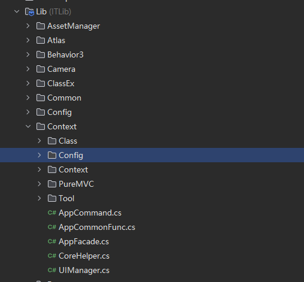
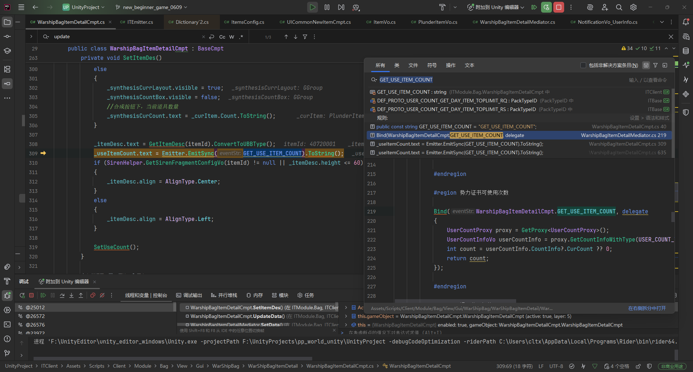
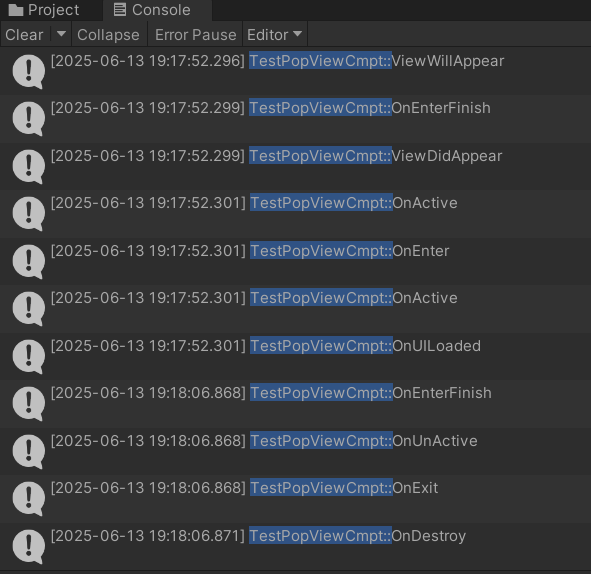
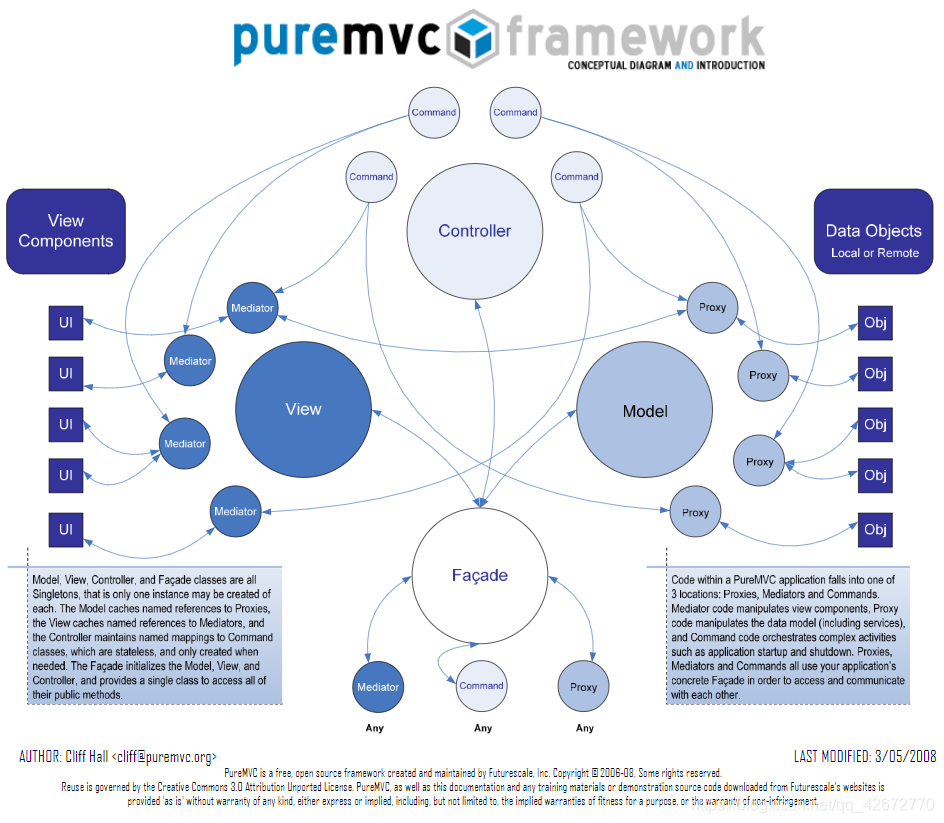
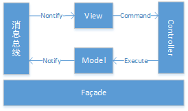
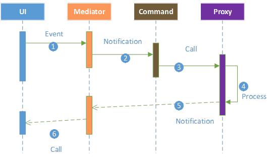
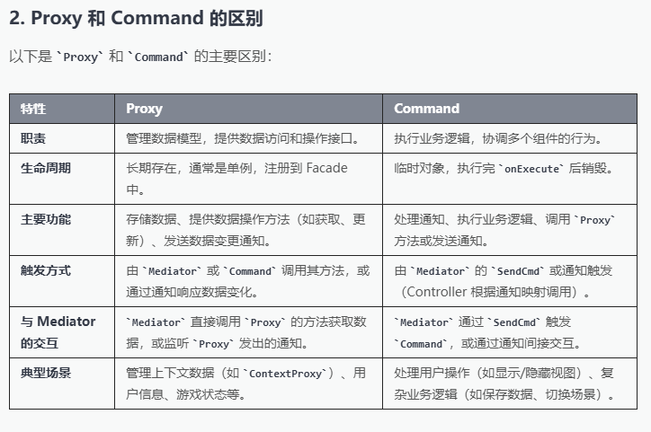

基于FGUI设计完成发布的资产，在PMVC架构下对资产进行自动的解析


PMVC CORE
- Controller
  - 实现IController接口方法
    - 实现command的注册，注销，检索获取
    - 实现command的执行
      - 通过Name查找是否command完成注册并返回该Command实例，并调用onExecute实现
- Model
  - 实现IModel接口
    - 实现对Model代理(Proxy)的注册，注销，检索获取
      - Proxy: 实现INotifier接口，实现其SendNotification方法
- View
  - 实现IVew接口规定的方法
    - 实现接口中对 观察者的注册，注销，观察者通知
    - 实现接口中对 中介者的注册，注销，中介者检索获取
  - 实现单例


`Client/module`下不同组件模块的文件结构：
- Config
  - 配置，注册
- Controller
  - 各Cmd，发送请求到各Proxy中执行数据处理
- Model
  - 各Proxy，对VO数据的处理
- View
  - cmt和mediator，负责UI的事件绑定，请求分发
- Vo
  - 数据
- Module.cs
  - 进行各种加载项
  - Model
  - View
  - Controller
``` c
  namespace ITModule.Bag
{
    public sealed class Module : BaseModule
    {
        protected override void OnRegister()
        {
            RegisterProxy(Model.Config);
            // 实例化一个字典，存入view基本/关键信息，对应`context/ContentView.cs`，这个类是view的描述类
            RegisterView(View.Config);
            // 各类指令
            RegisterCmd(Controller.Config);
            RegisterMediator(new ModuleMediator());
        }
    }
}
  ```
- ModuleMediator
  - 中介者类


`*** Cmpt`
- 
- 事件触发： 通过Emitter.Emit触发某些事先在字典中注册好的事件
- 
- 与UI进行直接交互与数据设置
`*** Mediator`
- 事件绑定： Bind里面 ViewComponent.Emitter.On绑定事件，即具体的事件逻辑在这里面，BaseMediator里面带有BaseCmpt ViewComponent


事件，以新秀碎片合成为例，cmpt 中UI事件在Mediator进行绑定，Mediator中的绑定事件中将数据发送给对应的Proxy中的命令，proxy里请求好像发服务器去了，反正就是和实体数据进行交互。


场景的切换加载等
- 从`Assets/Scripts/Client/Enter/Entrance.cs`开始场景的逻辑，从StartUp开始准备，`InitFacade()`初始化`AppFacade`，再初始化`Module`，即在前面facade中注册各个module的信息，再注册各个Proxy，Cmd，view，Mediator等
- `StartScene`中进行初始场景加载
- 数据加载完成的通知由`facade`发送`SendNoti`

- 进入各个场景时，以`module`中场景加载为例
  - 场景的切换通过信息分发进行，也就是`Notification`，通过那个`SendNoti`
  - 场景管理之类的在哪,点击Item跳转时，当前`Mediator`调用其父类`BaseNotifier`里的弹窗操作加载进入Detail场景，父类里的弹窗操作为在`AppCommonFunc`里定义的静态方法.
  - 换场景也是通过父类里面的AddView，将子视图挂在上层，场景数据在`ContextViewVo`里
  - UI挂载好像是`BaseCmt里完成` `BaseCmt: 356: AssetManager.Instance.LoadFairyGuiGComponent(packageName, resName, action, false);`
  - 由`***Mediator`中`OnHandleNotification`接受通知进行后续处理，准备数据等操作（从Proxy里拿VO，用Helper拿等），
  ```c
  // 这里就是去专门管理物品获取方式的ItemGetProxy里拿itemGetList，也就是获取途径列表，使用ItemGetVo存储，用于渲染在面板上的获取途径部分
    List<ItemGetVo> itemGetList = GetProxy<ItemGetProxy>().GetItemGetVoListByWarshipBag(_plunderItemVo.ItemId);
  ```
  - 数据准备好后通过`BaseMediator`中的`GetViewComponent`方法获取`Cmpt`对象，也就是将数据交给`Cmpt`与UI进行直接交互。
  - 

- VO的初始化在哪里，和持久化数据的交互呢 
- UI的挂载呢，怎么和Unity场景进行挂载的，怎么把gameObject挂场景里的

Mapbase module


# 注册/绑定
Config中对MVC注册
UI绑定在Cmpt中与UI**Cmpt中的UI进行一一对应
在InitFacade中注册全局的Proxy，Cmd，view，Mediator，每个Module的这些东西的注册各自完成，也就是放在该模块的module下，Entrance会调用每个模块的注册逻辑完成注册，还会完成SceneConfig;
SubLayerConfig;
WindowConfig;的注册，这些都是ContextViewVo页面


# 流向
FGUI 发布出UI***Cmpt.cs、Binder
Entrance 初始化控制MVC的AppFacade，初始化Module,Data等，
facade.SendNoti<CORE_GO_TO_SCENE_NOTI>(SCENE.LOGIN);加载初始登录页面
页面的mediator OnHandleNotification接收信息后进后续逻辑，SetData等，数据准备好后通过`BaseMediator`中的`GetViewComponent`方法获取`Cmpt`对象，也就是将数据交给`Cmpt`与UI进行直接交互。

# 事件
事件绑定具体逻辑在Meditor中BindEvent完成，通过Command对VO进行操作
事件的调用由Cmpt（有具体的生命周期）中的Emitter.Emit完成
Command在同级目录下Config/Controller.cs中进行注册
具体逻辑在Controller/**Cmd.cs中与Proxy交互完成

## Emitter里面的事件注册
Cmt里面的Emitter.Emit的回调方法列表是在Mediator里面的Bind完成的，Bind是父类BaseMediator里面方法，调用了Emitter单例的On方法，即在Emitter里完成了回调事件的注册管理。
至于一些通用方法，比如ON_BACK等，也是在BaseMediator的Register事先完成了注册

# 页面跳转
页面指向，new ContextViewVo("ITModule.Login.LoginGameCmpt", "ITModule.Login.LoginGameMediator")，由类名实例化ContextViewVo对象
ContextViewVo对象保存页面信息，该对象用于页面跳转等操作
跳转有多种方式，facade发noti，当前Mediator里调父类方法等

# 通知
`View`

# 生命周期
## BaseCmpt生命周期










AppFacade.NotifyObservers -> Facade.NotifyObservers{view.NotifyObservers(notification) :: IView.NotifyObservers } 
view.NotifyObservers{observer.NotifyObserver} (从View下的observerMap中foreach 调用 每个observer.NotifyObserver)
每个View注册时会注册observerDic和mediatorMap, 或者说所有Mediator是注册在Facade的单例View中，Proxy同理，都在Facade的单例model中，Controller和Command同理

当调用 SendNotification 方法时，Facade 会通过将该消息分发给所有已经注册了的所有观察者，观察者通过name决定是否相应。
SendNoti的通知在Notification中定义


# QA
- 物品详细数据页面重复渲染了好几次，为啥





# PMVC
- 框架的最简单的表现在于职责分离，将代码根据其职责分离为各个独立的职责层级，相较于原始的数据逻辑处理，视图展示混在一起的写法：UI点击Click事件中直接接逻辑处理，代码极难维护并无法复用逻辑代码。清晰的将具有各个职能的代码进行分离，直观的提升其可维护性以及可复用性。
- 然而仅仅将视图层与数据逻辑层进行分离仍无法避免某些场景下数据流的混乱，且数据逻辑并没有实现逻辑与数据之间的解耦，同时仅存在两层的话视图层中每个UI引用相当于一个“控制接口”，在数据产生变化时需要直接操作UI进行更新，这会导致一个操作需要手动更新多处UI的混乱，并且对UI状态的管理代码也难以复用，可维护性低。

PMVC将程序的视图层、控制层以及模型层进行分离
- 按当前项目中看，视图层包括 Mediator和对应的Cmpt，Mediator用于管理UI组件（update等）并进行UI组件事件的处理（Bind），同时负责cmd的发送等。一般来说，中介者只对UI的展示以及状态进行管理，不会在Mediator里进行复杂的逻辑处理，对于复杂的业务逻辑由Mediator交给cmd进行处理，对于简单的UI拿数据更新逻辑可以跳过cmd流程，直接持有proxy获取数据进行ui的更新。但最好是只使用proxy的getter，不直接修改Proxy中的数据。
  - 通知的必要性仍是在于解耦与提高可维护性，通知以广播的形式发送给各个关心的中介者，通过通知形成数据流的单向通信，数据流向清晰。
    - 广播的意义在于当某个通知下事件需要被触发时不需要去持有各个对象的引用（当状态发生变化时，由执行者根据引用对象逐个去触发），这种做法难以管理与维护，广播使得事件发起处不需要明确知道事件的执行者是谁，执行者同理。对于某个事件状态的变化执行者只需要去注册关心该事件并作出反应即可。广播（Noti）也就是模型层到视图层之间实现单向通信的主要做法。
- 控制层，即cmd，主要负责对各种业务逻辑进行处理，并在处理完成后发送通知给中介者以完成视图层的更新。
  - 控制层基本上就是获取各个proxy数据，还有传入的数据进行业务处理并更新数据层数据后发送通知以进行视图层的更新渲染。
- 模型层即专注于管理数据，包括网络的收发包，以及当前状态下数据的持有等，往往可以在收包后发送通知直接通知更新，或是sendcmd进行业务处理后由cmd进行通知分发并更新视图层信息。


# Vo与更新
- 项目里的写法基本是：首次回包那里初始化一个核心状态（可以通过初始化一些核心数据），后续的改变在proxy中使用Set方法进行事先初始化好的核心状态的数据更新。
- 核心状态的数据信息是不暴漏的，只提供安全的信息get方法


[2025-08-04 11:27:15.480] [NET_PACKET] 2025/8/4 11:27:15 recvData: MountEquipBaseRefreshPreviewRS rsID=16740 {'err_info':{'err_code':2147483648,'err_msg':0,},'header':{'session':1754277582-159,'protocol':338,'ranch_protocol':1,},'equip_info':{'equip_id':51564001,'equip_guid':511,'base_attrs':[{'attr_info':{'attr_id':6520101,'value':231,'min_value':150,'max_value':300,'attr_desc':坐骑防御,'figure':1,'score_tap':1,},'index':1,},{'attr_info':{'attr_id':6500301,'value':130,'min_value':60,'max_value':150,'attr_desc':坐骑暴击率,'figure':2,'score_tap':1,},'index':2,},{'attr_info':{'attr_id':6000606,'value':123,'min_value':75,'max_value':150,'attr_desc':闪避后防御,'figure':1,'score_tap':1,'special_symbol':,'attr_units':},'index':3,},],'equip_name':紫金马缰,'pos':4,'equip_quality':6,'force_value':5679,'lock':0,'equip_season_id':1,'rand_attrs':[{'attr_info':{'attr_id':6500511,'value':1,'min_value':1,'max_value':1,'attr_desc':虚弱,'figure':1,'score_tap':2,'special_symbol':,'attr_units':},'index':1},{'attr_info':{'attr_id':6500512,'value':3,'min_value':3,'max_value':3,'attr_desc':封印,'figure':1,'score_tap':2,'special_symbol':,'attr_units':},'index':2},{'attr_info':{'attr_id':6500513,'value':1,'min_value':1,'max_value':1,'attr_desc':落雷,'figure':1,'score_tap':2,'special_symbol':,'attr_units':},'index':3},{'attr_info':{'attr_id':6500516,'value':1,'min_value':1,'max_value':1,'attr_desc':冰冻,'figure':1,'score_tap':2,'special_symbol':,'attr_units':},'index':4},{'attr_info':{'attr_id':6500517,'value':3,'min_value':3,'max_value':3,'attr_desc':净化,'figure':1,'score_tap':2,'special_symbol':,'attr_units':},'index':5},]},'refresh_cost':[{'itemId':52900001,'Count':100,},],'charge_cost':[{'itemId':34021103,'Count':200,},]}

[2025-08-04 11:27:39.397] [NET_PACKET] SendRQ: MountEquipBaseRefreshRQ rqID=16741 {'equip_guid':511,'refresh_cost':[{'itemId':52900001,'Count':100,},],'index_list':[2,],'charge_cost':[{'itemId':34021103,'Count':200,},]}

[2025-08-04 11:27:39.473] [NET_PACKET] 2025/8/4 11:27:39 recvData: MountEquipBaseRefreshRS rsID=16742 {'err_info':{'err_code':2147483648,'err_msg':0,},'header':{'session':1754277582-161,'protocol':338,'ranch_protocol':1,},'refresh_new_attr':{'base_attr':[{'attr_info':{'attr_id':6520101,'value':230,'min_value':150,'max_value':300,'attr_desc':坐骑防御,'figure':1,'score_tap':1,},'index':1,},{'attr_info':{'attr_id':6500301,'value':130,'min_value':60,'max_value':150,'attr_desc':坐骑暴击率,'figure':2,'score_tap':1,},'index':2,},{'attr_info':{'attr_id':6500401,'value':600,'min_value':240,'max_value':600,'attr_desc':坐骑暴击伤害,'figure':2,'score_tap':2,},'index':3,},],'new_force':8003,}}


