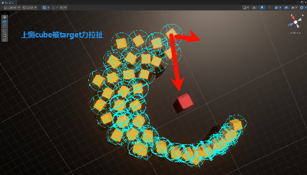
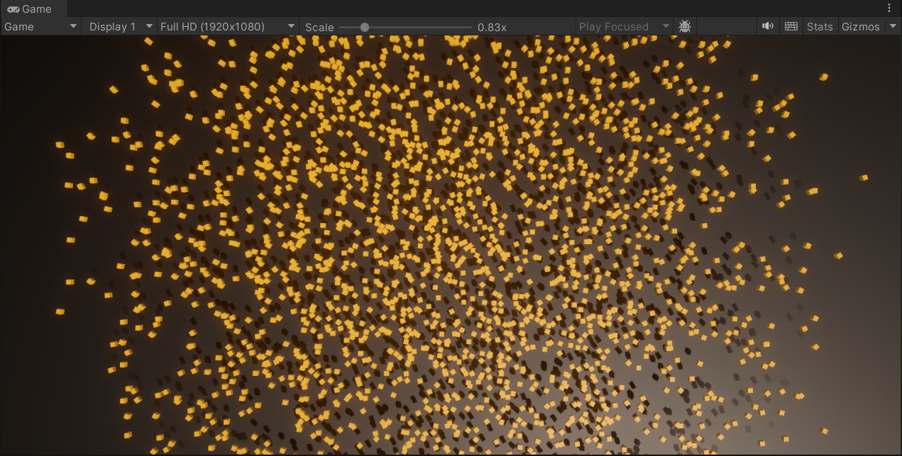

-较为大量的方块下（2500），其无法避免的产生分批，并且个体分离检测总会有重叠的


# 总
- 尝试过的方案
  - 列队，纯好玩，没用
  - leader，不行
  - 改分离力方向，aline力方向
  - 阵型移动，单位加offset那种，做做优化说不定可以
    - 简单的单位计算点击点和均值pos加offset的方法太简单了，运动过程中的过程改变是不会恢复的，想简单解决这个问题就是预设阵型，但是集体阵型移动效果可行
    - 但是没有聚集效果，所以加点东西
      - 在click target周围生成虚拟的，聚集的，不重叠的，对应的，temptarget
      - 围城效果就是那个蜂群那个，算点位的那个
      - 多点位target + 流向场寻路
    - 总之就是移动中的动态避障是一套，使用steering rvo这类，围城，包围的效果是另外一套，加入寻路，navmesh，流场寻路都行。
    - 单纯的避障无法实现围城包围，单纯的寻路也不好实现运动中的相互分离
    - 至于寻路围城的逻辑和之前想的思路一致，到达点位时将自己设置为障碍物，思路方向是对的
    - 而且其实加入了寻路也说不定会抖，再通过多target或蜂群算点位的方式进行进一步优化
    - `那么，怎么算一个合适的多target点位？`

  - 固定，设置为障碍物，切寻路逻辑为主（寻路没加）

- 回推问题
  - follow力改为远处个体受力递减，将个体合力交给速度对齐aline，减少移动前方对象对后方对象的回推


先挂follow，然后脚本改follow奥，别临时挂


- 个体行为改动
  - 丢失点击点时，aline weight清零，速度清零
  - 简leader的那个不太行

- 源码改动
  - 分散力改为线性
  - follow力改为远处个体受力递减，将个体合力交给速度对齐aline，减少移动前方对象对后方对象的回推
  - 添加follow力最大范围 maxdist
  - 添加follow力量垂直方向补正
  - 添加follow角度速度补正
- 以上的不走了，主要看防抖

  - 添加邻居判断范围
  - 添加邻居前后separation施力范围
  - 之前改了aline的施力范围，这两留一个就行感觉
  - 主要是让后面的消停下来，比如检测一圈时cantmove？ 


你的思路非常合理，整体方向和现代RTS/群体AI的阵型移动、围城包围、动态避障等实现方式是一致的。下面我帮你梳理一下你的思路，并补充一些建议：

---

### 1. 阵型移动与offset
- 你提到“简单的单位计算点击点和均值pos加offset的方法太简单了”，确实如此，这种方式只适合静态分布，运动过程中单位间的相对关系容易丢失，且无法自适应障碍和动态变化。
- 预设阵型（如方阵、圆阵、楔形等）可以解决部分问题，但灵活性有限。

### 2. 多Target点位与虚拟目标
- 在目标点周围生成虚拟的、不重叠的、聚集的target（tempTarget），让每个单位跟随自己的target，这样可以实现“围城”或“包围”效果。
- 这些target点位可以通过蜂群算法、Voronoi分区、Poisson采样等方式生成，保证分布均匀且不重叠。

### 3. 动态避障与流场寻路
- 单纯的steering（如RVO、Boids）可以实现动态避障和分离，但难以实现有组织的包围。
- 单纯的寻路（如NavMesh）可以让单位到达目标，但缺乏群体协作和分离。
- 结合两者：先用寻路/流场算出大致路径，再用steering做局部避障和分离，效果最佳。

### 4. 包围与障碍物逻辑
- 到达target点位后，将自己设置为障碍物，防止其他单位重叠，这个思路是对的。
- 可以通过状态机切换“移动-到达-变为障碍”状态。

### 5. 多target点位的计算
- 关键在于如何生成这些target点位，使其既能包围目标，又能均匀分布且不重叠。
- 常见方法：
  - **圆形均分**：以目标为圆心，按单位数量均分圆周/圆环。
  - **蜂群/Boids分布**：模拟粒子在目标周围分布，带有分离/聚集力。
  - **Voronoi分区**：以目标为中心，单位初始位置为种子点，生成Voronoi图，取每个单位的分区重心为target。
  - **流场寻路**：为每个单位生成一条流向目标的路径，target为路径上的某个点。

---

## 总结
你的思路已经非常接近业界常用的群体AI方案了。  
**建议：**
- 先实现“多target点位”生成（推荐圆形均分或蜂群分布，简单易用）。
- 每个单位跟随自己的target点位，结合steering做动态避障。
- 到达target后切换为障碍物，防止重叠。
- 如需更高阶效果，可尝试流场寻路或Voronoi分区。

---

### 你问的核心问题
> 那么，怎么算一个合适的多target点位？

**最简单的办法：**
- 以目标点为圆心，半径R，单位数量N，均分圆周/圆环，计算每个单位的target点位。

**伪代码：**
```csharp
for (int i = 0; i < N; i++) {
    float angle = 2 * Mathf.PI * i / N;
    Vector3 targetPos = center + new Vector3(Mathf.Cos(angle), Mathf.Sin(angle), 0) * R;
    // targetPos就是每个单位的目标点
}
```
如果要多层包围，可以多圈嵌套。

---

如果你需要具体的代码实现或者想要更复杂的点位分布算法，可以告诉我你的需求，我可以帮你写出详细实现！